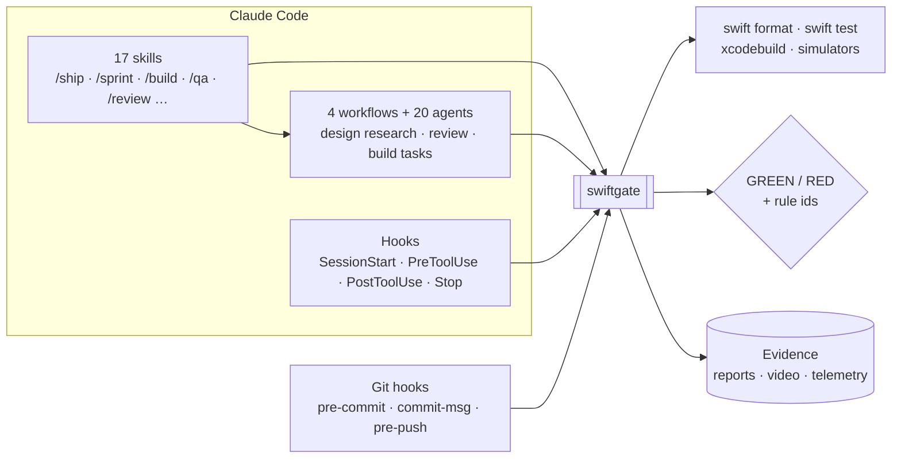
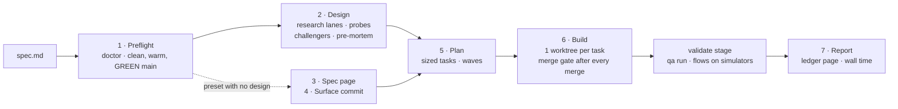
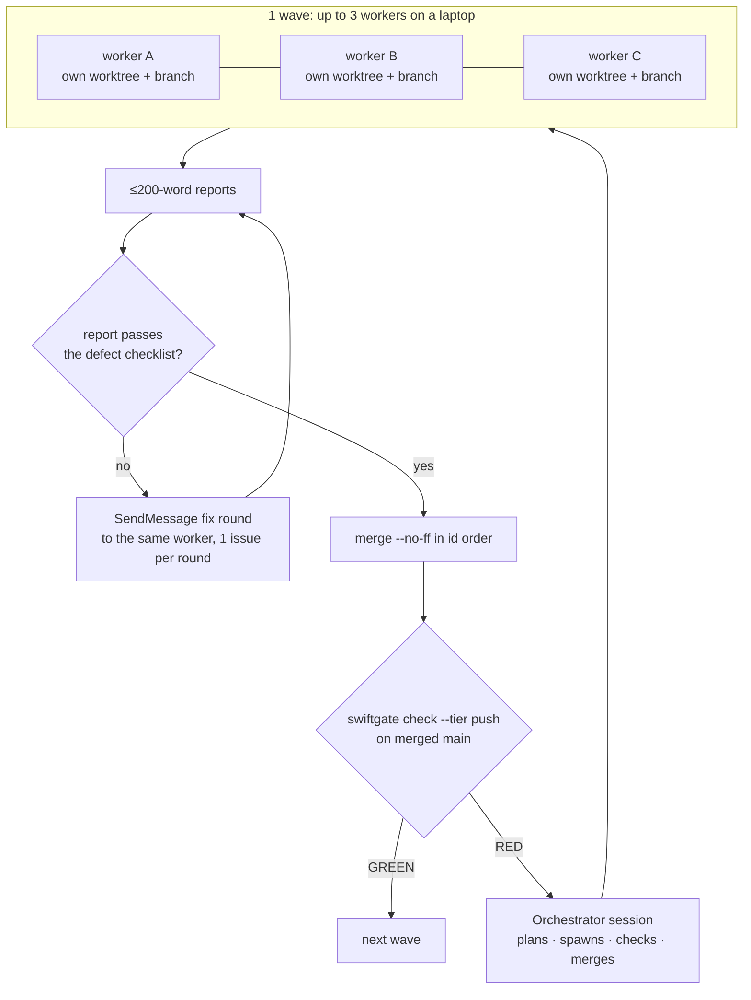

# swift-harness

**Hand Claude Code a spec. Get back a merged, GREEN, simulator-verified SwiftUI app, with the
evidence to prove it.**

swift-harness is a Claude Code plugin that lets agents take an iOS feature from a spec file to
merged code on `main` with no human input. 1 Swift CLI, `swiftgate`, judges every step, so an
agent can't talk its way past a check.

  

| 7 / 7 | ~30 min | ~$5.50 | 0 | 12 days | 2,752 |
|:---:|:---:|:---:|:---:|:---:|:---:|
| practice apps built spec to merged | per app, 25 to 32 min | mean cost per app | human inputs | from first commit to freeze | commits, 84% co-authored by Claude |

The numbers come from the [practice-app results](docs/results/2026-10-05-practice-app-results.md)
and the git history. The harness froze at the tag `harness-freeze-2026-10-05`.

This README tells 2 stories:

1. [**What the harness does**](#part-1-what-the-harness-does): 1 gate, hooks, skills, agents,
   simulator QA, anti-faking, a live dashboard and local telemetry.
2. [**How it got built**](#part-2-ai-native-engineering): 1 engineer as the
   orchestrator over fleets of Claude agents, 12 days, every merge behind the same gate.

---

## Part 1: what the harness does

### The problem

Coding agents write Swift fast. Left alone, they also drift: a `Date()` in a reducer, a singleton
behind a protocol, a `try!` with no reason, a test that passes whether the code works or not.
Rules in a prompt don't hold. The agent forgets them, and every place meant to enforce them checks
something a little different.

### The answer: there is 1 gate

`swiftgate` is a Swift CLI that owns every check: lint, architecture, test tiers, red/green proof,
mutation, simulator evidence. Hooks, skills, agents, workflows and git hooks all call it, and none
of them re-implement a check. **When the gate says GREEN, it's GREEN everywhere.**



`swiftgate` follows the layering it enforces. A pure domain module holds the logic, IO adapters sit
behind protocols, and a thin CLI wires them together. It knows 460+ rule ids, each documented in
[`standards.md`](plugin/docs/standards.md), and `swiftgate self-test` proves every code rule fires
on a seeded violation and passes clean code.

### Hooks keep the agent honest while it types

- **Every Swift edit** gets formatted and linted on the spot.
- **PreToolUse guards** (24 `guard.*` ids) deny raw `xcodebuild`, hand edits to snapshots or
  `Package.resolved`, and wiping every simulator. They parse the shell command itself, so a
  compound command or an env prefix can't slip a banned command past them.
- **Subagents never hit a permission prompt.** The hook allows or denies each call with a reason
  the agent can act on.
- **The session can't stop** while `swiftgate check --tier fast` is RED.
- **Hook latency is a tested budget:** the fastest of several PreToolUse runs stays under 50ms of
  CPU.

### 3 ways to run a change

| Command | Use it when | What happens |
|---|---|---|
| `/swift-harness:ship <spec>` | the change needs a design | preflight, design, plan, parallel build in git worktrees, simulator QA, report |
| `/swift-harness:sprint <spec>` | the spec already says what to build | 1 session, 1 branch, test-first slices behind a gate, no workers |
| `swiftgate run <spec.md>` | the repository isn't yours (brownfield) | plans and builds the spec headless, with no input, in a time box |



**`ship`** runs 7 steps from [its skill](plugin/skills/ship/SKILL.md) and stops at the first halt
(a RED `main` after the fixer, a design conflict, a spent time budget), naming the commands that
resume it. A preset with no design tier swaps step 2 for a 1-page spec page and a surface commit
([ADR 0003](docs/adrs/0003-ship-may-skip-the-design-step.md)). The build's `validate` stage runs the
simulator QA.

**`sprint`** writes a 1-page spec with 1 acceptance test per slice, lands a surface commit, builds
each slice test-first, and fast-forwards `main` only after a final `ready` gate.

**`run`** is the brownfield profile. `swiftgate discover --apply` infers the repository's own build
and test commands and keeps its config in the git directory
([design](docs/designs/2026-10-03-brownfield-profile-design.md)).

### 20 agents, each with 1 job

| Stage | Agents |
|---|---|
| Design research lanes | `design-lane-codebase`, `design-lane-apple-docs`, `design-lane-packages`, `design-lane-prior-decisions` |
| Design drafting and checks | `design-decomposer`, `design-drafter`, `design-claim-checker`, `design-evidence-auditor` |
| Design review | `design-challenger`, `design-pre-mortem`, `design-standards-conformance` |
| Build | `build-worker`, `build-fixer`, `brownfield-explorer` |
| Code review | `swiftui`, `concurrency`, `architecture`, `api-errors`, `test-quality`, `verifier` |

The 4 workflows (`design-research`, `design-review`, `build-task`, `review`) fan these out in
parallel. Design claims cite evidence with a hash, and `probe` compiles a design's API snippets
against the pinned packages. The `verifier` reproduces each review finding without seeing the
reviewer's reasoning, and `review-synth` returns merge, fix-then-merge or refactor-needed.

### Agents can't fake GREEN

| Check | What it proves |
|---|---|
| `prove` | every new or changed test fails on an assertion with the source change reverted |
| `mutate` | the tests kill mutants (flipped conditions and boundaries) on the changed lines |
| `reach` | each test, run alone, touches the module it claims to test |
| `surface-check` | a surface commit adds API and no behaviour: empty bodies, `.none` effects, `EmptyView` |
| `testlint` | no assertion-free, tautological, sleeping or wrong-tier tests |

Verdicts come from the test reports, not exit codes. A configured retry is itself a finding,
because retries hide flakes. Editing a design or build agent's prompt blocks `git push` until
`swiftgate calibrate` passes that agent again on labelled cases.

### QA that writes the checks before the code

- **Validation rows come first.** Each plan carries `validation.json`: 1 row per requirement, with
  layered checks (acceptance, then flow, then state). A validation worker writes them in its own
  worktree, against a contract of names and accessibility ids, before the feature code exists.
  `qa lint` checks the flow files offline.
- **Flows run in real simulators, on video.** `swiftgate qa run` runs each row once its tasks have
  merged. Flows drive the app through `agent-device` on simulators that `swiftgate sim` leases under
  a machine-wide cap, and every flow records video.
- **Every row ends with a result:** pass, red, unverified, waiting or abandoned. A red flow gets at
  most 2 repairs a run, and the fixer must judge it from the frames and reproduce it in a unit test.
- **`/swift-harness:qa` decides what to try; `swiftgate` decides pass or fail.**

### A judge for what static checks can't see

`swiftgate judge` asks whether a test would fail if its behaviour broke, plus 3 more questions, and
gets probabilities back. The backend is Claude, or a **Jev-to-Claude cascade**: TypeSafe's Jev
decision model (`jev-1.13.0`) answers first, and the answers it's unsure of escalate to Claude,
which also writes the reason for any block. In a benchmark of 66 labelled tests, 3 repeats each,
the cascade matched Claude at about a quarter of the cost
([summary](evals/results/2026-09-30-judge-benchmark/summary.md); 10 positives per question, so
the sample is small). The judge is off until a repository opts in, because it sends test source off
the machine ([ADR 0007](docs/adrs/0007-jev-is-an-opt-in-second-judge-backend.md)).

### Watch a run live


*The Board tab, rendered by `swiftgate report --html` from a captured test fixture.*

`swiftgate view` serves a live run viewer on `127.0.0.1`, polling every second, with a "now" strip
that shows each running task's phase, elapsed time and stall or halt badges.
`swiftgate report --html` writes the same page as a self-contained folder that opens offline.

| Tab | Shows |
|---|---|
| Overview | the run summary and a row per task |
| Timeline | every span at 1x, 2x or 4x zoom; RED spans explain why |
| Board | a kanban of queued, building, gating, review, merged and blocked |
| Graph | the task dependency graph, in waves |
| Spec | requirements mapped to tasks, commits and merge gates |
| Gates | every gate run, and each test `prove` ran |
| Tokens | tokens and dollar cost per task and role |
| Validation | each row's newest QA result, with per-step video |

The page is read-only and carries no source or prompts ([run viewer](plugin/docs/run-viewer.md)).

### Local telemetry, on by default

Typed JSON-lines events record gate runs and steps, every test result, hook decisions, cache
lookups and build halts with reasons. Token counts and cost come from Claude Code transcripts, read
offline: ids, models, counts and times, never text. Nothing leaves the machine, and telemetry never
gates a verdict. `swiftgate events summary` reports cost, gate time variance, flaky and slow tests
and halt waits ([telemetry](plugin/docs/telemetry.md)).

### Proof

- **7 practice apps, spec to merged code, no input.** Each started from a fresh clone of a shared
  starter project and a `spec.md`, and ran `swiftgate run` headless in a 40-minute box. All passed
  in 25 to 32 minutes (mean 29.0), at $4.36 to $6.86 a run. All 40 flow rows pass with simulator video
  ([results](docs/results/2026-10-05-practice-app-results.md)).

  | App | Attempts | Wall time | Cost |
  |---|---|---|---|
  | tic-tac-toe | 2 | 30.9 min | $4.36 |
  | send-money | 7 | 29.5 min | $5.88 |
  | price-tracker | 6 | 32.0 min | $5.45 |
  | pos-checkout | 1 | 25.1 min | $4.53 |
  | chat-app | 3 | 30.7 min | $5.83 |
  | pacman | 1 | 26.9 min | $5.81 |
  | swipe-arcade | 4 | 27.7 min | $6.86 |

- **Every layer catches its seed.** A fresh bootstrap of `examples/SampleApp` took 1 seeded
  violation per layer, from a `Date()` in Core to a surviving mutant. Each turned RED with the
  expected rule id, and a clean tree stayed GREEN at every tier
  ([end-to-end report](docs/e2e-report.md)).
- **Unattended sprints.** 2 headless `/swift-harness:sprint` runs built a persisted form and an
  approval workflow with undo: 31m 45s ($2.75) and 12m 28s ($1.02).
- **Evals grade the harness against labels it didn't write.** Rule corpora, hook payloads, injected
  faults, skill routing, seeded reviews and the judge benchmark. Most suites have 1 recorded run, so
  read each number with its sample size ([evals](evals/README.md)).

---

## Part 2: AI-native engineering

1 engineer built swift-harness in 12 days (2026-09-24 to 2026-10-05) by working as the
**orchestrator** over fleets of Claude agents. The engineer and the orchestrator session planned,
checked and merged. Agents wrote most of the code: 84% of commits carry a Claude co-author trailer.

### The numbers

| Measure | Value | How to check |
|---|---|---|
| Commits | 2,752 | `git rev-list --count HEAD` |
| Merge commits | 840 | `git rev-list --count --merges HEAD` |
| Worker branches merged as `Merge: <subject>` | 558 | `git log --format=%s \| grep -c '^Merge: '` |
| Commits co-authored by Claude | 2,316 (84%) | `git log --format=%B \| grep -c '^Co-Authored-By: Claude'` |
| Busiest day | 900 commits (2026-10-04) | `git log --format=%ad --date=short \| sort \| uniq -c` |
| `swiftgate` source / tests | ~133k / ~137k lines of Swift | `git ls-files plugin/gate/Sources` and `Tests`, counted with `wc -l` |
| Gate test suite | 4,689 tests at the freeze | the [results page](docs/results/2026-10-05-practice-app-results.md#harness-work-in-the-loop) |

### Waves of parallel workers



- **1 committer per worktree.** Each task gets its own `git worktree` and branch, with `.build`
  APFS-cloned from `main` so no worker pays for a cold SwiftSyntax build. Workers commit to their
  own branch and never push.
- **Only the orchestrator merges.** It merges in id order and runs the push gate on merged `main`
  after each batch. Branches that pass alone still break `main` about once per batch, so the full
  suite runs after every batch.
- **Test-first briefs.** Every worker gets the same [brief](docs/process/worker-brief.md): write the
  failing test first, named `<behavior> — catches <regression>`, and see it fail. Stay in the write
  set, use only captured fixtures, and self-gate before committing.
- **Reports get checked, not trusted.** The [runbook](docs/process/orchestrator-runbook.md) keeps a
  table of defects real reports hid: checks that can't fail, a second copy of shared logic, a new
  required flag with no caller updated. Every report gets read against it.
- **A push bar.** Each push followed 2 clean full-suite runs in a row and a leak scan.

### Speedups from measured runs

Speed work started from timings of real runs, with the harness's own telemetry and run reports,
not from reading code.

| Change | Before | After |
|---|---|---|
| Contract slice gate | 240 to 248 s | 55 to 58 s |
| Final prove, reusing the last merge gate's prove | 54 to 77 s | 9 s |
| Merge prove, with a kept, pre-built tree | 85 s | 65 s |
| QA capture per check | 1.1 to 1.3 s | 0.35 to 0.44 s |
| Guard refusals per run | 17 | 0 |

2 more attempted speedups showed no reliable measured win, so they stayed unmerged.

### Every failed app run became a generic fix

The 7 apps took 24 attempts. Each failure became 1 fix worker per finding, then a full suite run,
then the next attempt. No fix was app-specific:

| Failed attempt | Generic fix |
|---|---|
| The orchestrator hung on shell aliases waiting at a prompt | run sessions clear aliases and close stdin |
| A flow checked a short-lived state that no fake held still | contracts give each in-flight state a `held` scenario |
| A clock-driven screen had no way to hold still | `plan import` refuses such a screen with no held scenario |
| A real app defect was misread as a timing race | the fixer judges a red row from its frames and reproduces it in a unit test |
| QA's own captures were slower than the state they checked | 1 snapshot per check, images filled from the video |

### Evals keep the harness honest

Each eval grades the harness against independent labels, never its own output. Each grader is proven on
known-good and known-bad cases first, and every failure gets an error analysis. A miss in the
failure-modes suite (a mismatched Xcode pin) became a gate change. Most suites have 1 recorded run,
and sample sizes are small ([evals](evals/README.md)).

---

## Quick start

The repository is its own plugin marketplace, and the plugin it serves is `plugin/`. Register it
once per machine, then enable it only in the iOS repositories that use it:

```bash
claude plugin marketplace add calube/swift-harness      # or a local checkout path
cd /path/to/your-ios-app
claude plugin install swift-harness@swift-harness --scope project   # or --scope local
```

Then run `/swift-harness:bootstrap` in a session there. It runs `swiftgate bootstrap` (a dry run,
then `--apply`), which writes `.swiftgate.toml`, `AGENTS.md` and the git hooks, and links
`~/.local/bin/swiftgate`.

To try a checkout without installing anything, pass its plugin directory for 1 session:
`claude --plugin-dir /path/to/swift-harness/plugin`.

To pick up new commits, run `claude plugin marketplace update swift-harness`, then
`claude plugin update swift-harness@swift-harness`.

<details>
<summary>Why project or local scope, not user scope</summary>

`marketplace add` records the marketplace in your user settings but enables nothing. `--scope
project` writes the plugin to the repository's `.claude/settings.json`, which you commit:

```json
{
  "enabledPlugins": { "swift-harness@swift-harness": true }
}
```

`--scope local` writes the same key to `.claude/settings.local.json` instead, for you alone.
Avoid the default user scope: it loads the hooks in every session on the machine. They no-op
outside a repository with `.swiftgate.toml`, but each still spawns a process per tool call.

</details>

<details>
<summary>Why neither manifest pins a version</summary>

Claude Code takes an install's version from `plugin.json`'s `version`, then the marketplace
entry's `version`, then the first 12 characters of the marketplace clone's commit. `plugin
update` skips an install whose version string hasn't changed. Neither manifest pins a version, so
every commit counts as a new one. `swiftgate check --tier push` fails if either manifest gains a
`version` (`plugin-version.pinned`).

</details>

## The bar

The opinions live in [`standards.md`](plugin/docs/standards.md), and the gate enforces them.

| Area | Rule |
|---|---|
| Toolchain | Swift 6 language mode, iOS 18+, a pinned Xcode. `swiftgate doctor` blocks on a mismatch |
| Modules | A thin app target, logic in local packages. Each module has a kind: `feature`, `engine`, `render`, `library` or `client`. Core modules import no UI framework |
| Architecture | TCA 1.x by default: `@Reducer`, `@ObservableState`, `TestStore` |
| Determinism | No `Date()`, `UUID()`, `Task.sleep`, `asyncAfter` or `.random` in Core. Time, randomness and IO arrive through `@Dependency` |
| Services | Every service is a `FooClient` / `FooClientLive` pair. Vendor SDKs live only in `*Live` modules. No singletons |
| Logging | `LogClient` / `TracingClient` with privacy-tagged attributes. No `print`, no direct `Logger` |
| Escape hatches | `try!`, `as!`, `fatalError`, `@unchecked Sendable` and every suppression carry `// swiftgate:allow <rule> — <reason>` |
| Comments | Only what the code can't say. No restated code, no history, no codenames |
| Tests | 4 tiers with budgets: T0 static (under 5s), T1 host (under 60s), T2 simulator snapshots, T3 UI flows |

## Reference

<details>
<summary>Skills (17)</summary>

Each runs as `/swift-harness:<name>`.

| Skill | Use it to |
|---|---|
| `ship` | take a spec to merged, green code: design, plan, build and validate in 1 command |
| `sprint` | build a spec in 1 session on 1 branch, with no design doc or workers |
| `run` | drive the orchestrator session that `swiftgate run` launches in a brownfield clone |
| `design` | frame, research, draft, review, publish and amend a design before any code |
| `plan` | turn an approved design into a build plan of sized, scheduled tasks |
| `build` | run a plan's tasks in parallel worktrees until merged `main` is green |
| `qa` | check a change in a running simulator and report the verdict `swiftgate` prints |
| `bootstrap` | stamp or upgrade the harness in an iOS repository |
| `architecture` | pick a new module's kind and scaffold its packages |
| `tdd` | write a failing test first, then make it pass |
| `test-gate` | run the pre-ready gate and judge new tests for slop |
| `review` | run the multi-agent code review on a Swift change |
| `pr-feedback` | work review comments to a stopping rule: validate, fix, gate, reply, resolve |
| `comment-audit` | judge each comment a change adds: keep, trim or cut |
| `validate` | produce ready-for-review evidence and a PR body block |
| `prose` | write docs that pass the plain-English rules `swiftgate prose` checks |
| `status` | list active plans across this machine's bootstrapped repositories |

</details>

<details>
<summary><code>swiftgate</code> subcommands</summary>

Run `swiftgate <subcommand> --help` for any of these. Nested subcommands are in parentheses.

| Area | Subcommands |
|---|---|
| Gate tiers | `check`, `test`, `test-only`, `stats` |
| Static checks | `lint`, `arch`, `testlint`, `impact`, `comments`, `coverage`, `module-graph` |
| Test proof | `prove`, `mutate`, `reach`, `stress`, `snapshots` |
| Judge | `judge` (`tests`, `ask`, `bench`, `bench-render`, `events`, `diff-risk`) |
| Simulator QA | `sim` (`up`, `snap`, `verify`, `down`, and `hold`, which `sim up` starts), `qa` (`run`, `lint`, `adopt`, `stage`) |
| Design | `design-scope`, `design-lint`, `design-diff`, `design-render`, `design-telemetry`, `evidence`, `probe` |
| Plan and build | `plan` (`claim`, `release`, `set`, `confirm`, `surface`, `import`), `plan-schedule`, `plan-lint`, `ledger`, `index`, `build` (`start`, `next`, `merge`, `check-return`, `proof-bases`, `record-gate`, `finish`, `halt`, `resume`, `cutoff`, `gate-wait`, `no-repair`), `worktree`, `context-pack` |
| Fast modes | `sprint`, `spec-page`, `surface-check` |
| Brownfield | `run` (`start`, `report`, `checkout`, `clock`), `discover`, `warmup`, `claude`, `allow`, `xcode` |
| Review | `review-input`, `review-synth` |
| Runs and telemetry | `report`, `view`, `events` (`list`, `summary`, `ingest`, `span`) |
| Docs | `docs-lint`, `prose` |
| Harness | `bootstrap`, `doctor`, `gc`, `hook`, `self-test`, `calibrate` |

</details>

Every capability, with the command behind it: [`docs/capabilities.md`](docs/capabilities.md).

## Roadmap

- **Agentic profiling, designed and not built.** `swiftgate profile` and `leaks` would wrap
  `xctrace` and `leaks` and cut their output down to compact JSON an agent can read
  ([design](docs/designs/2026-09-28-agentic-profiling-design.md),
  [ADR 0006](docs/adrs/0006-profiling-wraps-xctrace-report-only-first.md)).
- **Open follow-ups from the freeze.** The
  [results page](docs/results/2026-10-05-practice-app-results.md#open-follow-ups-at-the-freeze)
  lists them. None blocks a passing run.

## Contributing

Contributor material (this README, `AGENTS.md`, `docs/`, `examples/`, `tests/`, `evals/`) stays at
the root. Everything consumers install lives in `plugin/`. Start at [`AGENTS.md`](AGENTS.md), then
[`docs/index.md`](docs/index.md). Multi-task work runs in waves: the
[orchestrator runbook](docs/process/orchestrator-runbook.md) drives them, and each worker follows
the [worker brief](docs/process/worker-brief.md).

```bash
cd plugin/gate
swift build && swift test && swift format lint --strict -r Sources Tests Package.swift
```

`swift test` also runs every `tests/*_test.mjs` (needs `node`) and `tests/shim_test.sh`, and
reports each as skipped when its interpreter is missing from `PATH`. `claude plugin validate .`
checks the marketplace manifest, and `claude plugin validate --strict plugin` checks the plugin;
`swiftgate check --tier ready` runs the latter.
