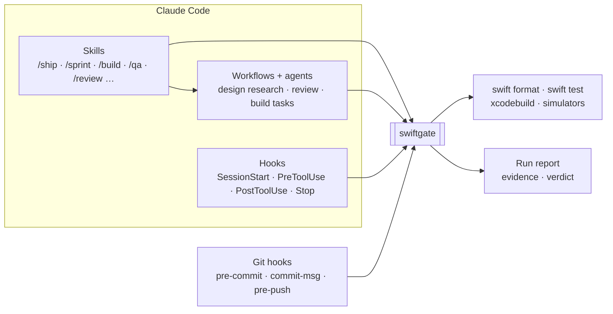

# swift-harness

A Claude Code plugin that holds agent-written SwiftUI code to a staff engineer's bar, and proves
it did.

  

**Status:** frozen at the tag `harness-freeze-2026-10-05`. 7 of 7 practice apps pass a one-shot,
spec-to-merged run with no human input. See the
[results](docs/results/2026-10-05-practice-app-results.md).

## Why

Coding agents write Swift fast. Left alone, they also drift: a `Date()` in a reducer, a singleton
behind a protocol, a `try!` with no reason, a test that passes whether the code works or not.
Rules in a prompt don't hold. The agent forgets them, and every place meant to enforce them checks
something a little different.

swift-harness fixes that with 1 rule: **there is 1 gate.** `swiftgate` is a Swift CLI that owns
every check: lint, architecture, test tiers, red/green proof, mutation, simulator evidence. Claude
Code hooks, skills, agents, workflows and git hooks all call it, and none of them re-implement a
check. When the gate says GREEN, it's GREEN everywhere.

## How it works



- **Hooks keep the agent honest while it types.** The hook formats and lints each Swift edit on
  the spot. It denies raw `xcodebuild`, hand edits to snapshots or `Package.resolved`, and
  wiping every simulator. The session can't stop while `swiftgate check --tier fast` is RED.
- **Git hooks hold the same line outside Claude.** Pre-commit and commit-msg check comments.
  Pre-push runs the push tier. They call the same binary.
- **Skills and workflows do the thinking; the gate does the judging.** Each step asks
  `swiftgate` for the verdict instead of deciding on its own.
- **`swiftgate` follows the layering it enforces.** It has a pure domain module, IO adapters
  behind protocols, and a thin CLI. `swiftgate self-test` proves its own rules.

## 3 ways to run a change

| Command | Use it when | What it does |
|---|---|---|
| `/swift-harness:ship <spec>` | a change needs a design | design, plan, then parallel build in git worktrees, then simulator QA |
| `/swift-harness:sprint <spec>` | the spec already says what to build | 1 session, 1 branch, test-first slices behind a gate, no workers |
| `swiftgate run <spec.md>` | the repository isn't yours (brownfield) | plans and builds the spec headless, with no input, in a time box, and writes nothing into the tree |

**`ship`** walks 5 stages and stops at the first halt (a RED `main` after the fixer, a design
conflict, a spent time budget), naming where to resume:

1. **Preflight.** `swiftgate doctor` checks the machine, the Xcode pin and a clean, warm `main`.
2. **Design.** Research agents read the codebase, Apple's docs, packages and prior decisions.
   Probes compile the risky claims. Challengers, a pre-mortem and a standards check review the
   draft before you approve it.
3. **Plan.** The design becomes sized tasks, and `swiftgate plan-schedule` orders them into waves.
4. **Build.** Each task runs test-first in its own worktree, in parallel. Every return gets
   checked and merged, and the merge gate runs on `main` after each merge.
5. **Validate.** Under a preset with `sim_qa = "changed"`, `/swift-harness:qa` drives the changed
   screens in a simulator and records video and accessibility evidence.

**`sprint`** writes a 1-page spec with 1 acceptance test per slice. It lands a surface commit that
`swiftgate surface-check` proves adds API and no behaviour, builds each slice test-first, and
fast-forwards `main` only after a final `ready` gate. `ship` can take the same shortcut under a
preset that skips design ([ADR 0003](docs/adrs/0003-ship-may-skip-the-design-step.md)).

**`run`** is the brownfield profile. `swiftgate discover --apply` infers the repository's own
build and test commands and keeps its config in the git directory. The run imports a plan,
builds tasks in parallel and proves every changed test fails with its change reverted
([design](docs/designs/2026-10-03-brownfield-profile-design.md)).

## Highlights

**Agents can't fake GREEN.**

- A new test has to fail with the source change reverted (`prove`), kill mutants on the changed
  lines (`mutate`), and reach the module it claims to test (`reach`).
- Verdicts come from the test reports, not exit codes. A configured retry is itself a finding,
  because retries hide flakes.
- Hooks parse the shell command itself, so compound commands and env prefixes don't get a banned
  command past them.

**The harness checks itself.**

- Every code rule has a seeded violation, and `swiftgate self-test` proves each one fires and that
  clean code passes.
- A test checks the rule table in `standards.md` against the rule registries, so no rule ships
  undocumented.
- Editing a design or build agent's prompt blocks `git push` until `swiftgate calibrate` passes
  that agent again on labelled cases.
- Hook latency is a tested budget: the fastest of several PreToolUse runs stays under 50ms of CPU.

**Parallel agents, 1 source of truth.**

- `plan-schedule` orders tasks into waves where no 2 tasks write the same files.
- 1 orchestrator lock per plan and a ledger that rejects illegal status changes keep parallel
  sessions from trampling each other.
- Subagents never hit a permission prompt. The hook allows or denies every call a subagent makes,
  with a reason the agent can act on.

**Evidence a person can check.**

- `/swift-harness:qa` drives the app in a simulator through `agent-device`. `swiftgate sim`
  leases a device on a machine-wide cap, and `swiftgate qa run` runs each requirement's
  acceptance, flow and state checks.
- `swiftgate view` serves a live run viewer, and `report --html` writes 1 offline page per
  build: timeline, tasks, gates, tokens and each flow's video.
- Local telemetry is on by default and never leaves the machine. It records no source, prompt or
  key ([`telemetry.md`](plugin/docs/telemetry.md)).

Every capability, with the command behind it: [`docs/capabilities.md`](docs/capabilities.md).

## The bar

The opinions live in [`standards.md`](plugin/docs/standards.md), and the gate enforces them.

| Area | Rule |
|---|---|
| Toolchain | Swift 6 language mode, iOS 18+, a pinned Xcode. `swiftgate doctor` blocks on a mismatch |
| Modules | A thin app target, logic in local packages. Each module has a kind: `feature`, `engine`, `render`, `library` or `client`. Core modules import no UI framework |
| Architecture | TCA 1.x by default: `@Reducer`, `@ObservableState`, `TestStore` |
| Determinism | No `Date()`, `UUID()`, `Task.sleep`, `asyncAfter` or `.random` in Core. Time, randomness and IO arrive through `@Dependency` |
| Services | Every service is a `FooClient` / `FooClientLive` pair. Vendor SDKs live only in `*Live` modules. No singletons |
| Logging | `LogClient` / `TracingClient` with privacy-tagged attributes. No `print`, no direct `Logger` |
| Escape hatches | `try!`, `as!`, `fatalError`, `@unchecked Sendable` and every suppression carry `// swiftgate:allow <rule> — <reason>` |
| Comments | Only what the code can't say. No restated code, no history, no codenames |

**Tests** come in 4 tiers, each with a budget: T0 static (under 5s), T1 host (under 60s), T2
simulator snapshots, and T3 UI flows. Tests that assert nothing, are tautological, sleep, or sit
in the wrong tier fail `swiftgate testlint`.

**An opt-in judge** reads what static checks can't. `swiftgate judge` asks a model whether a test
would fail if its behaviour broke, plus 3 more questions. It stays off until a repository opts
in, because it sends test source off the machine. The backend is Claude, or TypeSafe's Jev
(`jev-1.13.0`), which hands the answers it's unsure of to Claude.

## Proof

The harness gets tested the way it tests apps: seeded failures, real runs, recorded verdicts.

- **7 practice apps, spec to merged code, no input.** Each started from a fresh clone and a
  `spec.md`, with a 40-minute box. All 7 pass, in 25 to 32 minutes and $4.36 to $6.86 a run.
  Reaching that took 24 attempts, and each failure became a generic harness fix
  ([results](docs/results/2026-10-05-practice-app-results.md)).
- **Every layer catches its seed.** A fresh bootstrap of `examples/SampleApp` took 1 seeded
  violation per layer, from a `Date()` in Core to a surviving mutant. Each turned RED with the
  expected rule id, and a clean tree stayed GREEN at every tier
  ([end-to-end report](docs/e2e-report.md)).
- **Unattended sprints.** 2 headless `/swift-harness:sprint` runs built a persisted form and an
  approval workflow with undo, with no questions: 31m 45s ($2.75) and 12m 28s ($1.02).
- **The gate tests itself.** `swiftgate` carries about 4,700 Swift Testing tests against fixtures
  captured from real tool runs, never hand-written.
- **Evals measure the harness from outside.** Rule corpora, hook payloads, injected faults, skill
  routing, seeded reviews and a judge benchmark, each graded against labels the harness didn't
  produce. Most suites have 1 recorded run, and sample sizes are small
  ([evals](evals/README.md)).

## Quick start

The repository is its own plugin marketplace, and the plugin it serves is `plugin/`. Register it
once per machine, then enable it only in the iOS repositories that use it:

```bash
claude plugin marketplace add calube/swift-harness      # or a local checkout path
cd /path/to/your-ios-app
claude plugin install swift-harness@swift-harness --scope project   # or --scope local
```

Then run `/swift-harness:bootstrap` in a session there. It runs `swiftgate bootstrap` (a dry run,
then `--apply`), which writes `.swiftgate.toml`, `AGENTS.md` and the git hooks, and links
`~/.local/bin/swiftgate`.

To try a checkout without installing anything, pass its plugin directory for 1 session:
`claude --plugin-dir /path/to/swift-harness/plugin`.

To pick up new commits, run `claude plugin marketplace update swift-harness`, then
`claude plugin update swift-harness@swift-harness`.

<details>
<summary>Why project or local scope, not user scope</summary>

`marketplace add` records the marketplace in your user settings but enables nothing. `--scope
project` writes the plugin to the repository's `.claude/settings.json`, which you commit:

```json
{
  "enabledPlugins": { "swift-harness@swift-harness": true }
}
```

`--scope local` writes the same key to `.claude/settings.local.json` instead, for you alone.
Avoid the default user scope: it loads the hooks in every session on the machine. They no-op
outside a repository with `.swiftgate.toml`, but each still spawns a process per tool call.

</details>

<details>
<summary>Why neither manifest pins a version</summary>

Claude Code takes an install's version from `plugin.json`'s `version`, then the marketplace
entry's `version`, then the first 12 characters of the marketplace clone's commit. `plugin
update` skips an install whose version string hasn't changed. Neither manifest pins a version, so
every commit counts as a new one. `swiftgate check --tier push` fails if either manifest gains a
`version` (`plugin-version.pinned`).

</details>

## Reference

### Skills

Each runs as `/swift-harness:<name>`.

| Skill | Use it to |
|---|---|
| `ship` | take a spec to merged, green code: design, plan, build and validate in 1 command |
| `sprint` | build a spec in 1 session on 1 branch, with no design doc or workers |
| `run` | drive the orchestrator session that `swiftgate run` launches in a brownfield clone |
| `design` | frame, research, draft, review, publish and amend a design before any code |
| `plan` | turn an approved design into a build plan of sized, scheduled tasks |
| `build` | run a plan's tasks in parallel worktrees until merged `main` is green |
| `qa` | check a change in a running simulator and report the verdict `swiftgate` prints |
| `bootstrap` | stamp or upgrade the harness in an iOS repository |
| `architecture` | pick a new module's kind and scaffold its packages |
| `tdd` | write a failing test first, then make it pass |
| `test-gate` | run the pre-ready gate and judge new tests for slop |
| `review` | run the multi-agent code review on a Swift change |
| `pr-feedback` | work review comments to a stopping rule: validate, fix, gate, reply, resolve |
| `comment-audit` | judge each comment a change adds: keep, trim or cut |
| `validate` | produce ready-for-review evidence and a PR body block |
| `prose` | write docs that pass the plain-English rules `swiftgate prose` checks |
| `status` | list active plans across this machine's bootstrapped repositories |

<details>
<summary><code>swiftgate</code> subcommands</summary>

Run `swiftgate <subcommand> --help` for any of these.

| Area | Subcommands |
|---|---|
| Gate tiers | `check`, `test`, `test-only`, `stats` |
| Static checks | `lint`, `arch`, `testlint`, `impact`, `comments`, `coverage`, `module-graph` |
| Test proof | `prove`, `mutate`, `reach`, `stress`, `snapshots` |
| Judge | `judge` (`tests`, `ask`, `bench`, `bench-render`, `events`, `diff-risk`) |
| Simulator QA | `sim` (`up`, `snap`, `verify`, `down`), `qa` (`run`, `lint`, `adopt`, `stage`) |
| Design | `design-scope`, `design-lint`, `design-diff`, `design-render`, `design-telemetry`, `evidence`, `probe` |
| Plan and build | `plan`, `plan-schedule`, `plan-lint`, `ledger`, `index`, `build`, `worktree`, `context-pack` |
| Fast modes | `sprint`, `spec-page`, `surface-check` |
| Brownfield | `run`, `discover`, `warmup`, `claude`, `allow`, `xcode` |
| Review | `review-input`, `review-synth` |
| Runs and telemetry | `report`, `view`, `events` |
| Docs | `docs-lint`, `prose` |
| Harness | `bootstrap`, `doctor`, `gc`, `hook`, `self-test`, `calibrate` |

</details>

## Roadmap

- **Agentic profiling, designed and not built.** `swiftgate profile` and `leaks` would wrap
  `xctrace` and `leaks` and cut their output down to compact JSON an agent can read. They start
  report-only, measured per signpost.
  [Design](docs/designs/2026-09-28-agentic-profiling-design.md) ·
  [ADR 0006](docs/adrs/0006-profiling-wraps-xctrace-report-only-first.md)
- **Open follow-ups from the freeze.** The [results page](docs/results/2026-10-05-practice-app-results.md#open-follow-ups-at-the-freeze)
  lists them. None blocks a passing run.

## Contributing

Contributor material (this README, `AGENTS.md`, `docs/`, `examples/`, `tests/`, `evals/`) stays at
the root. Everything consumers install lives in `plugin/`. Start at [`AGENTS.md`](AGENTS.md), then
[`docs/index.md`](docs/index.md).

```bash
cd plugin/gate
swift build && swift test && swift format lint --strict -r Sources Tests Package.swift
```

`swift test` also runs every `tests/*_test.mjs` (needs `node`) and `tests/shim_test.sh`, and
reports each as skipped when its interpreter is missing from `PATH`. `claude plugin validate .`
checks the marketplace manifest, and `claude plugin validate --strict plugin` checks the plugin;
`swiftgate check --tier ready` runs the latter.
