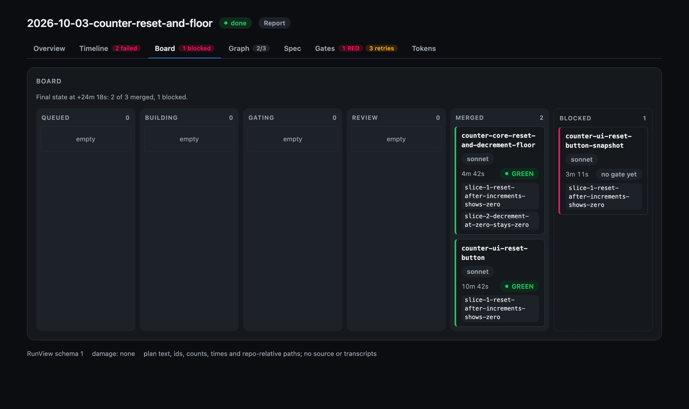

# swift-harness

**Hand Claude Code a spec. Get back a merged, GREEN, simulator-verified SwiftUI app, with the evidence.**

  

| 7 / 7 | ~30 min | ~$5.50 | 0 | 12 days | 2,752 |
|:---:|:---:|:---:|:---:|:---:|:---:|
| practice apps, spec to merged | per app (25 to 32) | mean cost per app | human inputs | first commit to freeze | commits, 84% co-authored by Claude |

A Claude Code plugin. 1 Swift CLI, `swiftgate`, judges every step, so an agent can't talk its way
past a check. Frozen at `harness-freeze-2026-10-05`.

## 1 gate

Every hook, skill, workflow and git hook calls `swiftgate`. None re-implements a check.


## A brownfield run

`swiftgate run spec.md`: a repository the harness doesn't own, 1 spec, 0 questions, nothing written
into the user's tree.


Also: `/swift-harness:ship` (design, plan, parallel build, QA) and `/swift-harness:sprint` (1
branch, test-first slices) for repositories the harness owns.

## Model-judged decisions

Jev answers first; Claude takes the uncertain answers and writes the reason for every block. Off
until a repository opts in ([ADR 0007](docs/adrs/0007-jev-is-an-opt-in-second-judge-backend.md),
[benchmark](evals/results/2026-09-30-judge-benchmark/summary.md)).


## Telemetry and the live dashboard

Local only, on by default, never gates a verdict. `swiftgate view` serves it live;
`swiftgate report --html` writes it offline ([run viewer](plugin/docs/run-viewer.md),
[telemetry](plugin/docs/telemetry.md)).




## Agents can't fake GREEN

| Check | Proves |
|---|---|
| `prove` | each new or changed test fails with its source change reverted |
| `mutate` | the tests kill mutants on the changed lines |
| `reach` | each test, run alone, touches the module it claims to test |
| `surface-check` | a surface commit adds API and no behaviour |
| `testlint` | no assertion-free, tautological, sleeping or wrong-tier tests |
| hooks | 24 guards deny raw `xcodebuild`, snapshot edits and more; the session can't stop RED |

## Proof

Each app: a fresh clone, a `spec.md`, headless `swiftgate run`, a 40-minute box, 0 inputs.

| App | Attempts | Wall time | Cost |
|---|---|---|---|
| tic-tac-toe | 2 | 30.9 min | $4.36 |
| send-money | 7 | 29.5 min | $5.88 |
| price-tracker | 6 | 32.0 min | $5.45 |
| pos-checkout | 1 | 25.1 min | $4.53 |
| chat-app | 3 | 30.7 min | $5.83 |
| pacman | 1 | 26.9 min | $5.81 |
| swipe-arcade | 4 | 27.7 min | $6.86 |

- **Seeded violations:** 1 per layer, each RED with the expected rule id; a clean tree GREEN at
  every tier ([end-to-end report](docs/e2e-report.md)).
- **Evals:** graded against labels the harness didn't write; small samples ([evals](evals/README.md)).
- **Details:** [practice-app results](docs/results/2026-10-05-practice-app-results.md).

## Built by 1 engineer and fleets of Claude agents

12 days. The engineer orchestrated; agents wrote the code in parallel worktrees; every merge passed the
same gate.

| Commits | Merges | Claude co-authored | Gate source / tests | Gate tests |
|:---:|:---:|:---:|:---:|:---:|
| 2,752 | 840 | 84% | ~133k / ~137k lines | 4,689 |


| Measured speedup | Before | After |
|---|---|---|
| Contract slice gate | 240 to 248 s | 55 to 58 s |
| Final prove | 54 to 77 s | 9 s |
| QA capture per check | 1.1 to 1.3 s | 0.35 to 0.44 s |
| Guard refusals per run | 17 | 0 |

Every failed app run (24 attempts for 7 apps) became a generic harness fix, never an app-specific
one. Process: [orchestrator runbook](docs/process/orchestrator-runbook.md) ·
[worker brief](docs/process/worker-brief.md).

## Quick start

The repository is its own plugin marketplace, and the plugin it serves is `plugin/`. Register it
once per machine, then enable it only in the iOS repositories that use it:

```bash
claude plugin marketplace add calube/swift-harness      # or a local checkout path
cd /path/to/your-ios-app
claude plugin install swift-harness@swift-harness --scope project   # or --scope local
```

Then run `/swift-harness:bootstrap` in a session there. It runs `swiftgate bootstrap` (a dry run,
then `--apply`), which writes `.swiftgate.toml`, `AGENTS.md` and the git hooks, and links
`~/.local/bin/swiftgate`.

To try a checkout without installing anything, pass its plugin directory for 1 session:
`claude --plugin-dir /path/to/swift-harness/plugin`.

To pick up new commits, run `claude plugin marketplace update swift-harness`, then
`claude plugin update swift-harness@swift-harness`.

<details>
<summary>Why project or local scope, not user scope</summary>

`marketplace add` records the marketplace in your user settings but enables nothing. `--scope
project` writes the plugin to the repository's `.claude/settings.json`, which you commit:

```json
{
  "enabledPlugins": { "swift-harness@swift-harness": true }
}
```

`--scope local` writes the same key to `.claude/settings.local.json` instead, for you alone.
Avoid the default user scope: it loads the hooks in every session on the machine. They no-op
outside a repository with `.swiftgate.toml`, but each still spawns a process per tool call.

</details>

<details>
<summary>Why neither manifest pins a version</summary>

Claude Code takes an install's version from `plugin.json`'s `version`, then the marketplace
entry's `version`, then the first 12 characters of the marketplace clone's commit. `plugin
update` skips an install whose version string hasn't changed. Neither manifest pins a version, so
every commit counts as a new one. `swiftgate check --tier push` fails if either manifest gains a
`version` (`plugin-version.pinned`).

</details>

<details>
<summary>The bar</summary>

The gate enforces [`standards.md`](plugin/docs/standards.md).

| Area | Rule |
|---|---|
| Toolchain | Swift 6 language mode, iOS 18+, a pinned Xcode. `swiftgate doctor` blocks on a mismatch |
| Modules | A thin app target, logic in local packages. Each module has a kind: `feature`, `engine`, `render`, `library` or `client`. Core modules import no UI framework |
| Architecture | TCA 1.x by default: `@Reducer`, `@ObservableState`, `TestStore` |
| Determinism | No `Date()`, `UUID()`, `Task.sleep`, `asyncAfter` or `.random` in Core. Time, randomness and IO arrive through `@Dependency` |
| Services | Every service is a `FooClient` / `FooClientLive` pair. Vendor SDKs live only in `*Live` modules. No singletons |
| Logging | `LogClient` / `TracingClient` with privacy-tagged attributes. No `print`, no direct `Logger` |
| Escape hatches | `try!`, `as!`, `fatalError`, `@unchecked Sendable` and every suppression carry `// swiftgate:allow <rule> — <reason>` |
| Comments | Only what the code can't say. No restated code, no history, no codenames |
| Tests | 4 tiers with budgets: T0 static (under 5s), T1 host (under 60s), T2 simulator snapshots, T3 UI flows |

</details>

## Reference

<details>
<summary>Skills (17)</summary>

Each runs as `/swift-harness:<name>`.

| Skill | Use it to |
|---|---|
| `ship` | take a spec to merged, green code: design, plan, build and validate in 1 command |
| `sprint` | build a spec in 1 session on 1 branch, with no design doc or workers |
| `run` | drive the orchestrator session that `swiftgate run` launches in a brownfield clone |
| `design` | frame, research, draft, review, publish and amend a design before any code |
| `plan` | turn an approved design into a build plan of sized, scheduled tasks |
| `build` | run a plan's tasks in parallel worktrees until merged `main` is green |
| `qa` | check a change in a running simulator and report the verdict `swiftgate` prints |
| `bootstrap` | stamp or upgrade the harness in an iOS repository |
| `architecture` | pick a new module's kind and scaffold its packages |
| `tdd` | write a failing test first, then make it pass |
| `test-gate` | run the pre-ready gate and judge new tests for slop |
| `review` | run the multi-agent code review on a Swift change |
| `pr-feedback` | work review comments to a stopping rule: validate, fix, gate, reply, resolve |
| `comment-audit` | judge each comment a change adds: keep, trim or cut |
| `validate` | produce ready-for-review evidence and a PR body block |
| `prose` | write docs that pass the plain-English rules `swiftgate prose` checks |
| `status` | list active plans across this machine's bootstrapped repositories |

</details>

<details>
<summary><code>swiftgate</code> subcommands</summary>

Run `swiftgate <subcommand> --help` for any of these. Nested subcommands are in parentheses.

| Area | Subcommands |
|---|---|
| Gate tiers | `check`, `test`, `test-only`, `stats` |
| Static checks | `lint`, `arch`, `testlint`, `impact`, `comments`, `coverage`, `module-graph` |
| Test proof | `prove`, `mutate`, `reach`, `stress`, `snapshots` |
| Judge | `judge` (`tests`, `ask`, `bench`, `bench-render`, `events`, `diff-risk`) |
| Simulator QA | `sim` (`up`, `snap`, `verify`, `down`, and `hold`, which `sim up` starts), `qa` (`run`, `lint`, `adopt`, `stage`) |
| Design | `design-scope`, `design-lint`, `design-diff`, `design-render`, `design-telemetry`, `evidence`, `probe` |
| Plan and build | `plan` (`claim`, `release`, `set`, `confirm`, `surface`, `import`), `plan-schedule`, `plan-lint`, `ledger`, `index`, `build` (`start`, `next`, `merge`, `check-return`, `proof-bases`, `record-gate`, `finish`, `halt`, `resume`, `cutoff`, `gate-wait`, `no-repair`), `worktree`, `context-pack` |
| Fast modes | `sprint`, `spec-page`, `surface-check` |
| Brownfield | `run` (`start`, `report`, `checkout`, `clock`), `discover`, `warmup`, `claude`, `allow`, `xcode` |
| Review | `review-input`, `review-synth` |
| Runs and telemetry | `report`, `view`, `events` (`list`, `summary`, `ingest`, `span`) |
| Docs | `docs-lint`, `prose` |
| Harness | `bootstrap`, `doctor`, `gc`, `hook`, `self-test`, `calibrate` |

</details>

Every capability, with the command behind it: [`docs/capabilities.md`](docs/capabilities.md).

## Roadmap

- **Agentic profiling, designed and not built.** `swiftgate profile` and `leaks` would wrap
  `xctrace` and `leaks` and cut their output down to compact JSON an agent can read
  ([design](docs/designs/2026-09-28-agentic-profiling-design.md),
  [ADR 0006](docs/adrs/0006-profiling-wraps-xctrace-report-only-first.md)).
- **Open follow-ups from the freeze.** The
  [results page](docs/results/2026-10-05-practice-app-results.md#open-follow-ups-at-the-freeze)
  lists them. None blocks a passing run.

## Contributing

Contributor material (this README, `AGENTS.md`, `docs/`, `examples/`, `tests/`, `evals/`) stays at
the root. Everything consumers install lives in `plugin/`. Start at [`AGENTS.md`](AGENTS.md), then
[`docs/index.md`](docs/index.md). Multi-task work runs in waves: the
[orchestrator runbook](docs/process/orchestrator-runbook.md) drives them, and each worker follows
the [worker brief](docs/process/worker-brief.md).

```bash
cd plugin/gate
swift build && swift test && swift format lint --strict -r Sources Tests Package.swift
```

`swift test` also runs every `tests/*_test.mjs` (needs `node`) and `tests/shim_test.sh`, and
reports each as skipped when its interpreter is missing from `PATH`. `claude plugin validate .`
checks the marketplace manifest, and `claude plugin validate --strict plugin` checks the plugin;
`swiftgate check --tier ready` runs the latter.
