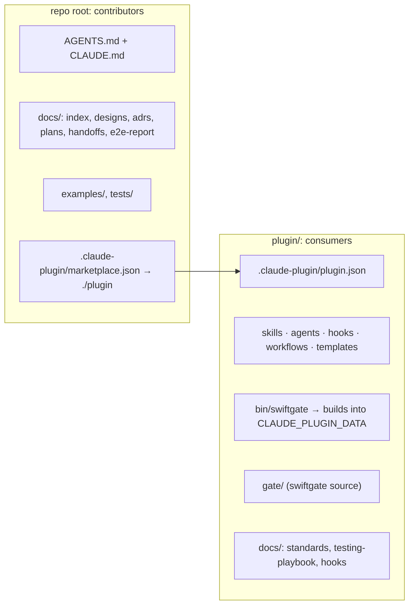

# 0002. Consumer plugin lives in `plugin/`

Status: accepted, 2026-09-25. Changes the plugin layout in the Foundation design (§4.1). Lands as the
packaging task before the first real install.

## Context

The repo serves two audiences. Contributors build the harness: they need designs, ADRs, plans, handoffs,
the e2e report, gate tests and an `AGENTS.md` about developing the plugin. Consumers install the plugin
into their app sessions: they need skills, agents, hooks, workflows, templates, the `swiftgate` source
and the standards and playbook that skills read at runtime.

Today the repo root is the plugin root, so both audiences get the same tree. The Claude Code plugin docs
settle three facts that make this untenable:

- Install copies only the plugin directory into the cache, and paths that escape it fail
  ([plugin loading](https://code.claude.com/docs/en/plugins/loading.md#in-place-and-copied-plugins)).
- A root `CLAUDE.md` is never loaded as context, and `claude plugin validate` warns when it finds one
  ([manifest reference](https://code.claude.com/docs/en/plugins/manifest-reference.md)). Consumer
  instructions reach sessions through skills, agents, hooks, and the `AGENTS.md` that bootstrap stamps.
- A marketplace `source` can be a relative subdirectory such as `"./plugin"`
  ([marketplace reference](https://code.claude.com/docs/en/plugins/marketplace-reference.md#relative-path-plugin-source)).
  There is no ignore or `files` list, so the directory itself decides what ships.

## Decision

- `plugin/` is a hand-maintained source directory, not generated output, so nothing can drift from source.
- The shim builds `swiftgate` into `${CLAUDE_PLUGIN_DATA}`, keyed by source hash. That directory persists
  across plugin updates; the per-version cache dir does not.
- The consumer's agent guide is `plugin/templates/AGENTS.md`, which bootstrap stamps into each app repo.
  The root `AGENTS.md` is for contributors only.

## Consequences

- Consumers compile SwiftSyntax on the first run of each version, which takes minutes, and they receive
  `gate/Tests`. A prebuilt binary release can remove both later, without changing this layout.
- Every source path moves once. The move runs after all code waves of the design-and-plan build, so no
  in-flight task collides with it.
- `claude plugin validate plugin` becomes part of the ready gate for the plugin repo.

## Alternatives rejected

- **Generated `dist/` with a prebuilt binary.** No compile step for consumers, but it needs a release
  pipeline and a binary in git, and `dist/` can drift unless only the release step writes it.
- **Root stays the plugin, contributor material moves to `dev/`.** The contributor `AGENTS.md` would leave
  the root, so agents editing `gate/` or `skills/` would never find it.
