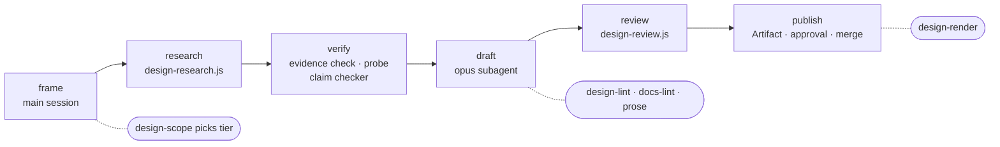
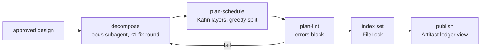

# swift-harness: design and plan workflows

**Status: Built.** `/swift-harness:design`, `/swift-harness:plan`, their 11 agents and every `swiftgate` command
in §6.1 ship in the plugin. The plan skill later gained a second input, a confirmed spec page, which this design
predates (see the note in §3.2).

**In brief.** This design adds 2 plugin skills. `/swift-harness:design` turns a feature request into a design
doc the user approves, and `/swift-harness:plan` turns that design into tasks a build can schedule. They exist to
keep invented APIs and unchecked claims out of a design's decisions: every claim cites a checked quote, a captured
command output or a compiled probe. The design skill researches with parallel agents, checks claims with
`swiftgate evidence` and `swiftgate probe`, and lints the doc. 3 reviewers read it before the user approves it on
a published page. The plan skill splits the design into tasks, schedules them into waves with
`swiftgate plan-schedule`, lints the result, and keeps plan state in the git common dir that every worktree shares.

<!-- RESUME
Status: APPROVED 2026-09-25. Built. The brainstorm decisions record (D1–D20; D19 amends D11) and the plan now live only in the tag `harness-freeze-2026-10-05`.
Read first: this header → §2 (decision map) → the section you need. Grep; don't read the whole file.
Corrects Foundation spec §2 row 2 and §4.2 (plan-state location, "ledger canonical in git") — see §15.
Open: agent_id not yet seen live in hook payloads; Artifact runtime capabilities (comments, db) are a claude.ai dependency.
-->

## 1. Purpose

Two plugin skills that turn a feature request into an approved, evidence-backed design and a
schedulable plan:

- **`/swift-harness:design`** — frames the problem with the user, researches with cited evidence,
  proves API claims with symbol probes, drafts a template-linted design doc, reviews it with three
  agents, and publishes it as a commentable Claude Artifact the user approves.
- **`/swift-harness:plan`** — decomposes an approved design into tasks with write sets, gates, test
  coverage and sizes, schedules them into waves deterministically, and lints the result.

Hallucination is the failure this sub-project exists to prevent: nothing reaches a design's
Decision section unless a deterministic check or a probe backs it.

### Non-goals (sub-project 2)

- Creating worktrees, executing waves, the build loop, merging task branches — sub-project 5.
  Sub-project 2 defines the formats and protocols sub-project 5 consumes: `ledger.json`, the
  `design-conflict` report, the `needs-replan` task state, and worker context packs.
- Simulator QA and profiling evidence — sub-projects 3 and 4.
- CI. Every check is a `swiftgate` command a CI job could later call.

## 2. Decision map

Every locked decision and where this spec carries it. Doubles as the self-review checklist.

| Decision | Subject | Section |
|---|---|---|
| D1 | Skill-sequenced phases, two small workflows, gates between, halt/ask/resume | §3, §7 |
| D2 | Models: `sonnet` for lanes + probe authoring, `opus` for judgment; no relay agent types | §7.3 |
| D3 | Claim schema, citation kinds, `evidence check` rules | §5.2, §6.2 |
| D4 | `swiftgate probe` | §6.2 |
| D5 | `design-lint` tagging rules | §5.3, §6.2 |
| D6 | Review agents, finding contract, verdicts, one revise round | §7.2, §8.2 |
| D7 | Artifact approval + `--revise` | §8.3 |
| D8 | Design drift, `--amend`, `design-diff`, `needs-replan` | §5.5, §5.9, §8.4 |
| D9 | Staleness | §8.5 |
| D10 | Reuse cache | §8.6 |
| D11 | Durable (committed) vs ephemeral; no plan branch | §4 |
| D12 | Design doc shape and doc layout | §4, §5.3 |
| D13 | `docs-lint`, status frontmatter | §5.4, §6.2 |
| D14 | Depth tiers, `design-scope` | §8.1 |
| D15 | Ledger schema, `plan-schedule`, `plan-lint`, decomposer | §5.7, §6.2, §9 |
| D16 | Task sizing | §9.3 |
| D17 | Context engineering | §5.10, §10 |
| D18 | Id policy | §5.1 |
| D19 | Shared state in the git common dir; Foundation edits | §4, §6.3 |
| D20 | Proving the harness catches lies | §12, §13 |
| D21 | Artifacts are visual-first views, not transcribed text | §6.2 (`design-render`) |
| D22 | Repo design docs carry Mermaid diagrams | §5.3, §6.2 |
| D23 | Conciseness by prose word budgets | §5.3, §6.2 |
| D24 | Plugin-owned `prose` skill + `swiftgate prose`, written fresh | §6.2, §7.3 |
| D25 | Relative paths only | §6.2 (`docs-lint` local-paths family), write-time hook |
| D26 | Contributor/consumer split + steering | [ADR 0002](../adrs/0002-consumer-plugin-in-plugin-dir.md) |

## 3. Architecture

### 3.1 `/swift-harness:design` phases



Any phase boundary can halt → `AskUserQuestion` → resume (§3.4).

| Phase | Runs in | Does | Exit gate |
|---|---|---|---|
| frame | main session | clarify goal, area, constraints via `AskUserQuestion` only (multiple choice, recommended first); answers recorded as `answer` claims; `swiftgate design-scope` recommends a tier | user confirms tier |
| research | `design-research.js` | ≤4 read-only lanes emit claim records and probe snippets | every lane returned or marked `NOT RESEARCHED` |
| verify | main session | `swiftgate evidence check` (mechanical), `swiftgate probe` (API existence/signature), opus claim checker on `quote-ok` claims | claims carry final status |
| draft | opus subagent (Agent tool) | writes the doc from the template using only `supported` claims | `design-lint` + `docs-lint` pass |
| review | `design-review.js` | 3 reviewers → verdict | `ready`, or one revise round then user |
| publish | main session | `design-render` → Artifact; commit on `design/<slug>`, open PR; read approval; merge | approval record `{decision, designSha, at}` |

### 3.2 `/swift-harness:plan` phases



Runs only when the design's approval record matches its current `designSha` (directly or through a
valid clarify chain, §8.4). Writes `plan.json` and `ledger.json` under the git common dir (§4).

> Note: the shipped plan skill also plans from a confirmed spec page with no design doc (`"source": "specPage"`).
> It confirms the page with `swiftgate plan confirm` and lands its surface commit with `swiftgate plan surface`.
> The [fast modes design](2026-09-27-fast-modes-design.md) §5 describes that path.

### 3.3 Split of responsibility

| Layer | Owns | Never does |
|---|---|---|
| Skill (`skills/design`, `skills/plan`) | phase order, user questions, writing files, publishing Artifacts, calling gates | re-implement a check (Foundation §4.3) |
| Workflow script (`workflows/design-research.js`, `workflows/design-review.js`) | parallel agent fan-out, structured returns, early return with `needsDecision[]` | touch the filesystem or network, publish, ask the user |
| Agent-tool subagent | single-agent judgment steps: claim checker, drafter, decomposer | write design, evidence, ledger or index files (guarded, §6.3) |
| `swiftgate` | every deterministic check and state write (`evidence`, `probe`, `design-*`, `docs-lint`, `plan-*`, `context-pack`, `index set`) | call agents, except `calibrate design` (§6.2) |

All design artifacts (doc, evidence, amendments) are written by the orchestrating main session.
Agents return content; the skill writes it. This keeps the D8 guard uniform: any non-orchestrator
write to those paths is denied.

### 3.4 Escalation: halt, ask, resume

Workflow `agent()` calls cannot block for a reply, and the script API has no pause primitive
(verified). So:

1. A workflow agent that needs a user decision returns it in its structured result:
   `{question, options[2–4], recommendation, evidence[]}`.
2. The script returns early with `needsDecision[]` once the current fan-out settles.
3. The skill merges concurrent asks (≤4 per `AskUserQuestion` prompt, recommended option first),
   asks, and records each answer as an `answer` claim.
4. The skill relaunches the workflow with `resumeFromRunId`. The unchanged `agent()` prefix replays
   from cache; only agents downstream of the answer re-run.

Escalation happens only at phase boundaries. Gate failures between phases follow the same path when
they need a user call (for example, a probe refutes the only viable option).

## 4. Storage model

| Class | Location | Contents | Why here |
|---|---|---|---|
| Committed (durable) | `docs/<area>/designs/<slug>.md` | design doc | reviewed and approved artifact; outlives the plan |
| Committed | `docs/<area>/designs/<slug>.evidence/` | `claims.jsonl`, `amendments.jsonl`, `answers.jsonl`, `review-log.jsonl`, `snapshots/`, `captures/`, `probes/` | citations must travel with the doc |
| Committed | `docs/<area>/adrs/NNNN-<title>.md` | ADR for the decision (standard and deep tiers) | design history is load-bearing |
| Committed | `docs/<area>/index.md` row; `docs/index.md` row | router entries | reachability (`docs-lint`) |
| Shared, uncommitted | `$(git rev-parse --git-common-dir)/swift-harness/plans/index.json` | plan index | one view for every worktree |
| Shared, uncommitted | `…/swift-harness/plans/<date>-<slug>/plan.json`, `ledger.json`, `orchestrator.lock` | plan metadata, tasks and waves, per-plan orchestrator lock | same |
| Per-worktree (gitignored) | `.harness/runs/`, `.harness/derived-data/`, `.harness/hook-state/` | as Foundation | unchanged |
| Per-worktree (gitignored) | `.harness/task-status.json`, `.harness/context-pack/` | worker report; worker's context pack | local to one task |
| User-level | `~/.swift-harness/evidence-cache/` | reuse cache (§8.6) | cross-repo, immutable per pin |
| User-level | `~/.swift-harness/projects.json` | repo pointers only | unchanged |

Why the git common dir: gitignored files are never copied into `git worktree add` checkouts, and
Foundation resolved `.harness/` per worktree, so a gitignored `.harness/plans/` would give every
task worktree its own empty plan state. The common dir is shared by all worktrees, is never
committed or copied, and survives `git clean -fdx`.

Rules:

- The design doc, ADR and evidence land through a `design/<slug>` branch and PR. Artifact approval
  merges it. There is no plan branch; plan state is never committed.
- `swiftgate gc` never touches `…/swift-harness/plans/`.
- Doc layout follows the subsystem layout: a router per area ("If you're → Read" table plus a
  30-second summary of invariants), one file per topic, an `AGENTS.md` entry pointer with a
  `CLAUDE.md` symlink, `adrs/` for ADRs. Quick tier is the single-doc exception: one design
  doc plus its evidence, no ADR (§8.1).

## 5. Formats

### 5.1 Id policy

Ids are machine keys, never reader words.

| Scope | Form | Example |
|---|---|---|
| Requirement (committed) | `req-` + ≥3 words from its title, kebab, repo-unique | `req-offline-queue-drains-on-reconnect` |
| Test-plan item (committed) | `test-` + ≥3 words | `test-queued-orders-replay-in-submit-order` |
| Claim (committed) | `ev-` + ≥3 words | `ev-tca-effect-run-supports-cancellation` |
| ADR | `NNNN-<title>` file; every reference carries the title | `ADR 0004 (queue orders in a client module)` |
| Task, wave, amendment (local) | any; lives only in the ledger | task `offline-queue-core-reducer` |

- No `<slug>-R1`-style namespacing; ids are unique across the repo instead.
- Local ids never leave the ledger.
- `swiftgate comments`, `swiftgate testlint` and a new commit-message check reject, in comments,
  test names and commit messages: every known id (deterministic list built from ledgers, evidence
  and docs) and codename patterns (`[A-Z]{1,3}\d+[a-z]?`, `Phase N`, `Stage N`, `Wave N`).
- The harness never mints codenames. Motivation: opaque codenames accumulate in long-lived docs and
  code until nobody outside the author can read them.

### 5.2 Claim record

One JSON object per line in `claims.jsonl` (all examples in §5 are illustrative):

```json
{
  "id": "ev-tca-effect-run-supports-cancellation",
  "lane": "packages",
  "text": "Effect.run returns an effect that can be cancelled by id via .cancellable(id:).",
  "citation": {
    "kind": "file",
    "loc": ".build/checkouts/swift-composable-architecture/Sources/ComposableArchitecture/Effects/Cancellation.swift:L40-L52",
    "pin": "swift-composable-architecture@1.26.2",
    "quote": "public func cancellable<ID: Hashable & Sendable>(id: ID, cancelInFlight: Bool = false) -> Self"
  },
  "status": "supported"
}
```

| `citation.kind` | `loc` | `pin` | Mechanical check (`evidence check`) |
|---|---|---|---|
| `file` | repo path or `.build/checkouts/<pkg>/…` + line range | commit sha (codebase) or `<pkg>@<version>` | quote ⊂ cited lines; package pin matches `Package.resolved` |
| `snapshot` | stored doc snapshot under `snapshots/` | SDK version | snapshot contains the quote |
| `capture` | stored command output under `captures/` | content hash | hash matches the stored output |
| `probe` | probe file under `probes/` | resolved pins + SDK | probe verdict from `swiftgate probe` |
| `answer` | `answers.jsonl#<runId>/<n>` (`<n>` = 1-based ordinal within the run) | — | that record exists in `answers.jsonl` |

A `file` loc is repo-relative; every other kind's `loc` is relative to `<slug>.evidence/`, so citations travel
with the doc. A `capture` pin is `sha256:<lowercase hex>`.

User answers live in `<slug>.evidence/answers.jsonl`, one `{runId, question, options, answer, at}` per line,
written by the design skill.

Rules:

- Package docs are cited from `.build/checkouts/<pkg>` at the pinned version, never the web.
- Apple doc snapshots back semantics only. API existence or signature needs a `probe` claim.
- `status`: `new` → `quote-ok` | `quote-fail` (mechanical) → `supported` | `refuted` (claim
  checker, `quote-ok` only; probe claims take the probe verdict); any status → `stale` (§8.5).
- The opus claim checker judges only `quote-ok` claims: does the quote say what the text says?

### 5.3 Design doc template

File `docs/<area>/designs/<slug>.md`. Sections, in order:

| Section | Form | `design-lint` rule |
|---|---|---|
| Problem | prose | present, non-empty |
| Requirements | bullets `req-…: statement` | ids unique repo-wide, D18 form |
| Evidence | bullets | each tagged `[ev-…]` or `[UNVERIFIED]` |
| Options | 2–3 options, each with trade-offs | count 2–3 |
| Decision | bullets | each tagged; cited claims must be `supported` |
| Architecture | Mermaid diagrams: module graph (`flowchart`) and data flow (`sequenceDiagram` or `flowchart`), ≤ 80 prose words | ≥ 2 fenced `mermaid` blocks of a known diagram type |
| Module kinds | table: module → kind → reason | kinds from the standards model |
| Test plan by tier | bullets `test-…: behaviour — tier T1/T2/T3` | ids D18 form; tier present |
| Observability | prose + bullets | present |
| Perf & scale | bullets: throughput, tail latency, fan-out, failure isolation, resources, backpressure, 10× | each tagged; all seven named |
| Risks | bullets | every `[UNVERIFIED]` bullet elsewhere appears here or in Open questions: its text, with tags stripped, whitespace collapsed, case ignored and a trailing period dropped, is contained in one of these bullets |
| Open questions | bullets | as above |
| Changelog | dated entries from clarify and amend (§8.4) | append-only |

Prose sections are not sentence-linted. Tags are the only mechanical link from sentence to evidence.

**Diagrams over prose.** Options may carry a diagram each. Mermaid is the single diagram source for
both surfaces: GitHub renders it in the repo, and `design-render` renders the same blocks in the
Artifact. `design-lint` checks block presence and diagram type. Full syntax validation runs only when
`mmdc` is on PATH; otherwise it is skipped with a note, never `BLOCKED`.

**Word budgets.** Each section has a prose budget in `.swiftgate.toml [docs.budgets]`. Tables,
diagrams and code don't count. Default whole-design budget ~1,200 prose words (an estimate, tuned
from real designs). Over budget is a `design-lint` violation.

### 5.4 Status frontmatter and `designSha`

```yaml
---
status: approved            # proposed | approved | built | superseded-by: <slug>
area: ordering
tier: standard
---
```

| Transition | Who | When |
|---|---|---|
| → `proposed` | design skill | first commit on `design/<slug>` |
| → `approved` | design skill | approval read back from the Artifact; commit merged |
| → `built` | sub-project 5 | plan done |
| → `superseded-by: <slug>` | design skill | a later design replaces it |

`designSha` is the git blob id of the doc with the `status:` line removed, so status transitions
and the PR merge strategy don't change it. `design-diff` computes it.

`designSha` is an identity, not a storage key: the stripped content is never written to git, so no
command looks a revision up by it. To get the revision a `designSha` names, walk the design file's
committed history (`git log --follow -- <doc>`), strip each revision's `status:` line, and hash it
(`git hash-object --stdin`, never `-w`, because loose objects get pruned). `plan-lint` hashes the current doc and
compares. `design-diff` rebuilds a clarify chain by walking history this way.

### 5.5 Amendment record

One JSON object per line in `amendments.jsonl` (committed):

```json
{
  "title": "retry queue drains in batches of 20",
  "at": "2026-10-02T14:10:00Z",
  "class": "amend",
  "fromSha": "3f1c…",
  "toSha": "9b0e…",
  "changedIds": ["req-offline-queue-drains-on-reconnect", "test-queued-orders-replay-in-submit-order"],
  "newClaims": ["ev-urlsession-background-task-limit-per-session"],
  "trigger": "design-conflict from task offline-queue-core-reducer",
  "review": {"verdict": "ready", "reviewers": ["evidence-auditor", "standards-conformance"]},
  "approval": {"decision": "approve", "designSha": "9b0e…", "at": "2026-10-02T15:00:00Z"}
}
```

The ledger keys amendments by a local id; the committed record is keyed by `title` + `at` only.
`clarify` records carry `class: "clarify"`, no `review`, and no `approval`.

### 5.6 `plan.json`

Plan identity and approval chain (the ledger holds tasks and waves):

```json
{
  "schemaVersion": 1,
  "slug": "2026-09-25-offline-order-queue",
  "design": "docs/ordering/designs/offline-order-queue.md",
  "designSha": "3f1c…",
  "approval": {"decision": "approve", "designSha": "3f1c…", "at": "2026-09-25T18:00:00Z"},
  "clarifyChain": [{"fromSha": "3f1c…", "toSha": "7a2d…", "at": "…"}],
  "tier": "standard",
  "resume": "planned; 7 tasks in 3 waves; next: sub-project 5 starts the first wave"
}
```

### 5.7 `ledger.json`

```json
{
  "schemaVersion": 1,
  "resume": "…",
  "maxParallel": 3,
  "tasks": [
    {
      "id": "offline-queue-core-reducer",
      "deps": [],
      "writeSet": ["Packages/OrderQueue/Sources/OrderQueueCore/", "Packages/OrderQueue/Tests/OrderQueueCoreTests/"],
      "gate": "push",
      "tests": ["test-queued-orders-replay-in-submit-order"],
      "covers": ["req-offline-queue-drains-on-reconnect", "test-queued-orders-replay-in-submit-order"],
      "estLines": 180,
      "status": "pending",
      "worktree": "../myapp-2026-09-25-offline-order-queue-offline-queue-core-reducer"
    }
  ],
  "waves": [["offline-queue-core-reducer", "…"], ["…"]]
}
```

| Field | Rule |
|---|---|
| `writeSet` | exact paths or `/`-terminated prefixes |
| `gate` | tier ≥ the highest tier among `tests` |
| `covers` | `req-…` and `test-…` ids from the design at `designSha` |
| `status` | `pending` · `in-progress` · `done` · `needs-replan` · … (sub-project 5 adds `blocked` and `abandoned`, and tasks gain `model` and `branch`: see the [build executor spec](2026-09-26-build-executor-design.md) §5.2; `done` tasks are immutable) |
| `worktree` | name only, `../<repo>-<plan>-<task>`; sub-project 5 creates it |
| `waves` | must equal `plan-schedule` output (hand edits fail `plan-lint`) |

### 5.8 `index.json`

Shape unchanged from Foundation: `{"plans": [{"slug", "status", "resume"}]}`. Location moves to the
git common dir (§4). Written only through `swiftgate index set` (§6.2).

`status` is a closed set, `PlanStatus`: `designing` → `in-review` → `approved` → `planned` → `building` →
`done`, plus `abandoned` and `superseded` from any state. `index set` rejects any other value with exit 2.
SessionStart lists a plan as active unless its status is `done`, `abandoned` or `superseded`. Readers
tolerate an unknown value in an old index and show it as active, so a bad entry stays visible.

### 5.9 Worker reports: `design-conflict` and `needs-replan`

Workers cannot edit design, evidence or amendments (§6.3). A worker that finds the design wrong
writes to its own `.harness/task-status.json`:

```json
{
  "task": "offline-queue-core-reducer",
  "state": "blocked",
  "report": {
    "kind": "design-conflict",
    "section": "decision",
    "ids": ["req-offline-queue-drains-on-reconnect"],
    "claim": "the queue cannot drain in one request: the endpoint caps batches at 20",
    "evidence": [{"kind": "capture", "loc": ".harness/runs/…/response.json", "pin": "sha256:…", "quote": "\"maxBatch\": 20"}]
  }
}
```

- `section` is the design section anchor (the Foundation §9.1 finding location for designs).
- `evidence` uses the claim citation shape, so the orchestrator can run `evidence check` on it.
- The orchestrator responds with `/swift-harness:design --amend` (§8.4). Tasks whose `covers`
  intersect the changed ids move to `needs-replan`; others continue.

### 5.10 Context packs

`swiftgate context-pack --role <role>` slices verbatim, anchor-selected inputs. It never summarises.

| Role | Pack contents |
|---|---|
| research lane | frame answers; area; module-graph slice for touched modules; existing claims for the same pins (cache hits); lane brief |
| claim checker | the claim records to judge; cited line ranges and snapshot excerpts only |
| drafter | template; frame answers; `supported` claims, plus at `sketch` the user's `quote-ok` answer claims; probe verdicts; standards anchors for the module kinds in scope; the `design-lint` word budgets |
| evidence auditor | the doc; every cited claim with its citation excerpt |
| standards reviewer | the doc's Module kinds, Decision and Test plan sections; standards and playbook sections by anchor |
| challenger | the doc; the challenger question set |
| decomposer | Requirements, Decision, Architecture, Module kinds, Test plan and Risks sections; module graph; D16 bounds |
| worker | its ledger task entry; design sections covering its `covers` ids, and the Decision and Architecture sections, verbatim by anchor; cited claims; standards anchors for its modules' kinds; gate tier |

Worker pack budget defaults to ~15k tokens; over budget is a `plan-lint` error.

## 6. `swiftgate` additions

### 6.1 Commands

Exit codes as Foundation: **0** pass · **1** violations · **2** gate error. `--json` on every command.

| Command | Inputs | Output | Layer |
|---|---|---|---|
| `evidence check [--at <ref>]` | `claims.jsonl`, `Package.resolved`, cited files | per-claim `quote-ok`/`quote-fail`/`stale`/relocated | domain + Git/FS adapters |
| `evidence capture -- <cmd>` | command | stored output + hash + `capture` citation | adapter (ProcessRunner) |
| `evidence find <query> [--pkg <name>@<ver>]` | repo claims + user cache | matching claims with status, origin, reuse count | domain + FS adapter |
| `probe` | probe snippets | per-probe `pass`/`fail` + diagnostics | adapter (SwiftPM/xcodebuild) + domain (diagnostic → verdict) |
| `design-scope` | frame answers, module graph | recommended tier + reasons | pure domain |
| `design-lint <doc>` | doc, claims | violations (§5.3) | pure domain |
| `design-diff <old> <new>` | two doc revisions | `amend` or `clarify`, changed ids, `designSha` | pure domain |
| `design-render <doc>` | doc, claims | Artifact HTML | pure domain |
| `docs-lint` | `docs/`, optional `[docs]` config | violations | pure domain + FS adapter |
| `prose <files>` | markdown files, `[docs]` config | mechanical plain-English violations | pure domain |
| `plan-schedule` | ledger tasks, `[plan] max_parallel` | waves | pure domain |
| `plan-lint` | `plan.json`, `ledger.json`, design at `designSha` | errors + warnings | pure domain + Git adapter |
| `context-pack --role <r>` | role inputs (§5.10) | pack file + token count | pure domain + FS adapter |
| `index set <slug> <status> <resume>` | index.json | updated index | adapter (FileLock) |
| `calibrate design` | seeded cases | per-agent pass/fail vs labels | adapter (Claude CLI runner, as the Foundation judge) |

> Note: the shipped CLI also has `swiftgate plan claim|release|set`. The design skill runs `plan claim` to create
> the plan directory and write the per-plan `orchestrator.lock` (§6.3). `evidence cache` manages the reuse cache.

### 6.2 Command detail

- **`evidence check`** — D3 rules per kind (§5.2). `--at <ref>` re-checks against another ref:
  same lines → ok; quote moved within the file → auto-relocate `loc`; quote gone → `stale`; pin or
  SDK change → `stale`.
- **`probe`** — one scratch package pinned to `Package.resolved`; one file per probe wrapped in
  `enum Probe_<id>` (id sanitised to a Swift identifier); built once with `xcodebuild` for the iOS
  simulator with `-skipMacroValidation`, or `swift build` for host-only packages; DerivedData
  reused; per-probe verdict from diagnostics attributed to that probe's file. A fabricated API or
  a wrong signature fails. Files, under `<slug>.evidence/probes/`: input `<ev-id>.snippet.swift`
  (written by the skill); output the generated `Probe_<id>.swift` and `Probe_<id>.verdict.json` =
  `{claimId, verdict: pass|fail, diagnostics[], pins, sdk}`, which `evidence check` reads.
- **`design-scope`** — recommends quick / standard / deep; never offers quick when the design adds a
  module kind or a dependency.
- **`design-lint`** — §5.3 rules. Cited ids must be `supported`; `[UNVERIFIED]` must also appear in
  Risks or Open questions.
- **`design-render`** — builds a visual view, not a transcription (D21). Design page: phase flow and
  module graph from the doc's Mermaid blocks, options as a comparison table, evidence as status
  badges (supported / `UNVERIFIED` / refuted) that expand to the cited quote, requirements rendered
  by title. Ledger page: task DAG, wave timeline, requirement × task coverage matrix, predicted
  overhead share. Prose appears only where a diagram can't carry it: problem, risks, open questions.
- **`prose`** — mechanical plain-English checks over designs, ADRs and docs: adverbs, em-dashes,
  number words where numerals fit, passive voice, filler and business-jargon lists, sentence-length
  ceiling. The §5.3 ` — tier T<n>` tail of a `test-…:` bullet is syntax, not an em-dash finding. Rule set
  written fresh for the harness. Runs inside `design-lint` and at pre-push over
  changed docs.
- **`design-diff`** — changes touching a `req-…` line, Decision, Module kinds or Test plan →
  `amend`; anything else → `clarify`. Also verifies a clarify chain link by link.
- **`docs-lint`** — generic families:

  | Family | Check |
  |---|---|
  | Reference integrity | every `req-`/`test-`/`ev-` id resolves; ADR references carry number and title; every requirement is cited outside its definition |
  | Relative links | every relative `.md` link resolves |
  | Router reachability / managed files | every doc reachable from `docs/index.md`; listed managed files exist and scanned files are listed |
  | Non-vacuity | an anchor or rule that matches nothing fails |
  | Banned phrases | each entry carries the reason that killed it |
  | Repo-specific anchors | optional, from `.swiftgate.toml [docs]` |

  | Local paths | no machine-specific paths (home directories, user folders, temp directories); repo files by relative path; the harness's own product paths allowlisted as a constant |
  | Budgets | per-file prose budgets: `AGENTS.md` ≤ 60 lines, routers and topic files per `[docs.budgets]` |

  Ships with a seeded self-test, one violation per family.
- **`plan-schedule`** — Kahn topological layers; within a layer, greedy split so overlapping write
  sets land in different waves; tie-break by task id; width cap `[plan] max_parallel` (default 3).
- **`plan-lint`** — §9.2.
- **`index set`** — read-modify-write of `index.json` under a `FileLock`; concurrent local
  sessions serialise.
- **`calibrate design`** — runs the design agents against labelled seeds (§12). **Required** at
  pre-push in the plugin repo when `agents/design-*.md` or `workflows/design-*.js` changed since the
  last recorded pass (keyed by a content hash of those files); otherwise skipped.

### 6.3 Foundation code changes in scope

| Change | Detail |
|---|---|
| Common-dir resolution | `SessionContext` and `Guards` resolve plan state via `git rev-parse --git-common-dir` |
| Absolute-path matching | the edit guard resolves the tool path (relative, symlinked) to an absolute path before matching |
| Per-plan orchestrator lock | `…/plans/<plan>/orchestrator.lock` holds the session id; a session may write only its own plan's ledger and `plan.json`. `SWIFT_HARNESS_ORCHESTRATOR=1` stays as the explicit override; any `agent_id` still means not-orchestrator |
| Guard scope | extended from ledger/index to design docs, `<slug>.evidence/` (claims, amendments, snapshots, captures, probes) |
| Bootstrap | stamps `docs/index.md` router and the `AGENTS.md` pointer to it (AGENTS.md ≤ 60 lines); stops stamping `.harness/plans/`; removes a `.harness/plans/` gitignore entry if present; drops the repo-level `.harness/orchestrator.lock` entry |
| Id / codename checks | `comments` and `testlint` gain the D18 rules; lefthook gains a `commit-msg` hook running the same check |
| Hook budget | SessionStart plan injection capped (it already stays under the 10,000-character hook limit) |

## 7. Workflows and agents

### 7.1 `design-research.js`

| | |
|---|---|
| Agents | ≤4 lanes, `sonnet`: **codebase** (via the `swiftgate` module graph), **Apple docs** (snapshots at the pinned SDK), **packages** (`.build/checkouts` at pins), **prior decisions** (ADRs, earlier designs, evidence cache) |
| Input | per-lane context pack (§5.10) |
| Output | claim records (status `new`), probe snippets for every API the lane relies on, `needsDecision[]` |
| Concurrency | ≤3 running at once (the fourth lane queues) |
| Failure | a lane that dies or returns malformed output is `NOT RESEARCHED`; the design cannot reach `ready` with a lane missing |

### 7.2 `design-review.js`

| | |
|---|---|
| Agents | 3, `opus`: **evidence auditor** (Decision and Perf bullets follow from cited claims), **standards conformance** (module kinds, layering, test plan tiers against standards and playbook), **challenger** (`agents/design-challenger.md`, 5–7 questions written fresh, including: is this the best end-to-end design, not merely a complete one; what is the biggest blind spot). Deep tier adds a pre-mortem agent |
| Input | per-reviewer context pack |
| Output | findings in the Foundation §9.1 contract; location = design section anchor, not `file:line` |
| Failure | a reviewer that dies is `NOT REVIEWED`; the design cannot be `ready` |

### 7.3 Single-agent steps and models

| Agent | Model | Invoked as |
|---|---|---|
| research lanes, probe authoring | `sonnet` | workflow agents |
| claim checker | `opus` | Agent-tool subagent |
| drafter | `opus` | Agent-tool subagent |
| reviewers, pre-mortem | `opus` | workflow agents |
| decomposer | `opus` | Agent-tool subagent, one `SendMessage` fix round |
| prose pass | same agent as the drafter | the drafter applies `skills/prose` before `design-lint`; `swiftgate prose` is the gate |

Native model names only. The plugin never names relay or proxy agent types.

## 8. Design behaviour

### 8.1 Depth tiers

| Tier | Agents | Adds | Offered when |
|---|---|---|---|
| quick | 3: one research lane + claim checker + drafter (without the checker no claim reaches `supported`) | — | no new module kind, no new dependency |
| standard | ~9: 4 lanes + claim checker + drafter + 3 reviewers | — | default |
| deep | ~12 | pre-mortem, per-option probes, 2 revise rounds | `design-scope` recommends or user picks |

Only a build preset or `--tier sketch` selects a fourth tier, `sketch`: see the [build executor spec](2026-09-26-build-executor-design.md) §9.

Mechanical checks (`evidence check`, `probe`, `design-lint`, `docs-lint`) run at every tier. Quick
tier writes one design doc plus evidence, no ADR, no review agents; the user's Artifact approval is
its review.

### 8.2 Review verdicts

Literal strings: `ready` · `revise` · `rethink`.

| Verdict | Rule | Next |
|---|---|---|
| `ready` | no blocker or major; no `NOT RESEARCHED`/`NOT REVIEWED` | publish |
| `revise` | any blocker or major | one revise round: redraft, re-run only reviewers that raised blockers; surviving blockers → `AskUserQuestion` |
| `rethink` | a blocker against the Decision itself (decision contradicts evidence, or chosen option rests on a refuted claim) | halt; ask the user to reframe or pick another option |

Deep tier allows 2 revise rounds.

### 8.3 Approval

1. `design-render` produces the page; the skill publishes it as an Artifact with the `comments` and
   `db` capabilities.
2. Approve / Request-changes buttons write `{decision: approve|request-changes, at}` to the page `db`
   (collection `approval`, doc id = `designSha`); the skill reads it with `ArtifactData`. Without
   `db` (§14), approval goes through `AskUserQuestion`, recorded as an `answer` claim bound to the `designSha`.
3. **Approve** → status `approved`, merge the `design/<slug>` PR, record approval in `plan.json`
   when `/plan` runs.
4. **`/swift-harness:design --revise`** → pull comments with `ArtifactComments`. Questions get
   replies; change requests trigger a redraft round (lint + review), then republish to the same URL.

### 8.4 Amend and clarify

| Class | Triggered by (`design-diff`) | Process | Approval |
|---|---|---|---|
| `amend` | change to a `req-…` line, Decision, Module kinds or Test plan | amendment record; evidence + probes for new claims; 2-agent delta review (evidence auditor + standards conformance on the changed sections) | re-approval; new `designSha` |
| `clarify` | anything else | auto-apply; Changelog entry; clarify record | stays valid through a re-verifiable clarify chain |

After an amend, only tasks whose `covers` intersect the changed ids pause as `needs-replan`.
Completed tasks are immutable; a change they need becomes a new fix task.

### 8.5 Staleness

`evidence check --at <ref>` runs:

- at `/plan` start;
- at each wave boundary (sub-project 5 calls it);
- at pre-push, over designs with status `approved` or `built`.

A `stale` claim spawns a targeted re-research lane for that claim; the result is applied as an
amend or a clarify by `design-diff`.

### 8.6 Reuse cache

| Entry | Key | Location | Notes |
|---|---|---|---|
| package claims | `<pkg>@<ver>` | `~/.swift-harness/evidence-cache/<pkg>@<ver>.jsonl` | immutable per pin; cross-repo |
| claim-checker verdicts | (claim text hash, quote hash) | same cache | reused across repos |
| snapshots, probe results | SDK version | same cache | |
| codebase claims | — | never cached | code changes under them |

Entries carry `origin` and a reuse count. Refutes and amends write tombstones.

## 9. Plan behaviour

### 9.1 Decomposition

One `opus` decomposer subagent reads the design at `designSha` and proposes tasks; `plan-schedule`
computes waves; `plan-lint` errors go back to the same decomposer in one `SendMessage` fix round;
remaining errors halt and ask. Worktrees are named in the ledger and created by sub-project 5.

### 9.2 `plan-lint`

| Check | Severity |
|---|---|
| DAG acyclic; every dep exists | error |
| `gate` ≥ tier of the task's `tests` (T1 → `fast`, T2 → `push`, T3 → `ready`, the Foundation tier composition) | error |
| write sets disjoint within each wave | error |
| `waves` equal recomputed `plan-schedule` output | error |
| every `req-…` and `test-…` in the design at `designSha` covered (read from the design, not a ledger copy) | error |
| task size bounds (§9.3) | error / warning |
| worker context pack over budget | error |
| hot file (one path in many tasks' write sets) | warning |

### 9.3 Task sizing

Unit: one module's vertical slice that turns at least one `test-…` item green.

| Bound | Severity |
|---|---|
| `estLines` > 400 | error |
| touches > 2 modules (only an interface + live pair may share a task) | error |
| covers > 6 `test-…` items | error |
| context pack over budget | error |
| `estLines` < 40 | warning |
| single-dependent chain within one module | warning |

Bounds live in `.swiftgate.toml [plan]`. `stats` reports estimate error (`estLines` vs actual) and
overhead share. Overhead share = (wall − critical path) / wall, where wall sums each wave's largest `estLines`
and the critical path is the longest `estLines`-weighted dependency chain.

## 10. Context engineering

- Slice, never summarise: every agent input is a `context-pack` of verbatim, anchor-selected text.
- Fresh agents per phase; at most one `SendMessage` continuation.
- Auto-loaded context is budgeted: `AGENTS.md` ≤ 60 lines; SessionStart injection capped.
- `stats` records tokens per agent and phase, and pack sizes.

## 11. Perf & scale

Every figure names its source. A figure marked *est.* is an estimate: no run measured it.

| Dimension | Figure / behaviour | Source |
|---|---|---|
| Throughput | 2.0M agent tokens for 2 designs: a standard design stopped at `rethink`, then a deep design through 5 review rounds. A standard design alone: 0.6–1M tokens *est.* | the 2026-09-26 rehearsal's `phases.jsonl` ([e2e report](../e2e-report.md), "§11 against measured") |
| Review cost | 6 review agents: 50 s wall, about 452k agent tokens | the Foundation review in the [e2e report](../e2e-report.md) |
| Latency | 78 min wall over 10 turns for both designs, about 30 of them for the standard design. Research lanes took 26 min, and redrafts took most of the rest. No probe build ran cold. The p99 is unmeasured: 1 run has no tail | the 2026-09-26 rehearsal |
| Cost | $28.35 for the rehearsal session plus 3 `calibrate design` runs. `calibrate design` alone: 23 cases on 11 agents in 133.3 s, $0.97 summed over its cases | the rehearsal; `calibrate design` run `20260928T051607Z-e2e6a092` |
| Fan-out | ≤3 concurrent agents per phase; phases serial; worst case ≈ slowest lane + probe build + claim checker + drafter + slowest reviewer | design |
| Failure isolation | dead lane → `NOT RESEARCHED`; dead reviewer → `NOT REVIEWED`; neither can yield `ready`; one probe's failure doesn't fail siblings (per-file verdicts) | design |
| Resource accounting | one scratch probe package per worktree; DerivedData per worktree (Foundation §4.4); probes are a build action only, so *expected* no simulator boot and no simulator-cap slot | design |
| Backpressure | per-phase agent cap; `index set` FileLock serialises index writes; evidence cache appends locked; no machine-wide agent cap exists | design |
| Concurrency correctness | no plan branch, so the index-on-main race is gone; per-plan locks keep sessions to their own ledgers | design |

The rehearsal logged its phase lines by hand. `swiftgate design-telemetry` now records each
workflow launch: the output tokens the Workflow runtime counted, or `null` and the reason, and
the launch's own wall time. `stats --design <doc>` totals those lines and counts unmeasured ones
apart. This checkout's run history holds no design run yet, so no figure above comes from that
telemetry: `ls .harness/runs | grep -c '^design-'` printed 0 on 2026-09-28.

10× test (10 concurrent designs on one Mac): ≈30 agents at once with no machine-wide cap, and 10
cold probe builds contend for CPU and memory on a laptop already under memory pressure. That
breaks first. Mitigation in scope: the reuse cache (probe results per SDK, package claims per pin)
turns most repeats into lookups. A machine-wide agent cap is not in scope (§14). At 100×, per-pin
cache files grow append-only; tombstones keep them correct, not small.

## 12. Testing the harness

Three layers.

1. **Mechanical seeds in `swiftgate self-test`** — each must yield a violation:

   | Command | Seeds |
   |---|---|
   | `evidence check` | forged quote, wrong file, wrong pin, tampered capture |
   | `probe` | fabricated API, wrong signature |
   | `design-lint` | untagged Decision bullet, citation to a refuted claim, `[UNVERIFIED]` missing from Risks |
   | `plan-lint` | uncovered requirement, cycle, overlapping wave, hand-edited waves, oversize task, over-budget pack |
   | `design-diff` | requirement-line edit posing as clarify |
   | `docs-lint` | dangling id, bare ADR number, unreachable doc, vacuous anchor, over-budget file |
   | `design-lint` (D22–D23) | Architecture without Mermaid, unknown diagram type, section over word budget |
   | `prose` | adverb, em-dash, number word, jargon phrase |
   | `comments` / `testlint` | id leak, codename leak |

2. **Agent calibration (`calibrate design`)** — seeds labelled by construction:

   | Agent | Seed |
   |---|---|
   | claim checker | overstated claim vs genuine quote |
   | evidence auditor | decision contradicting evidence |
   | standards conformance | UIKit in a Core module |
   | challenger / auditor | option resting on a probe-refuted API |

   Precision comes from the user's Request-changes decisions and the dismissed-findings log
   `<slug>.evidence/review-log.jsonl` (`{findingId, reviewer, disposition: accepted|dismissed, reason}`).

3. **End-to-end** — see §13.

Metrics in `stats`: refute rate and `[UNVERIFIED]` rate per lane, probe fail rate, cache hit rate,
cost and wall time per phase, and **escape rate** (claims marked `supported` later disproved by an
amendment).

## 13. Acceptance

- Plugin installed for real (not `--plugin-dir` emulation); the plugin's own agent types run.
- A standard `/swift-harness:design` → `/swift-harness:plan` on a real feature in
  `examples/SampleApp`: design approved through the Artifact, PR merged, ledger passes `plan-lint`.
- A second run whose request names a nonexistent API ends with that claim `refuted` or
  `[UNVERIFIED]`, never in Decision.
- All §12 mechanical seeds fail as expected; `calibrate design` passes.
- Two worktrees of the same repo see the same `index.json` and ledger; a subagent write to a
  ledger, design doc or evidence file is denied.

## 14. Known risks and open items

| Item | Status |
|---|---|
| `agent_id` in hook payloads | not yet seen live; the guard also relies on the lock file and env var |
| Artifact `comments` and `db` capabilities | claude.ai dependency; approval flow breaks if unavailable |
| No machine-wide agent cap | 10× breaks on memory first (§11) |
| Estimates | closed: §11 names a source for each figure and marks the 2 left unmeasured (a standard design's own tokens, the p99), which `design-telemetry` records from the next design run on |
| Mermaid syntax | validated only when `mmdc` is installed; otherwise a broken diagram surfaces at render time |
| `prose` skill | written fresh, not copied from any existing style guide, so the harness has no external IP dependency |
| Clarify chain trust | approval survives clarify edits only because `design-diff` re-verifies every link |

## 15. Foundation spec corrections

| Foundation section | Was | Now |
|---|---|---|
| §2 row 2 | ledger at `.harness/ledger.json`, "ledger canonical in git"; per-plan ledger under `.harness/plans/<id>/` | plan state (`index.json`, `plan.json`, `ledger.json`, lock) in `$(git rev-parse --git-common-dir)/swift-harness/plans/`, never committed; design doc, ADR and evidence committed under `docs/<area>/`; escalation fallback verified as halt/ask/resume |
| §4.2 | `.harness/plans/` stamped in the repo with `design.md` and `evidence/` per plan | bootstrap no longer stamps `.harness/plans/`; design and evidence live in `docs/<area>/designs/`; bootstrap stamps `docs/index.md` and the `AGENTS.md` pointer |
| §4.2, §8 | `.harness/orchestrator.lock` (repo-level) | per-plan lock in the common dir |
| (repo docs) | plugin repo docs previously lived under a `superpowers` tree (`specs`, `plans`) and a separate `decisions` folder | the plugin repo's own docs moved to `docs/designs`, `docs/adrs`, `docs/plans` with a `docs/index.md` router; after the freeze, `docs/plans` lives only in the tag `harness-freeze-2026-10-05` |
