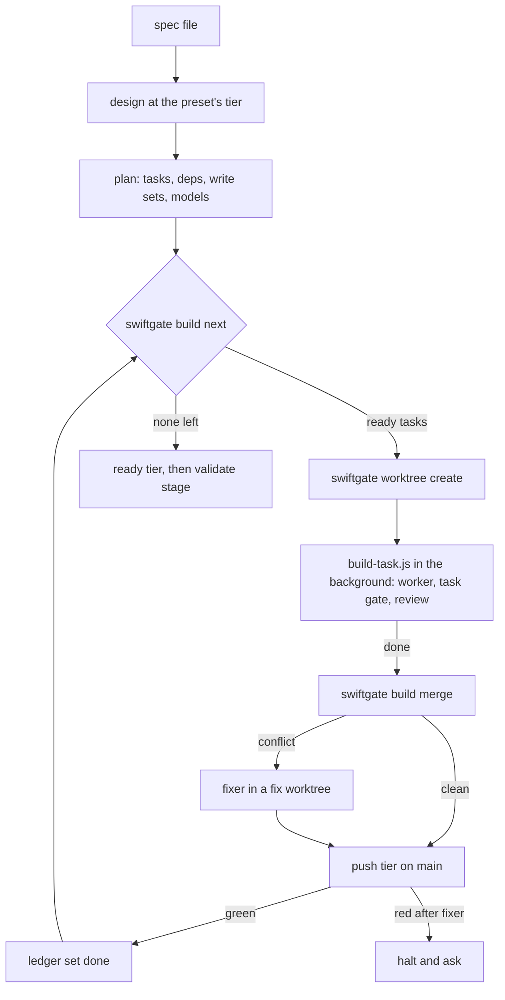

# swift-harness: sub-project 5, the build executor

<!-- RESUME
Status: APPROVED 2026-09-26 by the user, after review of the published page. Built. The brainstorm
decisions record (D1–D14; D5 amends D1) and the plan now live only in the tag `harness-freeze-2026-10-05`.
Read first: this header → §2 (decision map) → the section you need. Grep; don't read the whole file.
Corrects Foundation spec §2 (sub-project map row 5) and sub-project 2 spec §5.7 (ledger states and fields). See §15.
Open: whether a workflow agent can take a SendMessage fix round (§14).
-->

## 1. Purpose

Three pieces turn an approved plan, or a single spec file, into merged, gated code:

- **`/swift-harness:build`** executes a `planned` ledger. It starts each task once its dependencies
  reach `main`, runs 1 worker per task in its own warm worktree, reviews the result, merges it to `main`, gates
  merged `main`, and keeps the ledger current.
- **`/swift-harness:ship <spec-file> --preset <name>`** chains design → plan → build from 1 file, such as
  an interview README, with a single command.
- **Named presets** in `.swiftgate.toml` set parallelism, review depth, gate tiers, worker models, the
  design tier and a time budget. Bootstrap stamps `default` and `interview`.

The hand-run loop in the [orchestrator runbook](../process/orchestrator-runbook.md) built
sub-projects 1 and 2. This spec turns that loop into commands, a workflow and a skill, and keeps the
runbook's lessons as rules.

### Non-goals

- Simulator QA and profiling. Sub-projects 3 and 4 give an agent the ability to validate and to profile an
  implementation, and the user chooses their tools. The executor ends in a `validate` stage that calls
  what they provide (§8.6).
- Pushing to a remote. Merges stay on local `main`, as in the runbook.
- CI. Every step is a `swiftgate` command a CI job could call later.

## 2. Decision map

| Decision | Subject | Section |
|---|---|---|
| D1, D5 | Skill as event loop; `swiftgate` steps between tasks; one `build-task.js` per task | §3, §7.1 |
| D2 | Merge conflict or red `main`: one fixer, then halt | §8.3 |
| D3 | Review depth by preset: `full` or `gate` | §7.1, §10 |
| D4 | `sketch` design tier with in-chat approval | §9 |
| D5 | Dependency-driven scheduling | §8.1 |
| D6 | Named presets in `.swiftgate.toml` | §5.1, §10 |
| D7 | Time budget: stop new starts, land what's green | §8.5 |
| D8 | `validate` stage; sub-projects 3–4 plug in | §8.6, §15 |
| D9 | `swiftgate worktree create` seeds warm builds | §6.2 |
| D10 | Decomposer tags each task's worker model | §5.2 |
| D11 | Interview gates: `fast` per task, `push` per merge, `ready` at the end | §10 |
| D12 | Rehearsal fixture app and practice specs | §13 |
| D13 | `/swift-harness:ship` | §3.1 |
| D14 | `design-conflict` blocks only the affected tasks | §8.4 |

## 3. Architecture



### 3.1 `/swift-harness:ship`

1. **Preflight.** `swiftgate doctor`, a clean `main`, and `swiftgate worktree warm-check`, which fails when
   no warm `.build` or DerivedData exists to clone. A cold start costs minutes per worktree (§11).
2. **Design** runs `/swift-harness:design` at the preset's `design_tier`, with the spec file as the goal. The
   frame questions are where the user's clarifying questions go. At `design_tier = "none"`, a spec page and a
   surface commit on `main` replace the design ([fast modes §5](2026-09-27-fast-modes-design.md#5-design-free-ship)).
3. **Plan** runs `/swift-harness:plan` unchanged, apart from the decomposer's `model` tag (§5.2).
4. **Build** runs `/swift-harness:build --preset <name>`.
5. **Report.** It publishes the ledger page, with each task's status and timing, and ends with a summary.

Each step is the existing skill. `ship` passes the preset through and stops at the first halt. It never skips a
step the preset runs; only a preset whose `design_tier` is `none` selects the design-free path, and no flag does.

### 3.2 `/swift-harness:build`: the event loop

The skill is the orchestrator. Workflow scripts have no filesystem access, so every git and ledger step runs
in the main session as a `swiftgate` command:

1. `swiftgate build start <plan> --preset <name>` claims the plan, sets the index to `building`, and records
   the start time and preset in the run directory.
2. `swiftgate build next <plan> --json` returns the tasks to start now (§8.1). For each one, the skill runs
   `worktree create`, builds the worker's context pack, runs `ledger set <task> in-progress`, and launches
   `build-task.js` in the background.
3. On each task's completion notice, the skill checks the return (§5.3), then runs `build merge`, the push
   tier on `main`, and `ledger set <task> done`. It republishes the ledger page and goes back to step 2.
4. When `build next` reports nothing running and nothing ready, the skill runs the `ready` tier and the
   `validate` stage, sets the index to `done`, and reports.

### 3.3 Split of responsibility

| Actor | Does | Never does |
|---|---|---|
| `swiftgate` | scheduling, worktrees, merges, ledger writes, gates, time budget | call a model |
| `/build` skill | the event loop; launches workflows; asks the user | edit code; hand-write ledger JSON |
| `build-task.js` | worker → task gate → review → one fix pass | touch git outside its worktree |
| worker agent | code and tests in its worktree; commits to its branch | push, merge, write the ledger |
| fixer agent | resolves a conflict or red `main` in a fix worktree | commit to `main` |

### 3.4 Escalation

The pattern is the same as in sub-project 2: halt, ask, resume. A halt keeps every running task alive, and
the skill asks with `AskUserQuestion`. The halt points are a red `main` after the fixer, a `design-conflict`
(§8.4), a task that fails its gate after its fix pass, and a time-budget cutoff that would abandon work
(§8.5).

## 4. Storage

| Where | What | Written by |
|---|---|---|
| common dir `…/plans/<plan>/ledger.json` | task status, the new states and fields (§5.2) | `swiftgate ledger set` only |
| common dir `…/plans/<plan>/build/<run>/` | `run.json` (start time, preset), `events.jsonl` (one line per task transition, with its time), task returns | `swiftgate build *` |
| each worktree `.harness/task-status.json` | the worker's `design-conflict` report (sub-project 2 §5.9) | the worker |
| sibling `../<repo>-<plan>-<task>` | the task's worktree on branch `<plan>/<task>` | `worktree create` |
| sibling `../<repo>-<plan>-fix-<task>` | a fixer's worktree | `build merge` on conflict |

No one commits these files. `swiftgate gc` prunes finished runs, and `worktree remove` cleans up merged
worktrees and branches.

## 5. Formats

### 5.1 Presets

```toml
[build.presets.default]
design_tier = "standard"
max_parallel = 3
review = "full"            # full: architecture + test-quality per task, verified; gate: the task gate only
task_gate = "ledger"       # ledger: each task's planned gate; or fast | push | ready
merge_gate = "push"
worker_model = "tagged"    # tagged: the decomposer's tag; or sonnet | opus
time_budget_min = 0        # 0: no budget
stop_starts_before_min = 0
on_design_conflict = "amend"   # amend: full --amend flow; block: D14
task_proof = "per-task"    # per-task: each task gate proves and mutates; final: only the final gate does

[build.presets.interview]
design_tier = "sketch"
max_parallel = 3
review = "gate"
task_gate = "fast"
merge_gate = "push"
worker_model = "tagged"
time_budget_min = 38
stop_starts_before_min = 8
on_design_conflict = "block"
task_proof = "final"
```

A preset table must set every key, so a typo fails `swiftgate doctor` rather than falling back to a
default without warning. `design_tier` is a design tier or `none`; a preset at `none` must set
`on_design_conflict = "block"`, since there is no design to amend. `max_parallel` here overrides `[plan] max_parallel` for scheduling only; waves in
the ledger stay as planned.

A repository names the preset it prefers with `[harness] profile = "<name>"`.
`/swift-harness:build` and `/swift-harness:ship` use `--preset` when given, else the profile, else
`default`. `swiftgate bootstrap --profile <name>` stamps it, `default` without the flag. The key is
optional, but a profile naming no `[build.presets.<name>]` table fails `swiftgate doctor`
(`doctor.profile`). A profile only picks a preset: hooks, test-first rules, escape-hatch rules and
the merge gate's GREEN requirement are the same under every profile.

`task_proof` says which gate proves and mutates each task's change. Under `per-task` the worker's task
gate is `check --tier <task_gate> --base main --prove --mutate`, and `build check-return` fails a
worker's green gate that skipped either. Under `final` the task gate drops `--prove --mutate`,
`check-return` stops requiring them of a worker, and they run once, in the build's final `ready` gate
over every merged task's surface commit. A fixer's merge gate never needs them.

### 5.2 Ledger changes

| Change | Rule |
|---|---|
| `status` adds `blocked` | a `design-conflict` covers the task (§8.4); leaves only through `ledger set` after the user decides |
| `status` adds `abandoned` | cut off by the time budget (§8.5); the branch and worktree are kept |
| task field `model` | `sonnet` or `opus`, set by the decomposer: `opus` for concurrency, locks, cross-module interfaces and security work; `sonnet` otherwise. `plan-lint` requires it |
| task field `branch` | `<plan>/<task>`, set by `worktree create` |

`done` stays immutable. `abandoned` and `blocked` tasks don't count as merged for `build next`.

### 5.3 Task return

`build-task.js` returns 1 object per task, checked by `swiftgate build check-return`:

```json
{
  "task": "catalog-list-reducer",
  "outcome": "ready-to-merge",
  "commits": ["3f2a91c"],
  "gate": {"tier": "fast", "verdict": "GREEN", "runId": "…"},
  "review": {"mode": "gate", "findings": []},
  "testsAdded": ["test-catalog-list-loads-first-page"],
  "notes": "CatalogClient.fetchPage(_:) returns [Product]; page size is 20",
  "designConflict": null
}
```

`outcome` is one of `ready-to-merge`, `gate-red`, `review-blocked` or `design-conflict`. `check-return`
re-runs nothing: it checks that each commit exists on the task branch, that the gate run id exists and is
green in the run store, and that `designConflict` matches the worktree's `task-status.json`. A return
that claims more than the run store shows fails with exit 1. That's the runbook's "check every report"
rule, made mechanical.

`notes` carries the runbook's "notes for next waves". The worker context pack of a dependent task
includes the notes of every task it depends on, verbatim.

## 6. `swiftgate` additions

### 6.1 Commands

Exit codes follow Foundation: **0** pass, **1** violations, **2** gate error. Every command takes `--json`.

| Command | Does | Layer |
|---|---|---|
| `build start <plan> --preset <p>` | claims the plan, sets the index to `building`, writes `run.json` | domain + PlanState adapter |
| `build next <plan>` | tasks to start now, running tasks, budget state (§8.1, §8.5) | pure domain; clock via adapter |
| `build merge <plan> <task>` | `merge --no-ff` onto `main`; on conflict, aborts and cuts a fix worktree | domain + Git adapter |
| `build check-return <file>` | checks a task return against git and the run store (§5.3) | domain + Git/RunStore adapters |
| `build finish <plan>` | final summary; the index goes to `done`, or stays `building` with a resume note | domain + PlanState adapter |
| `ledger set <plan> <task> <status>` | one status change under the orchestrator lock; rejects illegal transitions | domain + PlanState adapter |
| `worktree create <plan> <task>` | `git worktree add` on the ledger's name and branch; APFS clone of `.build` and DerivedData; drops `ModuleCache` | adapter |
| `worktree warm-check` | fails when no warm build exists to clone | adapter |
| `worktree remove <plan> <task>` | removes a merged task's worktree and branch | adapter |

### 6.2 Command detail

- **`worktree create`** does the runbook's steps: an APFS clone (`cp -c`) of each package's `.build` and of
  the per-worktree DerivedData that Foundation §4.4 defines, then deletes every cloned `ModuleCache`, whose
  headers point at the old path. It calls `/usr/bin/find` and `/bin/cp` by absolute path, because shell
  wrappers can drop flags without saying so.
- **`ledger set`** allows `pending → in-progress → done`, `in-progress → blocked | abandoned | pending`
  (a retry), `blocked → pending | abandoned`, and `needs-replan` as sub-project 2 defines it. Every other
  change exits 2.
- **`build merge`** merges in the main checkout only after checking that `main` is clean and at the
  commit recorded by the last merge event. Another session merging to `main` in the meantime is a runbook
  known issue; here it's a halt, not a silent merge.

## 7. Workflow and agents

### 7.1 `build-task.js`

A pipeline for 1 task, launched in the background once per task:

1. **Worker** (`swift-harness:build-worker`, model from the task's `model` or the preset). It reads its
   context pack, works test-first in its worktree, commits to its branch, and loops until `check --tier
   <task_gate>` is green.
2. **Review** (`review = "full"` only): the discovery reviewers `architecture` and `test-quality` run in
   parallel on the task's diff, and each returns findings in the Foundation review contract. Each reviewer's
   findings go to an independent `verifier`, which checks them against the code and never adds findings of its
   own. Only a verified `blocker` or `major` finding gates the task.
3. **Fix pass**: at most 1. A fresh worker agent gets the red gate or the verified blocking findings, and the same
   worktree.
4. **Return** the object in §5.3.

A workflow can't pause for the user, so any decision returns early with an `outcome` for the skill to act on.

### 7.2 Agents

| Agent | Model | New or existing |
|---|---|---|
| `build-worker` | per task | new; the worker brief's standing rules and pitfalls, turned into an agent prompt |
| `build-fixer` | `opus` | new; resolves a conflict or red `main` in a fix worktree, with both tasks' returns |
| `architecture`, `test-quality` | as defined | existing; the discovery reviewers |
| `verifier` | as defined | existing; verifies each reviewer's findings, adds none |
| `design-decomposer` | `opus` | existing; adds the `model` tag (§5.2) |

## 8. Build behaviour

### 8.1 Scheduling

`build next` is pure. It takes the ledger, the running set, `max_parallel` and the budget state. It returns
the `pending` tasks whose every dependency is `done`, ordered by the longest remaining dependency chain
(critical path first) and then by task id, capped at the free slots. Within that set it never starts 2
tasks whose write sets overlap, so a merge conflict can only come from a semantic overlap the plan missed.

### 8.2 Merge

Merges run in completion order, 1 at a time, each followed by `merge_gate` on `main`. `worktree create` cuts
each task branch from `main` when it runs, so the branch contains every dependency the task needs.

### 8.3 Conflict or red `main`

`build merge` aborts a conflicted merge, which leaves `main` untouched, and cuts a fix worktree from `main`
with the task branch merged in and conflicted. A red `merge_gate` after a clean merge resets `main` to the
recorded pre-merge commit and cuts the same fix worktree. `build-fixer` gets both tasks' returns and 1
attempt. If the fix worktree then passes `merge_gate`, `build merge` merges it; otherwise the skill halts
and asks.

### 8.4 Design conflict

With `on_design_conflict = "block"`, the tasks whose `covers` intersect the report's ids move to `blocked`,
along with every task that depends on them. The others keep running, and the skill asks the user once:
retry with a note, drop the tasks, or stop. With `"amend"`, it runs the sub-project 2 amend flow.

### 8.5 Time budget

`build next` reports `phase: normal | no-new-starts | cutoff` from the elapsed time in `run.json`. At
`time_budget_min − stop_starts_before_min` it starts nothing new. At `time_budget_min`, the skill stops running
tasks with `TaskStop` and sets them to `abandoned`, and the skill goes straight to the final gate. Merged `main`
is always green, because the push tier ran after every merge. The report lists the tasks left unbuilt.

### 8.6 `validate` stage

After the `ready` tier, the skill runs the `validate` stage. Until sub-projects 3 and 4 ship, the stage
prints `validate: not configured` and passes. When they ship, it runs their QA and profiling
checks on merged `main`.

## 9. The `sketch` design tier

`sketch` exists for a spec that already states what to build, such as an interview README.

| Phase | `quick` | `sketch` |
|---|---|---|
| Frame | yes | yes; the questions go to the user |
| Research lane, probes, claim checker | 1 lane | none |
| Drafter + `design-lint` | yes | yes; Decision and Perf & scale bullets may be `[UNVERIFIED]` without a matching Risks entry, and a Decision may cite a `quote-ok` answer claim |
| Reviewers | none | none |
| Approval | Artifact | `AskUserQuestion`, recorded as an `answer` claim bound to the designSha |

`design-scope` never recommends `sketch`. Only a preset or `--tier sketch` selects it. The design doc's
status frontmatter records `tier: sketch`, so a later reader knows no research lane checked its claims.

## 10. The interview preset

The `interview` preset in §5.1 targets 45 minutes. It budgets about 5 minutes for design and plan, 30
for the build, and leaves the rest for the user to explain the harness while it runs.

| Knob | Value | Why |
|---|---|---|
| `design_tier` | `sketch` | no research phase before code |
| `review` | `gate` | fewer serial agent calls per task |
| `task_gate` | `fast` | T0 + affected T1 per worker loop |
| `merge_gate` | `push` | `main` stays green and demoable |
| `time_budget_min` | 38 | leaves time for the `ready` tier and the summary |
| `stop_starts_before_min` | 8 | a task started later rarely finishes |

These numbers are starting points. The rehearsal runs (§13) set the real values.

## 11. Perf & scale

Figures marked *est.* are estimates, not measurements.

| Dimension | Figure |
|---|---|
| Worker wall time | 9–35 min per harness task (runbook, measured); interview-sized app tasks *est.* 5–12 min |
| Merge + push tier | 45–70 s per merge on the harness (measured); an app's push tier is unmeasured |
| Worktree setup | seconds with an APFS clone; minutes cold (TCA and swift-syntax macro builds) |
| Fan-out | `max_parallel` workers, plus up to 2 reviewers and 2 verifiers each under `full` |
| Tokens | 140k–300k per worker (runbook, measured); 10–40k per fix pass |
| Failure isolation | 1 task's red gate or dead agent affects only that task and its dependents |

10× test (30 tasks at `max_parallel` 10): memory runs out first, since each worker runs its own Swift builds on
a laptop already under memory pressure. `max_parallel` is the only backpressure. A machine-wide agent cap
stays out of scope, as in sub-project 2.

## 12. Testing the harness

- **`swiftgate self-test` seeds.** Each must yield a violation:

  | Command | Seeds |
  |---|---|
  | `build next` | a task with an unmerged dependency; 2 tasks with overlapping write sets |
  | `ledger set` | `done → pending` |
  | `build check-return` | a commit not on the branch; a gate run id that doesn't exist |
  | `build merge` | `main` moved since the last merge |
  | preset parsing | a preset table missing a key |

- **Domain tests.** Scheduling order, budget phase transitions, and the blocked-set closure over
  dependents, all with an injected clock.
- **Adapter tests** against real `git worktree add` in a temp repo: clone and `ModuleCache` removal, merge
  abort and fix-worktree creation, and cleanup.
- **Calibration** for `build-worker` and `build-fixer`: seeded tasks with a known correct diff, and a seeded
  conflict with a known resolution.

## 13. Acceptance and rehearsal

- A pre-built TCA starter app plus 3 practice specs of increasing size, under `evals/` and coordinated with the
  evals session that owns that tree.
- `/swift-harness:ship <spec> --preset interview` runs to completion on each practice spec with no manual step
  other than the frame questions and the approval.
- `swiftgate stats --build <run>` reports wall time per phase (design, plan, each task, merges, final gate)
  against the preset's budget. The rehearsal runs tune the §10 values.
- A seeded design conflict blocks only its tasks. `build next` refuses a seeded late start at `no-new-starts`.
- A run of the `default` preset on `examples/SampleApp` merges a planned feature with `full` review.

## 14. Known risks and open items

| Item | Status |
|---|---|
| SendMessage to a workflow agent | unverified; the fix pass uses a fresh agent until it's confirmed |
| Background workflow notices | the event loop depends on a completion notice per `build-task.js` run |
| Semantic conflicts inside a wave | disjoint write sets don't prevent them; the push tier on each merge catches the compile-level ones |
| Worker time on app tasks | unmeasured until rehearsal; §10 values are guesses |
| Starter code in the interviewer's project | if the task must happen in their project, the warm-build clone is unavailable |
| Main-session context | a long build's completion notices fill the orchestrator's context; returns stay small (§5.3) |

## 15. Corrections to earlier specs

| Spec | Was | Now |
|---|---|---|
| Foundation §2, sub-project 5 row | depends on 1–4 | depends on 1–2; its `validate` stage calls sub-projects 3–4 when they exist (D8, confirmed by the user) |
| Sub-project 2 §5.7 | `status` states `pending · in-progress · done · needs-replan` | adds `blocked` and `abandoned`; tasks gain `model` and `branch` |
| Sub-project 2 §8.1 | tiers `quick · standard · deep` | adds `sketch`, selected only by a preset or `--tier` |
