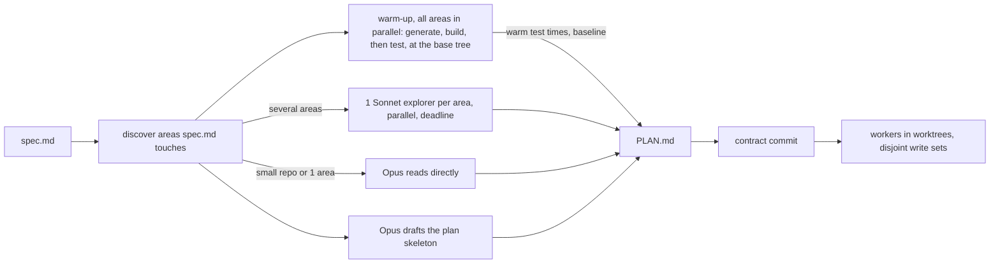

# swift-harness: the brownfield profile

**Status: Built.** `swiftgate discover`, `claude`, `run`, `warmup`, `xcode add-file`, `allow` and `test-only` ship,
with the `slice`, `merge` and `final` tiers. So do state in the git common dir, the language-neutral `neutral.*`
rules, the `brownfield-explorer` agent and the `/swift-harness:run` skill. Trial runs sit under `evals/results/`. The `finding-severity` question set exists, but nothing asks it. Notes in §2, §11 and §13
mark where the code moved past this design.

**In brief.** The brownfield profile lets the harness work in a repository it doesn't own, in any mix of languages
and build systems. It exists so a timed, single-session build can start from a fresh clone and finish with proven
tests and no harness files in the tree. The harness keeps its config and state under the git common dir and never
commits on the user's branch. `swiftgate discover` proposes each area's own test, lint and build commands, and
`swiftgate run` plans and builds a provided `spec.md` on a plan branch with no input from the user. A 30-second
slice gate still proves each changed test fails with the change reverted.

<!-- RESUME
Status: APPROVED by the user 2026-10-03, with 16 decisions. Built.
Why: the harness assumes it owns the repository. Bootstrap writes `.swiftgate.toml` and git hooks into the tree,
the default rules assume TCA, `@Dependency` and module kinds, and every change passes through design, plan and
build stages. None of that fits a repository someone else owns, with several languages and its own commands.
Builds on: the config loader, `ScratchWorktrees` and `prove`, the build executor, the judge cascade and the
telemetry envelope.
Read first: this header, §3, §5, §8 and §17.
-->

## 1. Purpose

Let the harness work in a repository it doesn't own. Such a repository can hold any mix of languages and build
systems, with its own architecture and its own commands. The harness adds proof that tests are real and a fast
parallel workflow, and leaves no trace in the tree. It reads a provided `spec.md` and builds it in 1 shot, with no
input from the user.

Input: the code in §2 and 36 hitches from timed, single-session practice builds (§16).

### Goals

- From clone to first gate in under 3 minutes, with 0 findings on code the change didn't touch.
- A per-slice gate of 30 s or less that still proves each changed test fails with the change reverted.
- 1 workflow for every language in the repository, driven by the repository's own commands.
- From `spec.md` to a plan branch with `final` GREEN and a report, with 0 user input.
- No file written into the working tree, and no commit on the user's checked-out branch.

### Non-goals

- Changing the repository's architecture, project structure, lint config or CI.
- Our standards by default. TCA, `@Dependency` and module kinds become opt-in packs (§6).
- A design doc, a ledger page, a confirm step or any approval stage (§11.6).
- Mutation testing per task, and simulator QA for areas that aren't iOS.

## 2. What exists today

| Piece | Where | Assumes ownership because |
|---|---|---|
| Config | `Config.fileName` (`plugin/gate/Sources/SwiftGateDomain/Config/Config.swift`), read by `ConfigLoader.load` (`plugin/gate/Sources/SwiftGateAdapters/Config/ConfigLoader.swift`) | the only location is `.swiftgate.toml` in the tree; `xcode`, `app_scheme` and `packages` are required |
| Hook activation | `plugin/hooks/hooks.json`; `HookSupport.swift` finds the nearest `.swiftgate.toml` | no committed config means no hooks |
| Bootstrap | `BootstrapFiles` (`plugin/gate/Sources/SwiftGateAdapters/Bootstrap.swift`), `plugin/skills/bootstrap/SKILL.md` | writes `AGENTS.md`, `CLAUDE.md`, `.swiftgate.toml`, `.swift-format`, `.swiftlint.yml`, `lefthook.yml`, `.gitignore`, `docs/index.md`, and runs `lefthook install` |
| Inference | `ConfigInference.swift` reads `xcodebuild -list -json` | Swift and Xcode only |
| Run state | `RunLayout` (`plugin/gate/Sources/SwiftGateDomain/RunLayout.swift`); 80 `.harness/` literals across 47 source files | state lives in the tree, hidden by the `.gitignore` bootstrap writes (`plugin/templates/gitignore`) |
| Tiers | `CheckTier` (`plugin/gate/Sources/SwiftGateDomain/Check.swift`); `plugin/docs/testing-playbook.md` §1 | T1 is `swift test`; budgets `t0 = 5s`, `t1 = 60s` in `Budgets` |
| Rules | `plugin/docs/standards.md` rule id index | `arch.*`, `test.non-exhaustive-store` and the module kinds assume TCA |
| Doctor | `plugin/gate/Sources/SwiftGateDomain/Doctor/Doctor.swift` | checks the shim, SwiftLint and the Xcode pin of an owned repository |
| Plan state | `PlanStateLayout` (`plugin/gate/Sources/SwiftGateDomain/Plan/PlanStateLayout.swift`) | already in the git common dir; this design keeps it there |
| Executor | `BuildPreset` (`plugin/gate/Sources/SwiftGateDomain/Build/BuildPreset.swift`), `plugin/skills/build/SKILL.md`, `plugin/workflows/build-task.js` | needs a ledger from the design path, `fast`/`push`/`ready` gates, and model aliases |
| Proof | `ChangedTestChecks.prove` (`plugin/gate/Sources/SwiftGateCLI/ChangedTestChecks.swift`), `ScratchWorktrees.swift` | Swift host tests only |
| Judge | `CascadingJudge.swift` (`plugin/gate/Sources/SwiftGateAdapters/Judge/`); playbook "Jev blocks, Claude settles" | built; this design reuses it |
| Telemetry | `plugin/docs/telemetry.md`, the telemetry design | events under `.harness/events/` |

> Note: this table records the code before this design. In a brownfield clone, config, run state and events now
> live under `<git common dir>/swift-harness/`, and the source has no `.harness/` literals left.

## 3. Decision map

| Decision | Choice | Section |
|---|---|---|
| Where state lives | `<git-common-dir>/swift-harness/`, per clone, never committed; hooks through `claude --settings` (user, 2026-10-03) | §4 |
| Default rules | neutral test-quality rules on changed lines, plus the repository's own lint config; our standards as opt-in packs (user, 2026-10-03) | §6 |
| Other languages | each area's own commands from discovery, plus the neutral checks and telemetry (user, 2026-10-03) | §7 |
| Shape | a `brownfield` profile inside swiftgate, with `swiftgate discover` (user, 2026-10-03) | §5 |
| Proof | per task, the task's changed tests only, no mutate (user, 2026-10-03) | §9 |
| Xcode projects | record how sources join targets; gate new files; never restructure (user, 2026-10-03) | §8 |
| Pass bar | 3 unfamiliar public repositories with more than 1 language (user, 2026-10-03) | §14 |
| Workflow | Opus plans, Sonnet 5.5 explores, builds and does QA, Jev classifies; contract commit first; 1 live `PLAN.md` (user, 2026-10-03) | §11 |
| Approval | none: `swiftgate run <spec.md>` applies discover, plans, builds and ends with `final` and a report (user, 2026-10-03) | §11.6 |

## 4. State, config and hooks

Every worktree of the clone shares the common dir, and git never sees it. Per-worktree state goes under that
worktree's own git dir.

| Path | Holds | Scope |
|---|---|---|
| `<common>/swift-harness/config.toml` | the applied config (§5.3) | clone |
| `<common>/swift-harness/settings.json` | the hook wiring, the same 4 events as `plugin/hooks/hooks.json` | clone |
| `<common>/swift-harness/discover/` | the last proposal and its inputs' hashes | clone |
| `<common>/swift-harness/baseline/<tree>.json` | known failures at a base tree (§10) | clone |
| `<common>/swift-harness/plans/<slug>/` | `PLAN.md`, a copy of an untracked `spec.md`, `ledger.json`, the lock, the report | clone |
| `<git-dir>/swift-harness/` | what `.harness/` holds today: runs, events, caches, hook state | worktree |

`swiftgate claude` starts `claude --settings <common>/swift-harness/settings.json`. `ConfigLoader` reads a
committed `.swiftgate.toml` first and the common dir's `config.toml` next; both together fail
`doctor.config-conflict`, unless `swiftgate run` set the committed file aside in
`<common>/swift-harness/committed-config-set-aside.json`. Then every worktree runs the brownfield profile, the file
stays in the tree unchanged, and the report names it. `RunLayout` takes a state root, so the 80 literals resolve through 1 seam. The only
file the workflow puts in the tree is the `PLAN.md` symlink (§11.4), listed in `.git/info/exclude`.

## 5. Discover

### 5.1 What it reads

`swiftgate discover` reads tracked files only (`git ls-files`), so leftover build output never becomes an area.
It runs no build and makes no network call. Its budget is 5 s for 10,000 tracked files, and 1 tree gives 1 proposal.

| Signal | Proposes |
|---|---|
| `Package.swift`, `*.xcodeproj`, `*.xcworkspace`, `project.yml`, `Project.swift` | swiftpm or xcode: an area per package or project; targets, schemes, test targets, how sources join targets (§8) |
| `Cargo.toml`, `go.mod` | cargo or go: an area per crate or module; the test command with a name filter; its linter |
| `build.gradle(.kts)`, `pom.xml` | jvm: an area per module; the test task with a filter; its linter |
| `package.json` and its workspace file | node: an area per package; its test, lint and build scripts |
| `pyproject.toml`, `setup.cfg` | python: an area per project; the test runner with a filter; its linter |
| `Gemfile`, `mix.exs`, `CMakeLists.txt`, others | command: an area with the commands CI runs |
| lint configs, `Makefile`, `justfile`, `bin/*`, CI workflow files | the repository's own lint config, and the commands CI already runs, which outrank guesses |

Each cached answer's key covers the build file's bytes and the listing of the directories it names.

### 5.2 Output

Discover applies its proposal: `swiftgate run` calls `discover --apply`, which writes `config.toml` and
`settings.json` with no confirm step. The warm-up runs every proposed command (§11.2), so a guessed command
proves itself before planning finishes. `swiftgate discover` alone prints the proposal, each value with its
source and confidence, for a user who wants to read it.

```text
swiftgate discover · 4 areas · 1.8s · applied to <common>/swift-harness/config.toml
area  language    root  value       command or setting                                 source                     confidence
api   python      api   test        pytest api/tests                                   api/pyproject.toml         found
api   python      api   test_files  pytest {tests}                                     api/pyproject.toml         found
web   javascript  web   test        npm --prefix web test                              web/package.json           found
web   javascript  web   lint        npx eslint {files}                                 .github/workflows/ci.yml   guessed
core  swift       Core  test        swift test --package-path Core                     Core/Package.swift         found
app   swift       App   build       xcodebuild build -workspace App/App.xcworkspace -scheme App  App/Project.swift  found
app   swift       App   inclusion   tuist (manifest App/Project.swift)                 App/Project.swift          found
missing: api lint (no linter configured)
```

### 5.3 Config schema

```toml
schema = 1
[harness]
profile = "brownfield"

[brownfield]
discovered_at = "<HEAD sha>"
slice_budget_s = 30
time_budget_min = 0          # 0: no budget; the clock starts when `swiftgate run` reads spec.md

[[areas]]
name = "core"
root = "Core"
language = "swift"           # swift | java | kotlin | javascript | typescript | python | go | rust | ruby | other
kind = "swiftpm"             # xcode | swiftpm | jvm | node | python | cargo | go | command
test = "swift test --package-path Core"
test_files = "swift test --package-path Core --filter {tests}"
lint = "swiftlint lint --config .swiftlint.yml {files}"
test_globs = ["Core/Tests/**/*.swift"]
packs = []                   # opt-in: "tca", "dependencies", "module-kinds"

[[areas]]
name = "app"
root = "App"
language = "swift"
kind = "xcode"
build = "xcodebuild build -workspace App/App.xcworkspace -scheme App -destination 'generic/platform=iOS Simulator'"

[areas.xcode]
workspace = "App/App.xcworkspace"
inclusion = "tuist"          # synchronized | xcodegen | tuist | explicit
manifest = "App/Project.swift"
schemes = ["App"]

[[allow]]                    # an inline swiftgate:allow still counts (§17 decision 9)
rule = "neutral.unsafe-shortcut"
path = "api/handlers.py"
line_sha = "<sha256 of the line>"
reason = "the parser guarantees a value here"
```

`{files}` and `{tests}` expand to the changed test files or ids. Without `test_files`, prove runs the whole `test`
command and says so.

Only `discover --apply` writes `config.toml`; nobody edits it by hand. When Opus can't make an area's command work,
that step drops for the area with a report line: a failing `build` drops the area, and a failing `test` leaves it
build-only.

## 6. Rules

Every check reads only added lines (`AddedLines.swift`), so untouched code never produces a finding.

| Rule | Checks | How |
|---|---|---|
| `neutral.not-proven` | a changed test passes with the change's source reverted | prove (§9) |
| `neutral.no-assertion` | a changed test with no assertion, or only a tautology | per-language assertion table (`expect`, `assert*`, `#expect`, `XCTAssert*`, `assertThat`), then the judge cascade |
| `neutral.unsafe-shortcut` | `try!`, `as!`, `fatalError`, `@unchecked Sendable`, `nonisolated(unsafe)`, `!!`, `as any`, `@ts-ignore`, a lint suppression, a skipped or focused test | per-language token table on added lines |
| `neutral.lint` | the repository's own lint config, on changed files, findings on added lines only | the area's `lint` command |
| `xcode.file-not-in-target` | a new Swift file under a source root that no target compiles | §8 |

Packs keep today's rule ids and turn on per area. Harness-internal checks, such as calibration freshness and
`docs-lint`, never run in this profile.

## 7. Areas in other languages

Each area runs its own `test`, `lint` and `build` commands plus the neutral rules; each result is a `gate.step`
(§12). A failing command is a finding only when the baseline (§10) lacks it. The gate reads JUnit XML when the
runner writes it, else the exit status and the last 40 lines.

## 8. Xcode projects the harness doesn't own

| Inclusion | New file joins a target by | The helper |
|---|---|---|
| synchronized folder (`PBXFileSystemSynchronizedRootGroup`) | sitting under the folder | does nothing |
| XcodeGen | the spec's source globs, after `xcodegen generate` | runs the pinned `xcodegen generate`; when XcodeGen is absent, adds the file to the project directly and says so |
| Tuist | `tuist generate` | runs it |
| explicit list | a file reference, a build file, a group child and a Sources phase entry | `swiftgate xcode add-file <path> --target <t>` adds those 4 entries with stable ids, then checks the project with `plutil -lint` and `xcodebuild -list` |

The helper never moves groups, renames targets or changes build settings. Workers call it instead of editing
`project.pbxproj`.

## 9. Tiers and proof

| Tier | When | Runs | Budget |
|---|---|---|---|
| `slice` | each task's gate, the Stop hook | neutral rules and lint on changed files; each touched area's changed tests at the task head; prove of those tests | 30 s, p95 |
| `merge` | after each merge, on the plan branch | each touched area's `test`, `lint` and `build`, against the baseline | the area's own time, measured |
| `final` | at the end of every run | `merge` for every area, plus UI and end-to-end commands discovery found | measured |

Prove reverts the task's non-test changes in a scratch worktree and reruns its changed tests through
`test_files`. After a crash it reruns each test alone, so 1 trap doesn't mark its siblings. `fast`, `push` and
`ready` stay for owned repositories.

When an area's smallest test run can't fit 30 s, such as app-hosted Xcode tests, `slice` runs the selected tests
if a warm run fits. Otherwise it only builds; those tests and their prove move to `merge`, and the report says so.
The warm-up (§11.2) measures each area's warm test time before planning, so `PLAN.md` names the build-only areas
up front.

Worktrees share each ecosystem's package and build caches, and a per-area DerivedData seed. The warm-up fills them
at the base tree; the contract commit still recompiles its dependents. Each area's cold cost is the warm-up's first
run, and a `gate.step` measures it again on a cold store.

`xcodebuild` area commands pass `-derivedDataPath`: the warm-up and the main checkout build in the seed, and each
linked worktree in its own folder under its git dir. Before a worktree's
first run, the runner clones the seed's `SourcePackages` into that folder with `cp -c` and points SwiftPM's
`workspace-state.json` at the copy. Build products and module caches aren't cloned. They name the seed's absolute
paths, so another checkout recompiles every file anyway, and its build database deletes the seed's products as
stale. Prove and baseline scratch trees keep Xcode's default DerivedData.

Task and fix worktrees are a pool of slots, `<repo>-<plan>.slot-<n>`, since build products name the tree's path.
`worktree create` and a fix cut check the branch out in a free slot, or add one. `worktree remove` refuses a slot
with uncommitted work, then resets it and empties its state root but its DerivedData; ignored build folders stay.
The next task in that slot rebuilds only what changed: 10–11 s against 96 s cold in a trial app.
`run checkout remove` removes every slot.

## 10. Baseline

A gate that sees a failing test or command reruns it at the merge base in a scratch worktree and caches the
answer in `baseline/<tree>.json`. The warm-up's test run at the base tree (§11.2) fills that file before any
worker starts. A failure at both trees goes to the report's `baseline` section and never gates. Discovery records
files already modified in the tree, and workers never stage them.

## 11. Workflow

### 11.1 Roles

| Role | Model | Does |
|---|---|---|
| orchestrator, planner | Opus | reads `spec.md`, picks areas, drafts and finishes `PLAN.md`, merges, answers every open question |
| explorer | Sonnet 5.5, pinned by id | 1 per area `spec.md` touches, read-only |
| worker, QA | Sonnet 5.5, pinned by id | builds 1 task in its worktree; QA drives the app when the risk class asks for it |
| classifier | Jev | test quality at gates through the built cascade to Claude; each slice's diff risk; pre-sorting review findings by severity |

The orchestrator makes every choice without asking the user, from git hook use to a reading of an ambiguous
spec, and records each assumption in `PLAN.md`.

### 11.2 Research to plan, about 8 minutes



Each explorer has a 3-minute soft and 4-minute hard deadline, and returns entry points, files to change, nearby
tests, working commands, risks and unknowns in 300 words or fewer. Opus drops a late report and names the area.

Once discover picks the touched areas, a warm-up runs each area's `build` and then its `test` at the base tree.
Every area warms in parallel at full speed, alongside the explorers. XcodeGen and Tuist areas run `generate` first,
or report the "not installed" case discover reports. When the repository commits the generated project, generate and
the warm build run in a scratch worktree under the git dir, so the user's tree shows no diff; a gitignored project
generates in place. Build output goes under the git dir, such as `-derivedDataPath`, or into paths the repository
already ignores. The warm-up fills the shared stores (§9) and gives warm test times for `slice`, each area's cold
cost and the base tree's baseline (§10). It waits for nothing and always runs to the end; its caches, times and
baseline serve the next run on that tree. When a guessed command fails, Opus fixes the config before planning
finishes. A command Opus can't fix becomes `missing`: that step drops for its area, with a report line.

### 11.3 Contract commit and write sets

The first commit holds the new types and signatures, compiles in every touched area, and changes no behavior.
Write sets come from the target graph: Xcode membership, `swift package describe`, and each build
system's module dependencies. A task that changes a target's types owns every target that reads them, unless the contract commit
landed them. Each removal has an owning task. Workers commit through the repository's own git hooks and never
use `--no-verify`; our commit-msg comments check doesn't run in this profile.

### 11.4 The plan file

The plan is 1 live file, `<common>/swift-harness/plans/<slug>/PLAN.md`. A git-excluded `PLAN.md` symlink at the
root points to it; workers read it by absolute path. `plan import` derives the executor's `ledger.json`. Its
"Assumptions" section records each reading Opus made of an ambiguous spec. Opus commits a snapshot only when the
user asks.

### 11.5 Review depth

Jev rates each slice's diff `low`, `medium` or `high`: the gate only, 1 Sonnet reviewer, or a full review plus QA.
Paths the config marks sensitive are always `high`. Opus decides every finding that would block.

> Note: in the shipped code, `swiftgate judge diff-risk` asks whichever backend `[judge]` names, and `discover`
> writes `backend = "claude"` by default, since Jev stays opt-in
> ([ADR 0007](../adrs/0007-jev-is-an-opt-in-second-judge-backend.md)). Nothing asks the `finding-severity` set.

### 11.6 One-shot run

The user provides the spec; the harness never writes it. `swiftgate run <spec.md>` reads it by path and copies an
untracked spec under the git dir, so the tree stays clean. The executor starts as soon as `PLAN.md` exists. The
user may read or edit `PLAN.md` or stop the run, but the run never asks them to. Every commit, from the contract
commit to each merge, lands on the plan branch in worktrees under the git dir. `final` runs at the end. The report
lists the assumptions, the baseline failures, the build-only areas and the plan branch to merge. The user's
checked-out branch changes only when they merge.

## 12. Telemetry

Events go to `<git-dir>/swift-harness/events/`; worktree removal copies them up to the common dir.

| Change | Payload |
|---|---|
| new kind `discover.run` | `ms`, `areas`, `languages`, `found`, `guessed`, `missing`, `edited` |
| new kind `warmup.run`, 1 per area | `area`, `ms`, `cold` or `warm`, `outcome` |
| `gate.step` gains `area?` and steps `area-test`, `area-lint`, `area-build`, `neutral`, `baseline`, `xcode-membership` | as today |
| `gate.run` gains `baselineCount` | count of failures the baseline absorbed |
| `judge.decision` question sets `diff-risk` and `finding-severity` | as today |
| `AgentRole` gains `explorer` and `classifier` | as today |

## 13. Coexistence

A repository with a committed `.swiftgate.toml` keeps today's behavior. The executor keeps `build start`, `next`,
`merge`, `record-gate` and `worktree`, and gains `[build.presets.brownfield]`.

| Preset key | `brownfield` value | New |
|---|---|---|
| `design_tier` | `none` | no |
| `max_parallel` | 3 | no |
| `review` | `classified` (§11.5) | yes |
| `task_gate` | `slice` | yes |
| `merge_gate` | `merge` | yes |
| `worker_model` | `claude-sonnet-5-5` | exact ids accepted |
| `task_proof` | `prove` (prove without mutate) | yes |
| `stall_min` | unset, so 15: a first cold gate can build for 5 min | yes |

A `--preset` from another profile fails and names the profile.

> Note: the shipped `brownfield` preset also sets `time_budget_min = 40`, `stop_starts_before_min = 13` and
> `on_design_conflict = "amend"`. A one-shot run always has this time box, so the `[brownfield] time_budget_min = 0`
> in §5 never turns the clock off.

## 14. Pass bar

| Measure | Target | From |
|---|---|---|
| clone to first gate | under 3 min | clone time to the first `gate.run` |
| findings on untouched code | 0 | a gate on an empty commit, and on a 1-line change |
| per-slice gate | 30 s or less, p95 | `gate.run` with `command = slice` |
| one-shot run | 1 per repository: a provided `spec.md` to a plan branch, every merge and `final` GREEN, 0 human input | `gate.run` with `command = final`, and no user prompt in the session |

The orchestrator picks the 3 repositories itself: public, more than 1 language, none tied to any practice task.


## 15. Open questions

The user decided all 5 on 2026-10-03; see §17, decisions 9 to 13.

## 16. Practice feedback

| Entry | Addressed by |
|---|---|
| calibration-freshness nit in a consumer repo | §6: harness-internal checks never run |
| `bootstrap --profile` ignored on an existing config | §4: config lives outside the tree; nothing to merge |
| doctor finds no session record (both entries) | §4: hooks load from the first prompt through `--settings` |
| sketch drafter over its word budget; sketch phase took 15 min | §1: no design doc; §11.2: 8 minutes to a plan |
| ledger page published as an Artifact | §1: no ledger page |
| Sonnet alias resolved to an older model | §11.1, §13: models pinned by id; `agent.usage` records the resolved model |
| stale manifest cache gave a false RED (both entries) | §5.1: cache key covers directory listings; TCA rules off by default |
| stall watch fires after 15 min | §11.2: explorer deadlines; §13: `stall_min` |
| serial chain; surface first; UI coupled to reducer; 4-task chain | §11.3: contract commit, write sets from the target graph |
| no way to run UI flows without `ready` | §9: `final` runs them without mutate |
| validate without proof bases | §9: prove runs per task from its own merge base |
| session cost, Opus at 81% | §11.1: Sonnet explores, builds and does QA |
| leftover `.build/` listed as a module | §5.1: tracked files only |
| context-pack rejects an absolute plans path | §11.4: workers read `PLAN.md` by absolute path |
| `ready` gate mandatory at the end | §9: no `ready` in this profile |
| `prove.crashed` on every sibling | §9: a crash reruns each test alone |
| negative test passed before the change, found at the end | §9: per-task prove |
| no task removes dead code | §11.3: each removal has an owning task |
| `--preset default` with no warning | §13 |
| previous attempt's design run dir left behind | §1: no design run |
| docs-lint skipped prose on a new router | §6: no docs rules in this profile |
| budget clock starts at `build start` | §5.3: the clock starts when `swiftgate run` reads `spec.md` |
| a core module and its UI module split into 2 tasks | §11.3: a task owns every target that reads its types |
| 230 s merge gate after a new dependency | §9: shared package stores, cold cost measured (§17 decision 11) |
| starter script's macro trust | not addressed: a practice script, not the harness |
| stray `grep`; the Sonnet 5.5 doubt | not addressed: assistant mistakes |
| session id change mid-run; background-session edit rule | not addressed: Claude Code behavior |
| guard resolves relative paths against the main checkout | not addressed: a guard bug with its own fix |
| no live view of workers | not addressed: its own design |
| aliased `cp` in the design skill | not addressed: this profile runs no design skill |

## 17. Decisions

| # | Question | Decision | By |
|---|---|---|---|
| 1 | Where do config and state live? | `.git/swift-harness/` per clone, never committed; hooks load through `claude --settings`; bootstrap writes nothing into the tree | user, 2026-10-03 |
| 2 | Which rules by default? | Language-neutral test-quality rules on changed lines only, plus the repository's own lint config; TCA, `@Dependency` and module kinds are opt-in packs per area, off by default | user, 2026-10-03 |
| 3 | What runs in other languages? | Each area's own test, lint and build commands from discovery, plus the neutral checks, with telemetry | user, 2026-10-03 |
| 4 | How does it ship? | A `brownfield` profile in swiftgate, with a deterministic `swiftgate discover` of a few seconds that the user confirms | user, 2026-10-03 |
| 5 | How much proof per task? | Each task's own changed tests, no mutate | user, 2026-10-03 |
| 6 | How are Xcode projects handled? | Discovery records inclusion; the gate checks every new Swift file is in a target; a helper regenerates or adds files; no restructuring | user, 2026-10-03 |
| 7 | What is the pass bar? | 3 unfamiliar public repositories with more than 1 language: under 3 min to first gate, 0 findings on untouched code, slice gate of 30 s or less, 1 real change each | user, 2026-10-03 |
| 8 | What is the workflow? | Opus orchestrates and plans; Sonnet 5.5 explores, builds and does QA; Jev classifies; about 8 minutes to a plan; contract commit, then workers with disjoint write sets; 1 live `PLAN.md`; no design doc, ledger page or approval stage beyond "go" | user, 2026-10-03 |
| 9 | Where does an escape-hatch allow live, when the team didn't ask for our comments in its code? | In `config.toml` as `[[allow]]` entries keyed by rule, path and the line's hash, each with a reason; an inline `swiftgate:allow` still counts | user, 2026-10-03 |
| 10 | What does `slice` do for an area whose smallest test run can't fit 30 s? | Run the selected tests when a warm run fits; otherwise build only, move those tests and their prove to `merge`, and add a report line | user, 2026-10-03 |
| 11 | Do worktrees install dependencies per task? | They share each ecosystem's package and build caches, and a per-area DerivedData seed; each area's cold cost is measured in `gate.step` | user, 2026-10-03 |
| 12 | Do workers run the repository's own git hooks? | Yes, never with `--no-verify`; our commit-msg comments check doesn't run in this profile | user, 2026-10-03 |
| 13 | Which 3 public repositories form the trial? | The orchestrator picks them with no user step: public, more than 1 language, none tied to any practice task | user, 2026-10-03 |
| 14 | Can the slow builds start before the plan exists? | Yes: as soon as discover finishes, every touched area warms in parallel at full speed: `generate` for XcodeGen and Tuist (in a scratch worktree when the repository commits the project), then `build`, then `test`, at the base tree; no file in the tree; it fills the shared stores, measures warm test times and cold cost, and pre-fills the baseline; it waits for nothing, runs to the end, and its results serve the next run on that tree | user, 2026-10-03 |
| 15 | Does any stage wait for the user? | No. `swiftgate run <spec.md>` reads a provided spec by path and copies an untracked one under the git dir; the clock starts there. The executor starts once `PLAN.md` exists; Opus answers every open question and records each assumption in its "Assumptions" section. The user may read, edit or stop, but is never asked. Every commit lands on the plan branch in worktrees under the git dir. `final` runs at the end of every run, then a report. Pass bar: 1 one-shot run per repository with 0 human input. Supersedes decision 8's "go" and decision 7's "1 real change each" | user, 2026-10-03 |
| 16 | Does the user confirm discover's proposal? | No. `discover --apply` runs on its own, and the warm-up runs every proposed command. Opus fixes a failing guess before planning finishes; one it can't fix becomes `missing`, and that step drops for its area with a report line. `swiftgate discover` alone still prints the proposal. Supersedes decision 4's "that the user confirms" | user, 2026-10-03 |

## 18. Tasks for a later plan

1. State root seam: `RunLayout` and the 80 `.harness/` literals resolve through 1 root; `ConfigLoader` reads the
   common dir; `doctor.config-conflict`.
2. `swiftgate discover` with fixtures captured from real public repositories, and `discover --apply` with no
   confirm step.
3. `settings.json` hook wiring and `swiftgate claude`.
4. Neutral rules and their rule-index rows, each with a captured fixture per language.
5. Area command runner and the `slice` and `merge` tiers, with baseline reruns, and the parallel warm-up with
   `warmup.run`.
6. Prove over `test_files` for every area kind, with crash isolation.
7. Xcode inclusion reader, `xcode.file-not-in-target` and `swiftgate xcode add-file`.
8. `swiftgate run <spec.md>`, `plan import` with the "Assumptions" section, the `brownfield` preset keys, pinned
   model ids in `build-task.js`, and the end-of-run `final` and report.
9. Jev `diff-risk` and `finding-severity` question sets.
10. Telemetry additions, then the 3-repository trial.
