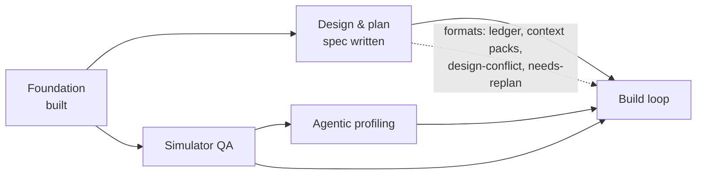
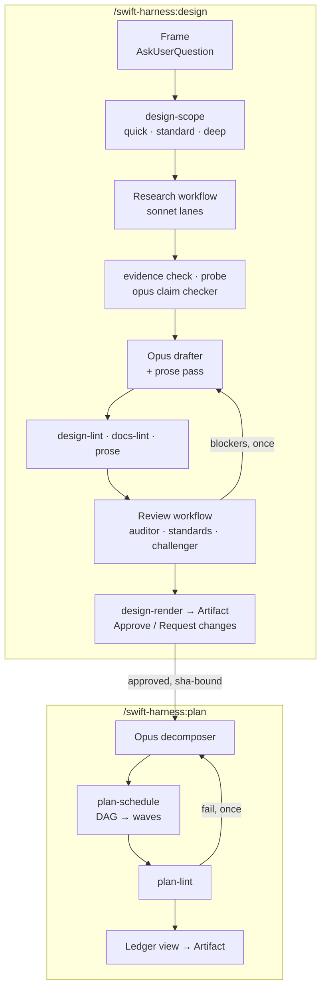
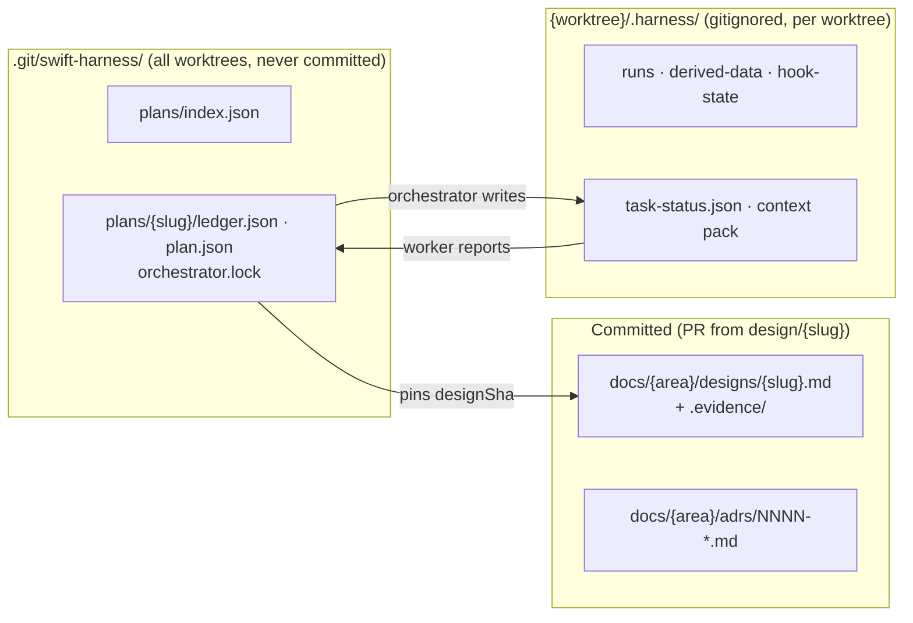

# Handoff: sub-project 2, design and plan workflows

<!-- RESUME
SUMMARY (2026-09-28 morning, for the next orchestrator session). Context was cleared on purpose. The user wants every
remaining item done TODAY: read docs/handoffs/2026-09-28-day-queue.md next; it is the ordered queue, marks every step
that needs the user, and lists what was in flight at the clear.
State: local main holds every overnight merge; origin/main untouched (never push it without the user). Backup branch:
origin backup/subproject-2-overnight-2026-09-27 (refresh with `git push origin main:refs/heads/backup/subproject-2-overnight-2026-09-27`
after grepping `git diff origin/main..main` for interview-specific terms).
Merged overnight, each through push + prove on an integration worktree and push on merged main: speed waves 2-3,
fast-modes waves 1-3 (`surface-check`, `swiftgate sprint`, `/swift-harness:sprint`), sub-project 2 hardening waves 1-3
plus `doctor-plugin-changed` (docs/plans/2026-09-27-subproject-2-hardening-plan.md), a shim-test leak fix, and tests
killing every mutant that survived in the new rules. Interfaces: docs/handoffs/subproject-5-interfaces.md and
docs/handoffs/subproject-2-interfaces.md (last sections). The user approved all 5 overnight decisions (2026-09-28).
Rules from the user: every worker on opus; build for correctness (design approval, plan tasks, surface-first workers,
push + prove merge gate, mutate once on main per wave); the orchestrator delegates ALL work to workers and only
spawns, reads reports, merges, gates and checkpoints; one prove on the machine at a time (mkdir lock
/tmp/swift-harness-speed-prove.lock); watchdog Monitor while workers run; keep the harness generic; sub-projects 3 and 4
are designed WITH the user (they pick the QA/profiling CLIs and MCPs); the ready-lock branch stays parked.
Read first: this header, docs/handoffs/2026-09-28-day-queue.md, the runbook in full
(docs/handoffs/subproject-2-orchestrator-runbook.md, including both overnight lesson sections), docs/handoffs/worker-brief.md.
-->

## 1. Where things are

| What | Where |
|---|---|
| Sub-project 2 spec | [`designs/2026-09-25-design-plan-workflows-design.md`](../designs/2026-09-25-design-plan-workflows-design.md) |
| Decision log (D1–D24) | [`2026-09-25-subproject-2-brainstorm-decisions.md`](2026-09-25-subproject-2-brainstorm-decisions.md) |
| Foundation spec / plan | [`designs/2026-09-24-swift-harness-foundation-design.md`](../designs/2026-09-24-swift-harness-foundation-design.md) · [`plans/2026-09-24-foundation-plan.md`](../plans/2026-09-24-foundation-plan.md) (complete) |
| Standards / playbook / ADRs | [`standards.md`](../../plugin/docs/standards.md) · [`testing-playbook.md`](../../plugin/docs/testing-playbook.md) · [`adrs/`](../adrs/README.md) |
| End-to-end evidence | [`e2e-report.md`](../e2e-report.md) |
| Worker brief | [`worker-brief.md`](worker-brief.md): reuse it for sub-project 2 workers |
| Throwaway e2e repo | not kept between sessions; the acceptance waves recreate `../swift-harness-e2e` as [`e2e-report.md`](../e2e-report.md) describes |

The plugin is **not installed**. It was tested with `claude -p --plugin-dir`.

## 2. Where sub-project 2 sits

## 3. What it delivers

Escalation from any workflow agent: return `needsDecision` → the orchestrator asks through
`AskUserQuestion` → records the answer as evidence → relaunches with `resumeFromRunId`.

## 4. Where state lives

Gitignored files never reach a `git worktree add` checkout, so shared plan state lives in the git common dir.

## 5. Handoff open items: resolved

| Item | Answer |
|---|---|
| Workflow agents get a reply mid-run? | No. Halt with `needsDecision`, ask, resume from cache |
| Ledger branch? | None. Ledgers aren't committed; designs merge through a `design/<slug>` PR |
| Artifact publishing from a workflow? | Main session only. Approval via page `db`, comments via `comments` |
| `agent_id` in hook payloads? | Still unseen live. The guard also uses the per-plan lock and env var |

## 6. Lessons from the Foundation build

- **Orchestrate thin.** Workers get the brief plus an interfaces note and return ≤200-word reports.
  Keep the interfaces note in the repo.
- **One committer per worktree or branch.** Name merge points early.
- **Running it beats reading it.** The e2e run found 9 bugs 500+ unit tests missed. Validate on
  `examples/SampleApp` with a real feature before calling it done.
- **Emulation is not installation.** Run the plugin's own agent types once after a real install.
- **Costs seen:** a review run took 6 agents, 50s, ~452k subagent tokens. Cap parallelism: the laptop is under memory pressure.
- **Toolchain:** Xcode 26.2 / Swift 6.2.3; TCA 1.26.2 via `@swift-6.1`. Never add
  `swift-issue-reporting` directly before Swift 6.4. `xcodebuild` needs `-skipMacroValidation`. No
  MainActor default isolation in Core. `swift test` 6.2 can't shuffle or repeat. Host XCTest skips
  are invisible under `--parallel`.

## 7. Known Foundation gaps (not blocking)

App and UI-test targets aren't in the module graph. Simulator-tier `prove` and `stress` are
pending. Live hook payloads not yet seen: subagent `agent_id`, Write, SessionStart resume. The judge
calibration set was labelled by the agent that tuned it.
