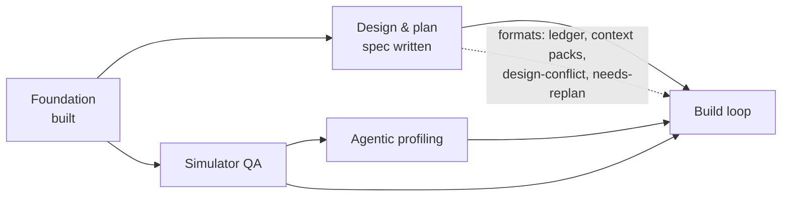
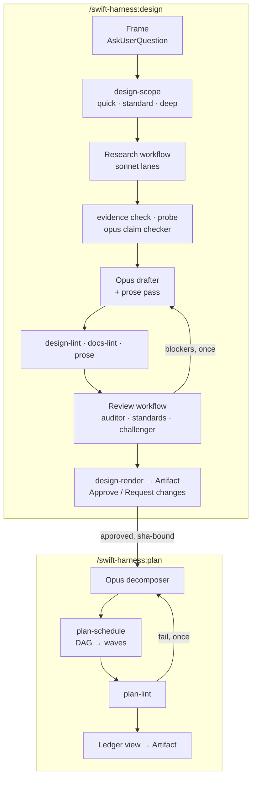
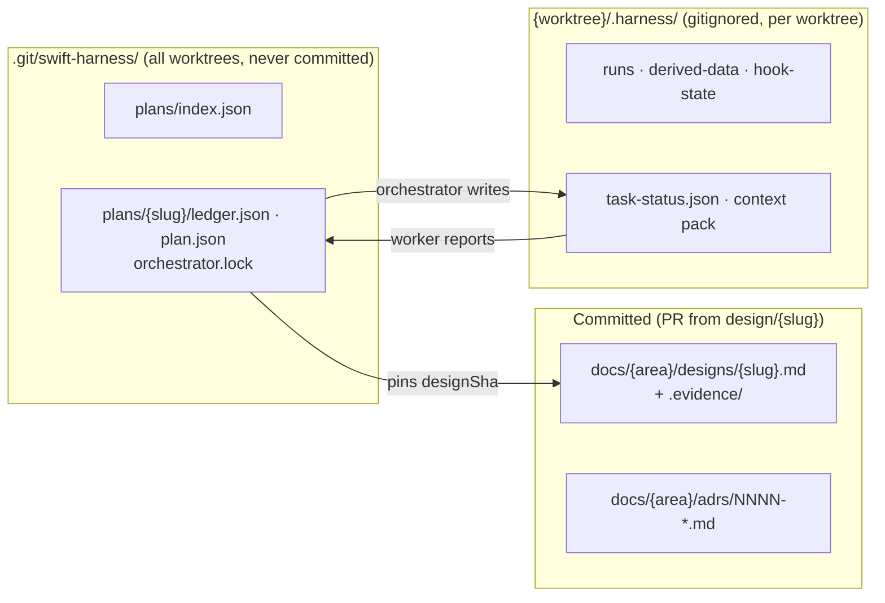

# Handoff: sub-project 2, design and plan workflows

<!-- RESUME
SUMMARY (2026-09-27 evening, for the user). The orchestrator session was cleared; start the next one from here.
State: origin/main 3dee52a GREEN (push tier, 1795 tests). Local main 620888a adds one docs commit, the interview
trial-run 2 evidence (docs/handoffs/2026-09-27-interview-trial-run-2.md); it isn't pushed yet. Merged today: review fix
wave 4 (repo hooks and bootstrap, whole-process-tree kills, review severity/dedupe/pre-existing, calibration on each
agent's frontmatter model), the shim cold-start Session id fix, the build recalibration after a build-worker.md edit, and
the build proof-base and write-set change (24fc934, from the interview session).
The user decided today: the hook guard gets a cache (the 50 ms budget stands); headless runs stop at in-review; §11 is
rewritten to measured figures and design runs keep local telemetry; review reports pre-existing defects and never blocks
on them; fix branches merge on push + prove, with mutate once on main; review-accuracy evals are frozen (5/5).
The user's verdict: ship is far too slow for a coding interview. A research session on speed is opening; don't
start speed work before it reports.
Paused, nothing running:
  - ready-tier-runs-one-at-a-time-and-cleans-up (opus), ../swift-harness-ready-tier-runs-one-at-a-time-and-cleans-up,
    WIP 07d00b0: a machine-wide flock for ready, mutate and prove; reaping recorded process groups; check --background
    plus swiftgate wait; per-phase telemetry; a total mutate concurrency bound; the mutate baseline run alone. Rebase onto
    24fc934 first, since that also changes check, prove and history.jsonl. The about-60 s LiveProcessRunner kills were
    not reproduced (kills landed in under 1.1 s at load 55–76).
  - Mutate on main has no verdict: --jobs 2 took 758 s at peak load 143 and was BLOCKED by 5 load-sensitive baseline
    tests (--jobs 8 took load to 353, 480 processes).
Queued fixes, not started: hook guard PlanLocks cache; §11 rewrite plus design-run telemetry; rule-index rows for every
design-lint.* and design-diff.* rule (none exist, which CLAUDE.md requires); a lint for unbounded intentional-hang
fixtures; review.json `telemetry` set on every run; dedupe merging a rule-less duplicate of a ruled blocker. From
interview trial run 2 (build and ship side): check-return --fix rejects every fixer return with
build-return.review-missing (the fixer contract says review is null); running sessions cache agent prompts, so merged
prompt edits don't reach them; worktree remove deletes the task gate's run report.
Ship speed research is done; the user holds the report (ask them for it). Only 27–40% of a trial run is model coding. Its ranked changes: (1) task_proof = "final"
preset key (per-task prove and mutate cost 13.7 min of 32.8 on run 2's critical path); (2) fail-fast gates; (3) the standards
excerpt in the worker pack; (4) impact + coverage and an app compile in the task gate; (5) a design = "none" path;
(6) a sprint skill; (7) surface commits + swiftgate surface-check; (8) HEAD sha on gate runs, and gate reports kept on
worktree remove; (9) check-return --fix accepts review: null; (10) never cut the task that makes the app compile. These
outrank the queued hardening above unless the user says otherwise.
Practice prompt set (user decision 2026-09-27): rotate varied shapes, each at 3–4× the list-and-detail exercise with a
live change request at minute 35, drawn from varied app shapes (the evals session owns the prompt list). Never
rehearse one prompt twice in a row, and keep the harness generic: no preset or rule may assume one app shape.
Next session's first job (the user's ask): work out how to write ADRs (docs/adrs/, see its README), design docs
(docs/designs/), plans (docs/plans/), and how to kick off workers (docs/handoffs/worker-brief.md and the runbook's wave
loop), then use that to drive the queued fixes.
Waiting on the user, in this order:
  1. Push 620888a to origin/main (docs only), and choose which queued fixes run first, given the ship speed research.
  2. The attended acceptance runs 26–28 with the user present, now unblocked (/plan works across sessions). For 28, the
     frame answers must allow a client module, or D2/D3 forces a reframe. Publish and Approve need an interactive session.
  3. Sub-projects 3 (simulator QA) and 4 (profiling): design WITH the user only. Research notes: qa-profiling-tools.md in
     the sibling swift-harness-research directory (it recommends agent-device plus xctrace/footprint; leak capture failed
     on the Simulator and may need Developer mode, a machine-wide change that needs the user).
Next for the orchestrator: merge the two in-flight workers (check the report checklist; gate; checkpoint the interfaces
note; back up with git push origin main:refs/heads/backup/subproject-2-fix-wave-4). Then run a short re-review Workflow of
the fixes (read-only, under 10 agents) and send the evals session its re-run list. Then stop and summarise for the user.
Peers sharing the main checkout (find them with ListAgents): the evals session (evals/ only; runs the no-model suites hooks.mjs
and faults.mjs, plus review-accuracy and routing), and the sub-project 5 build-executor session (waves 1–9 merged; 10–11 are
attended rehearsals). Message a peer before every merge into main and check .git/MERGE_HEAD first. A peer's report of a user
decision isn't enough: act on a decision only once the user confirms it here.
Read first: the plan RESUME (docs/plans/2026-09-25-design-plan-workflows-plan.md), then the runbook
(docs/handoffs/subproject-2-orchestrator-runbook.md, including its known issues and lessons), then the last sections of
docs/handoffs/subproject-2-interfaces.md, then the review doc. The spec (docs/designs/2026-09-25-design-plan-workflows-design.md)
is approved; grep it by §.
-->

## 1. Where things are

| What | Where |
|---|---|
| Sub-project 2 spec | [`designs/2026-09-25-design-plan-workflows-design.md`](../designs/2026-09-25-design-plan-workflows-design.md) |
| Decision log (D1–D24) | [`2026-09-25-subproject-2-brainstorm-decisions.md`](2026-09-25-subproject-2-brainstorm-decisions.md) |
| Foundation spec / plan | [`designs/2026-09-24-swift-harness-foundation-design.md`](../designs/2026-09-24-swift-harness-foundation-design.md) · [`plans/2026-09-24-foundation-plan.md`](../plans/2026-09-24-foundation-plan.md) (complete) |
| Standards / playbook / ADRs | [`standards.md`](../../plugin/docs/standards.md) · [`testing-playbook.md`](../../plugin/docs/testing-playbook.md) · [`adrs/`](../adrs/README.md) |
| End-to-end evidence | [`e2e-report.md`](../e2e-report.md) |
| Worker brief | [`worker-brief.md`](worker-brief.md): reuse it for sub-project 2 workers |
| Throwaway e2e repo | not kept between sessions; the acceptance waves recreate `../swift-harness-e2e` as [`e2e-report.md`](../e2e-report.md) describes |

The plugin is **not installed**. It was tested with `claude -p --plugin-dir`.

## 2. Where sub-project 2 sits

## 3. What it delivers

Escalation from any workflow agent: return `needsDecision` → the orchestrator asks through
`AskUserQuestion` → records the answer as evidence → relaunches with `resumeFromRunId`.

## 4. Where state lives

Gitignored files never reach a `git worktree add` checkout, so shared plan state lives in the git common dir.

## 5. Handoff open items: resolved

| Item | Answer |
|---|---|
| Workflow agents get a reply mid-run? | No. Halt with `needsDecision`, ask, resume from cache |
| Ledger branch? | None. Ledgers aren't committed; designs merge through a `design/<slug>` PR |
| Artifact publishing from a workflow? | Main session only. Approval via page `db`, comments via `comments` |
| `agent_id` in hook payloads? | Still unseen live. The guard also uses the per-plan lock and env var |

## 6. Lessons from the Foundation build

- **Orchestrate thin.** Workers get the brief plus an interfaces note and return ≤200-word reports.
  Keep the interfaces note in the repo.
- **One committer per worktree or branch.** Name merge points early.
- **Running it beats reading it.** The e2e run found 9 bugs 500+ unit tests missed. Validate on
  `examples/SampleApp` with a real feature before calling it done.
- **Emulation is not installation.** Run the plugin's own agent types once after a real install.
- **Costs seen:** a review run took 6 agents, 50s, ~452k subagent tokens. Cap parallelism: the laptop is under memory pressure.
- **Toolchain:** Xcode 26.2 / Swift 6.2.3; TCA 1.26.2 via `@swift-6.1`. Never add
  `swift-issue-reporting` directly before Swift 6.4. `xcodebuild` needs `-skipMacroValidation`. No
  MainActor default isolation in Core. `swift test` 6.2 can't shuffle or repeat. Host XCTest skips
  are invisible under `--parallel`.

## 7. Known Foundation gaps (not blocking)

App and UI-test targets aren't in the module graph. Simulator-tier `prove` and `stress` are
pending. Live hook payloads not yet seen: subagent `agent_id`, Write, SessionStart resume. The judge
calibration set was labelled by the agent that tuned it.
