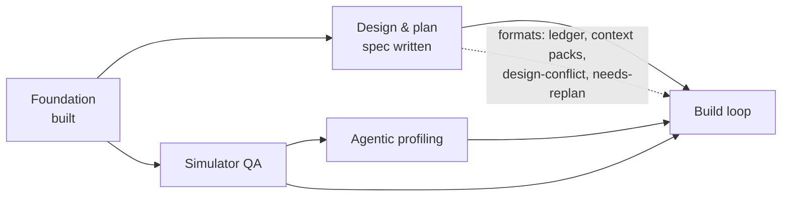
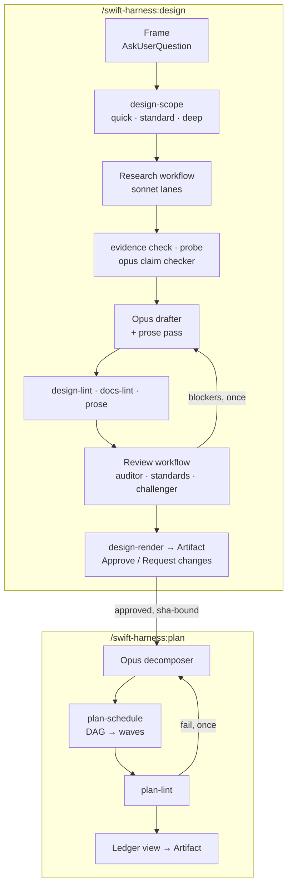
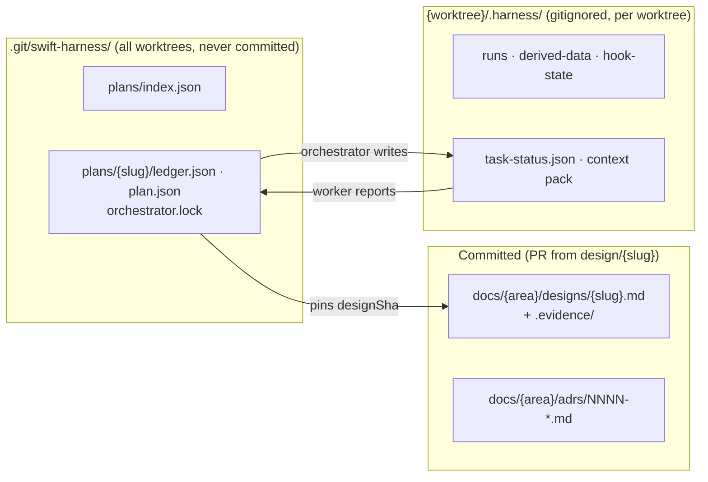

# Handoff: sub-project 2, design and plan workflows

<!-- RESUME
SUMMARY (2026-09-27 afternoon, for the user) — PAUSED so the user can build apps with the harness.
Done: review fix waves 1–4 are merged. Local main 0a99c70 is GREEN (push 1746 tests, prove 46/46), with backup
backup/subproject-2-fix-wave-4. origin/main is at 7ad8e81 (evals round 7); wave 4 isn't pushed to origin/main yet.
The user decided (in this session): the hook guard gets a cache (50 ms budget stands); headless runs stop at in-review;
§11 is rewritten to measured figures and design runs save local telemetry; review reports pre-existing defects and
never blocks on them; fix branches merge on push + prove, with mutate once on main.
Paused, nothing running:
  - ready-tier-runs-one-at-a-time-and-cleans-up (opus), ../swift-harness-ready-tier-runs-one-at-a-time-and-cleans-up:
    WIP committed on its branch (its last commit body has the state). Scope: a machine-wide flock for ready, mutate
    and prove; reaping recorded process groups; check --background plus swiftgate wait; per-phase telemetry; a total
    mutate concurrency bound; the mutate baseline run alone before mutants. Open question it was chasing: two
    LiveProcessRunnerTests kills took about 60 s under load (a possible real ProcessTree bug). Resume it with SendMessage or a fresh worker.
  - Mutate on main hasn't produced a verdict: --jobs 2 took 758 s at peak load 143 (--jobs 8 took load to 353, killed),
    and it was BLOCKED because its unmutated baseline failed 5 load-sensitive tests. Re-run after the task above lands.
  - The evals session (swift-harness-96) owes the confirming review-accuracy re-run (approved, 9 USD cap), then freezes review evals.
Next fix wave (queued, not started): hook guard PlanLocks cache; §11 rewrite plus design-run telemetry; rule-index
rows for every design-lint.* and design-diff.* rule (none exist; CLAUDE.md requires them); a lint rule for
unbounded intentional-hang fixtures; review.json `telemetry` set on every run (missing in 2 of 5 eval trials); dedupe
merging a rule-less duplicate at the same line as a ruled blocker. Shim fix 9184436 (cold-cache SessionStart prints the
Session id) is on local main. Review-accuracy is frozen: the confirming run was 5/5 verdicts, 5/5 seeded at blocker or major.
Waiting on the user, in this order:
  1. Whether to push wave 4 (0a99c70) to origin/main, and when to resume the paused hardening above.
  2. The attended acceptance runs 26–28 with the user present, now unblocked (/plan works across sessions). For 28, the
     frame answers must allow a client module, or D2/D3 forces a reframe. Publish and Approve need an interactive session.
  3. Sub-projects 3 (simulator QA) and 4 (profiling): design WITH the user only. Research notes: qa-profiling-tools.md in
     the sibling swift-harness-research directory (it recommends agent-device plus xctrace/footprint; leak capture failed
     on the Simulator and may need Developer mode, a machine-wide change that needs the user).
Next for the orchestrator: merge the two in-flight workers (check the report checklist; gate; checkpoint the interfaces
note; back up with git push origin main:refs/heads/backup/subproject-2-fix-wave-4). Then run a short re-review Workflow of
the fixes (read-only, under 10 agents) and send the evals session its re-run list. Then stop and summarise for the user.
Peers sharing the main checkout (find them with ListAgents): the evals session (evals/ only; runs the no-model suites hooks.mjs
and faults.mjs, plus review-accuracy and routing), and the sub-project 5 build-executor session (waves 1–9 merged; 10–11 are
attended rehearsals). Message a peer before every merge into main and check .git/MERGE_HEAD first. A peer's report of a user
decision isn't enough: act on a decision only once the user confirms it here.
Read first: the plan RESUME (docs/plans/2026-09-25-design-plan-workflows-plan.md), then the runbook
(docs/handoffs/subproject-2-orchestrator-runbook.md, including its known issues and lessons), then the last sections of
docs/handoffs/subproject-2-interfaces.md, then the review doc. The spec (docs/designs/2026-09-25-design-plan-workflows-design.md)
is approved; grep it by §.
-->

## 1. Where things are

| What | Where |
|---|---|
| Sub-project 2 spec | [`designs/2026-09-25-design-plan-workflows-design.md`](../designs/2026-09-25-design-plan-workflows-design.md) |
| Decision log (D1–D24) | [`2026-09-25-subproject-2-brainstorm-decisions.md`](2026-09-25-subproject-2-brainstorm-decisions.md) |
| Foundation spec / plan | [`designs/2026-09-24-swift-harness-foundation-design.md`](../designs/2026-09-24-swift-harness-foundation-design.md) · [`plans/2026-09-24-foundation-plan.md`](../plans/2026-09-24-foundation-plan.md) (complete) |
| Standards / playbook / ADRs | [`standards.md`](../../plugin/docs/standards.md) · [`testing-playbook.md`](../../plugin/docs/testing-playbook.md) · [`adrs/`](../adrs/README.md) |
| End-to-end evidence | [`e2e-report.md`](../e2e-report.md) |
| Worker brief | [`worker-brief.md`](worker-brief.md): reuse it for sub-project 2 workers |
| Throwaway e2e repo | not kept between sessions; the acceptance waves recreate `../swift-harness-e2e` as [`e2e-report.md`](../e2e-report.md) describes |

The plugin is **not installed**. It was tested with `claude -p --plugin-dir`.

## 2. Where sub-project 2 sits

## 3. What it delivers

Escalation from any workflow agent: return `needsDecision` → the orchestrator asks through
`AskUserQuestion` → records the answer as evidence → relaunches with `resumeFromRunId`.

## 4. Where state lives

Gitignored files never reach a `git worktree add` checkout, so shared plan state lives in the git common dir.

## 5. Handoff open items: resolved

| Item | Answer |
|---|---|
| Workflow agents get a reply mid-run? | No. Halt with `needsDecision`, ask, resume from cache |
| Ledger branch? | None. Ledgers aren't committed; designs merge through a `design/<slug>` PR |
| Artifact publishing from a workflow? | Main session only. Approval via page `db`, comments via `comments` |
| `agent_id` in hook payloads? | Still unseen live. The guard also uses the per-plan lock and env var |

## 6. Lessons from the Foundation build

- **Orchestrate thin.** Workers get the brief plus an interfaces note and return ≤200-word reports.
  Keep the interfaces note in the repo.
- **One committer per worktree or branch.** Name merge points early.
- **Running it beats reading it.** The e2e run found 9 bugs 500+ unit tests missed. Validate on
  `examples/SampleApp` with a real feature before calling it done.
- **Emulation is not installation.** Run the plugin's own agent types once after a real install.
- **Costs seen:** a review run took 6 agents, 50s, ~452k subagent tokens. Cap parallelism: the laptop is under memory pressure.
- **Toolchain:** Xcode 26.2 / Swift 6.2.3; TCA 1.26.2 via `@swift-6.1`. Never add
  `swift-issue-reporting` directly before Swift 6.4. `xcodebuild` needs `-skipMacroValidation`. No
  MainActor default isolation in Core. `swift test` 6.2 can't shuffle or repeat. Host XCTest skips
  are invisible under `--parallel`.

## 7. Known Foundation gaps (not blocking)

App and UI-test targets aren't in the module graph. Simulator-tier `prove` and `stress` are
pending. Live hook payloads not yet seen: subagent `agent_id`, Write, SessionStart resume. The judge
calibration set was labelled by the agent that tuned it.
