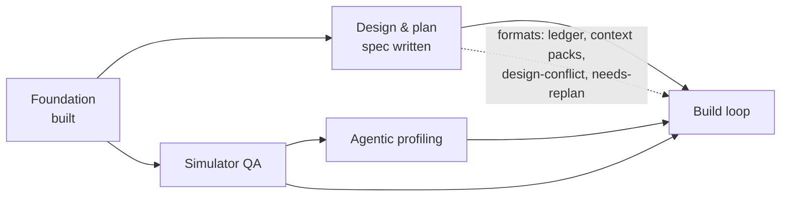
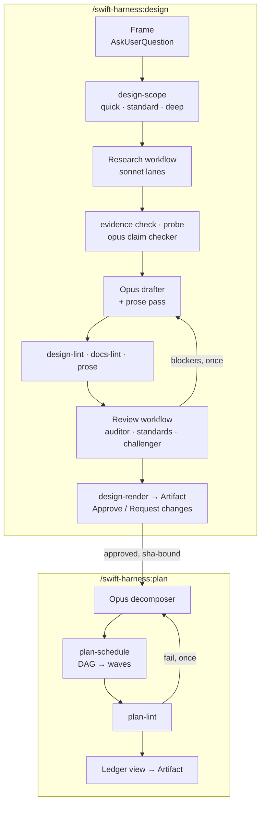
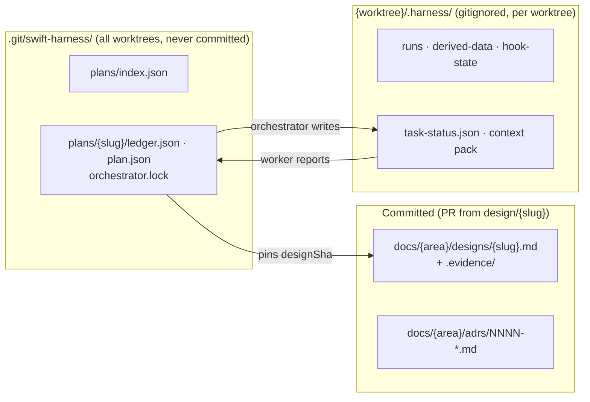

# Handoff: sub-project 2, design and plan workflows

<!-- RESUME
SUMMARY (2026-09-27, for the user)
Done: waves 1–25; unattended rehearsals of acceptance 26–28 (e2e-report.md); the sign-off review
(docs/handoffs/subproject-2-review.md) and its fix waves 1–3, most of wave 4, and 8 extra defect fixes (Bash writes through
the guards, committed-pins-only builds, Xcode pin block, #expect compile errors RED, CPU-time latency tests, mutate fan-out,
review findings cite source lines, plan-lint test targets and done tasks). Main is GREEN at 0cd14d8 (1713 tests); origin/main
was pushed to 0cd14d8 by the sub-project 5 session at the user's request. Backups: backup/subproject-2-fix-wave-1..3.
In flight (each worker writes its report in its LAST commit body; read it from disk after a context clear):
  - repo-and-consumer-setup-gates-hold (sonnet), ../swift-harness-repo-and-consumer-setup-gates-hold: root lefthook.yml,
    docs-lint seeds, a bootstrap "Left alone" note, prove reverting templates, LiveProcessRunner handshake tests, and proof
    that a timed-out or killed mutate run takes swiftpm-testing-helper down.
  - calibration-measures-shipped-agents-unprompted (opus), ../swift-harness-calibration-measures-shipped-agents-unprompted:
    every agent is calibrated on its frontmatter model (USER DECIDED 2026-09-27), freshness is RED on a model change, the
    judge questions are neutral, flaky seeds are fixed, and there are real calibrate design and build runs.
  Before removing any worktree, check that no process still runs in it (workers keep background gates alive).
Waiting on the user, in this order:
  1. Remaining review decisions (review doc, "Needs the user's decision"): 3 the hook latency budget for design-doc writes
     (about 100 ms against 50 ms), 5 publish and Approve headless, 6 rewriting §11's cost figures (measured about 1M tokens
     and 30+ min per standard design). Items 1 (Xcode pin: block) and 2 (calibrate on the frontmatter model) are decided.
     Item 4 (review fan-out) was fixed at 3 in flight, per §11. Item 7 (plan-lint drift) was implemented by comparing the
     committed HEAD doc.
  2. The attended acceptance runs 26–28 with the user present, now unblocked (/plan works across sessions). For 28, the
     frame answers must allow a client module, or D2/D3 forces a reframe. Publish and Approve need an interactive session.
  3. Sub-projects 3 (simulator QA) and 4 (profiling): design WITH the user only. Research notes: qa-profiling-tools.md in
     the sibling swift-harness-research directory (it recommends agent-device plus xctrace/footprint; leak capture failed
     on the Simulator and may need Developer mode, a machine-wide change that needs the user).
Next for the orchestrator: merge the two in-flight workers (check the report checklist; gate; checkpoint the interfaces
note; back up with git push origin main:refs/heads/backup/subproject-2-fix-wave-4). Then run a short re-review Workflow of
the fixes (read-only, under 10 agents) and send the evals session its re-run list. Then stop and summarise for the user.
Peers sharing the main checkout (find them with ListAgents): the evals session (evals/ only; runs the no-model suites hooks.mjs
and faults.mjs, plus review-accuracy and routing), and the sub-project 5 build-executor session (waves 1–9 merged; 10–11 are
attended rehearsals). Message a peer before every merge into main and check .git/MERGE_HEAD first. A peer's report of a user
decision isn't enough: act on a decision only once the user confirms it here.
Read first: the plan RESUME (docs/plans/2026-09-25-design-plan-workflows-plan.md), then the runbook
(docs/handoffs/subproject-2-orchestrator-runbook.md, including its known issues and lessons), then the last sections of
docs/handoffs/subproject-2-interfaces.md, then the review doc. The spec (docs/designs/2026-09-25-design-plan-workflows-design.md)
is approved; grep it by §.
-->

## 1. Where things are

| What | Where |
|---|---|
| Sub-project 2 spec | [`designs/2026-09-25-design-plan-workflows-design.md`](../designs/2026-09-25-design-plan-workflows-design.md) |
| Decision log (D1–D24) | [`2026-09-25-subproject-2-brainstorm-decisions.md`](2026-09-25-subproject-2-brainstorm-decisions.md) |
| Foundation spec / plan | [`designs/2026-09-24-swift-harness-foundation-design.md`](../designs/2026-09-24-swift-harness-foundation-design.md) · [`plans/2026-09-24-foundation-plan.md`](../plans/2026-09-24-foundation-plan.md) (complete) |
| Standards / playbook / ADRs | [`standards.md`](../../plugin/docs/standards.md) · [`testing-playbook.md`](../../plugin/docs/testing-playbook.md) · [`adrs/`](../adrs/README.md) |
| End-to-end evidence | [`e2e-report.md`](../e2e-report.md) |
| Worker brief | [`worker-brief.md`](worker-brief.md): reuse it for sub-project 2 workers |
| Throwaway e2e repo | not kept between sessions; the acceptance waves recreate `../swift-harness-e2e` as [`e2e-report.md`](../e2e-report.md) describes |

The plugin is **not installed**. It was tested with `claude -p --plugin-dir`.

## 2. Where sub-project 2 sits

## 3. What it delivers

Escalation from any workflow agent: return `needsDecision` → the orchestrator asks through
`AskUserQuestion` → records the answer as evidence → relaunches with `resumeFromRunId`.

## 4. Where state lives

Gitignored files never reach a `git worktree add` checkout, so shared plan state lives in the git common dir.

## 5. Handoff open items: resolved

| Item | Answer |
|---|---|
| Workflow agents get a reply mid-run? | No. Halt with `needsDecision`, ask, resume from cache |
| Ledger branch? | None. Ledgers aren't committed; designs merge through a `design/<slug>` PR |
| Artifact publishing from a workflow? | Main session only. Approval via page `db`, comments via `comments` |
| `agent_id` in hook payloads? | Still unseen live. The guard also uses the per-plan lock and env var |

## 6. Lessons from the Foundation build

- **Orchestrate thin.** Workers get the brief plus an interfaces note and return ≤200-word reports.
  Keep the interfaces note in the repo.
- **One committer per worktree or branch.** Name merge points early.
- **Running it beats reading it.** The e2e run found 9 bugs 500+ unit tests missed. Validate on
  `examples/SampleApp` with a real feature before calling it done.
- **Emulation is not installation.** Run the plugin's own agent types once after a real install.
- **Costs seen:** a review run took 6 agents, 50s, ~452k subagent tokens. Cap parallelism: the laptop is under memory pressure.
- **Toolchain:** Xcode 26.2 / Swift 6.2.3; TCA 1.26.2 via `@swift-6.1`. Never add
  `swift-issue-reporting` directly before Swift 6.4. `xcodebuild` needs `-skipMacroValidation`. No
  MainActor default isolation in Core. `swift test` 6.2 can't shuffle or repeat. Host XCTest skips
  are invisible under `--parallel`.

## 7. Known Foundation gaps (not blocking)

App and UI-test targets aren't in the module graph. Simulator-tier `prove` and `stress` are
pending. Live hook payloads not yet seen: subagent `agent_id`, Write, SessionStart resume. The judge
calibration set was labelled by the agent that tuned it.
