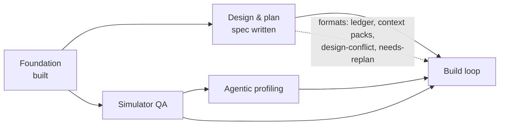
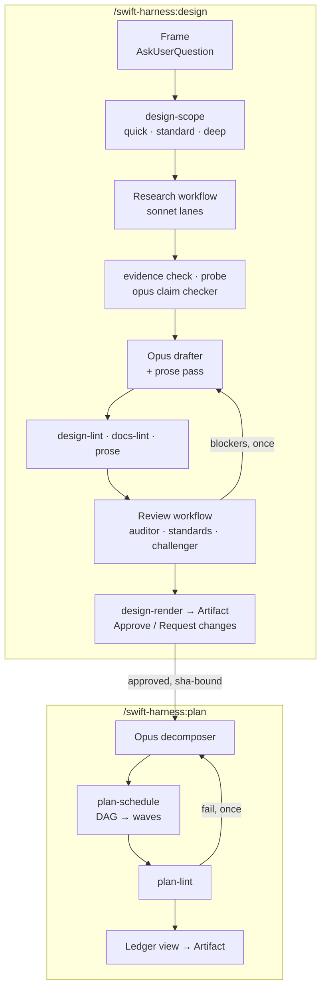
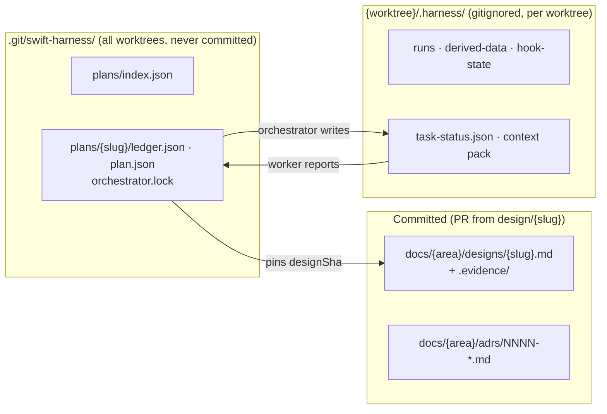

# Handoff: sub-project 2, design and plan workflows

<!-- RESUME
SUMMARY (2026-09-28 ~00:45, for the next orchestrator session). Context was cleared on purpose; the user wants every
remaining unattended wave run overnight, in order, without waiting on them.
State: origin/main 3dee52a (untouched; never push it without the user). Local main c48f765 holds speed wave 1 (merged,
push + prove + mutate GREEN, 16/16 killed), the fast-modes design (APPROVED) and plan, [ADR 0003](../adrs/0003-ship-may-skip-the-design-step.md) (accepted), and docs
commits. Backup: origin backup/subproject-2-speed-wave-1 = 9f913d2.
In flight at the clear: speed wave 2 (repo profile, worker-pack standards, task-gate impact/coverage/app-build). All 3
branches passed report review and sit merged on worktree ../swift-harness-speed-integration (branch speed-integration,
HEAD 7cb53d3; merged-surface proof base 002f4ae). Its gate `check --tier push --base main --prove --proof-base 002f4ae`
was running; read its report under that worktree's .harness/runs/ (newest), or re-run it. GREEN → message peers,
merge speed-integration into main, push tier on main, `mutate --base <main before the merge> --jobs 2`, checkpoint.
Overnight queue, in order (all opus, surface-first, push + prove merge gate, mutate once on main per wave):
  1. Finish speed wave 2 as above; append "Speed wave 2" to docs/handoffs/subproject-5-interfaces.md from the reports
     (profile: `[harness] profile`, `bootstrap --profile`, `doctor.profile`; worker pack derives kinds from the write set,
     `context-pack.module-kind-unknown`; check steps `--impact --coverage --app-build`, rules `app-build.*`).
  2. Combined wave (4 tasks, disjoint files): speed wave 3 (`speed-budget-keeps-app-compiling`,
     `speed-check-return-requires-task-gate-steps`, build-executor plan "Speed") + fast-modes wave 1
     (`surface-check-command`, `sprint-state-machine`, docs/plans/2026-09-27-fast-modes-plan.md).
  3. Fast-modes wave 2 (`sprint-commands`), then wave 3 (`sprint-skill`). Wave 4 (rehearsals) is attended: stop there.
  4. Then plan and run the queued sub-project 2 hardening the user already approved: hook guard PlanLocks cache (50 ms
     budget stands); §11 rewritten to measured figures + design-run telemetry; rule-index rows for every design-lint.*
     and design-diff.* rule; a lint for intentional-hang fixtures without their own deadline; review.json `telemetry` on
     every run; dedupe merging a rule-less duplicate of a ruled blocker; running sessions caching agent prompts (at
     least document it in the build skill); plan-lint's budget estimate dropping unresolved write-set entries silently;
     a build worker stopping at its first red test; plus, approved 2026-09-27, `arch.ui-host-compiled` (major) and the
     stale-session doctor check that stops ship, build and sprint (docs/designs/2026-09-27-speed-research-coverage-design.md
     §3, §4). All of it tonight (user, 2026-09-27). Write their task sections in a plan before spawning workers.
Rules from the user (2026-09-27): every worker on opus (the runbook says so). Build the harness for correctness: design
approval, plan tasks, surface-first workers, push + prove merge gate, mutate once on main; never shortcut because the
feature is a speed mode. Only 1 ready tier or prove on the machine at a time (workers share the mkdir lock
/tmp/swift-harness-speed-prove.lock); arm the watchdog Monitor while workers run and handle orphans and load yourself.
Gate before every commit. Message peer sessions (ListAgents) before each merge into main. Never push origin/main; a
backup branch push is fine after grepping the unpushed diff (`git diff origin/main..main`) for interview-specific terms.
Keep the harness generic. The ready-lock branch (../swift-harness-ready-tier-runs-one-at-a-time-and-cleans-up) stays
parked. Attended work waits for the user: fast-modes rehearsals, build-executor waves 10–11, acceptance runs 26–28,
sub-projects 3 and 4.
Known gaps to watch: interview-rehearsal-1's .swiftgate.toml lacks `task_proof` (its session was told; leave its repo
alone). Design-free ship (fast-modes design §5) waits for sprint's rehearsals before it gets plan tasks.
Read first: this header, the runbook in full (docs/handoffs/subproject-2-orchestrator-runbook.md, including "Lessons from
the first speed wave"), docs/handoffs/worker-brief.md (pitfall 10), then each plan's task sections as you reach them.
-->

## 1. Where things are

| What | Where |
|---|---|
| Sub-project 2 spec | [`designs/2026-09-25-design-plan-workflows-design.md`](../designs/2026-09-25-design-plan-workflows-design.md) |
| Decision log (D1–D24) | [`2026-09-25-subproject-2-brainstorm-decisions.md`](2026-09-25-subproject-2-brainstorm-decisions.md) |
| Foundation spec / plan | [`designs/2026-09-24-swift-harness-foundation-design.md`](../designs/2026-09-24-swift-harness-foundation-design.md) · [`plans/2026-09-24-foundation-plan.md`](../plans/2026-09-24-foundation-plan.md) (complete) |
| Standards / playbook / ADRs | [`standards.md`](../../plugin/docs/standards.md) · [`testing-playbook.md`](../../plugin/docs/testing-playbook.md) · [`adrs/`](../adrs/README.md) |
| End-to-end evidence | [`e2e-report.md`](../e2e-report.md) |
| Worker brief | [`worker-brief.md`](worker-brief.md): reuse it for sub-project 2 workers |
| Throwaway e2e repo | not kept between sessions; the acceptance waves recreate `../swift-harness-e2e` as [`e2e-report.md`](../e2e-report.md) describes |

The plugin is **not installed**. It was tested with `claude -p --plugin-dir`.

## 2. Where sub-project 2 sits

## 3. What it delivers

Escalation from any workflow agent: return `needsDecision` → the orchestrator asks through
`AskUserQuestion` → records the answer as evidence → relaunches with `resumeFromRunId`.

## 4. Where state lives

Gitignored files never reach a `git worktree add` checkout, so shared plan state lives in the git common dir.

## 5. Handoff open items: resolved

| Item | Answer |
|---|---|
| Workflow agents get a reply mid-run? | No. Halt with `needsDecision`, ask, resume from cache |
| Ledger branch? | None. Ledgers aren't committed; designs merge through a `design/<slug>` PR |
| Artifact publishing from a workflow? | Main session only. Approval via page `db`, comments via `comments` |
| `agent_id` in hook payloads? | Still unseen live. The guard also uses the per-plan lock and env var |

## 6. Lessons from the Foundation build

- **Orchestrate thin.** Workers get the brief plus an interfaces note and return ≤200-word reports.
  Keep the interfaces note in the repo.
- **One committer per worktree or branch.** Name merge points early.
- **Running it beats reading it.** The e2e run found 9 bugs 500+ unit tests missed. Validate on
  `examples/SampleApp` with a real feature before calling it done.
- **Emulation is not installation.** Run the plugin's own agent types once after a real install.
- **Costs seen:** a review run took 6 agents, 50s, ~452k subagent tokens. Cap parallelism: the laptop is under memory pressure.
- **Toolchain:** Xcode 26.2 / Swift 6.2.3; TCA 1.26.2 via `@swift-6.1`. Never add
  `swift-issue-reporting` directly before Swift 6.4. `xcodebuild` needs `-skipMacroValidation`. No
  MainActor default isolation in Core. `swift test` 6.2 can't shuffle or repeat. Host XCTest skips
  are invisible under `--parallel`.

## 7. Known Foundation gaps (not blocking)

App and UI-test targets aren't in the module graph. Simulator-tier `prove` and `stress` are
pending. Live hook payloads not yet seen: subagent `agent_id`, Write, SessionStart resume. The judge
calibration set was labelled by the agent that tuned it.
