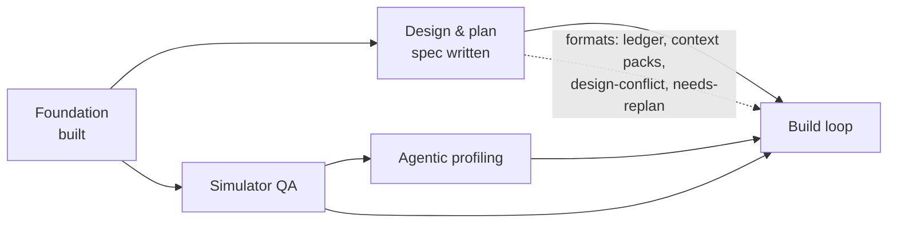
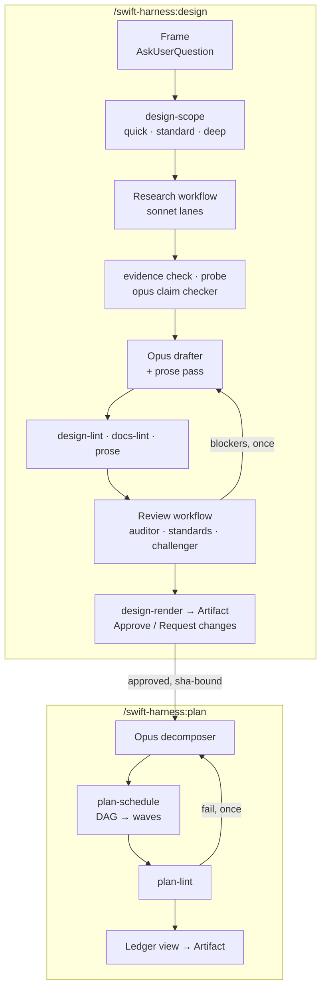
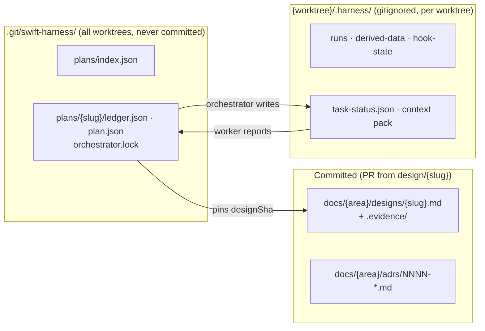

# Handoff: sub-project 2, design and plan workflows

<!-- RESUME
State (2026-09-26): IN PROGRESS. Waves 1–24 are merged and on origin/main (push tier GREEN, 1439 tests). Wave 25 is in flight.
Wave 25, in flight when this was written:
  - contributor-agents-md-for-harness-developers: done at 2af43c8 in ../swift-harness-contributor-agents-md-for-harness-developers.
    Push, docs-lint and prose are GREEN; it's 50 lines. The orchestrator reviewed and ACCEPTED it; merge it with the other wave 25 branch.
    Follow-up for the review: no automated check enforces "AGENTS.md names no app-only rule".
  - consumer-steering-channels (opus worker): running in ../swift-harness-consumer-steering-channels. Its full report goes in
    its LAST commit message body, including the observed CLAUDE_PLUGIN_ROOT/CLAUDE_PLUGIN_DATA values. Before touching that
    worktree, wait until it's quiet: `ps` shows no swift or claude process working in that path, and no new commits for a few
    minutes. Then check the report against the runbook checklist. The pre-step values must be real observations; if they're
    missing, re-run the pre-step yourself. The leak check must be shown failing on a planted ../../docs/adrs link.
Then, in order (the user approved this plan on 2026-09-26):
  1. Merge wave 25 (re-check `git log main` first: the evals session also merges to main), gate, checkpoint, and back up with
     `git push origin main:refs/heads/backup/subproject-2-wave-25`. Don't push origin/main unless the user says so.
  2. Acceptance waves 26–28 as an unattended REHEARSAL, recorded as such in docs/e2e-report.md:
     26 plugin-installs-for-real: install at PROJECT scope into a temp copy of examples/SampleApp, never the user's global config.
     27 nonexistent-api-run-refutes-claim: prove the API absent first, then run to the frame questions. This throwaway design is
        never merged, so the orchestrator may answer its frame questions, labelled "orchestrator-answered rehearsal".
     28 sampleapp-standard-design-to-plan: run up to publish. STOP before the Approve click and the merge/push; those are the user's.
        Never write an approval or answer record in the user's name.
     Fix harness defects the rehearsal finds, through the wave loop.
  3. The user opted in to a Workflow: review, audit and analyse all of sub-project 2 together with the evals session
     (ListAgents; its name starts with swift-harness-, and it's NOT this session). Send it eval requests, and fix what's found
     until sub-project 2 is something we'd sign off on as excellent. Load the workflow-authoring skill first.
  4. Sub-projects 3 (simulator QA) and 4 (profiling): design WITH the user only. Research notes, in progress:
     /Users/caleb/Developer/swift-harness-research/qa-profiling-tools.md. The user named AutoMobile MCP (already at 0.0.81,
     the latest), callstack agent-device and Maestro, and values simplicity and "works really well" above breadth.
Read first: the plan RESUME (docs/plans/2026-09-25-design-plan-workflows-plan.md) → the runbook
(docs/handoffs/subproject-2-orchestrator-runbook.md), which also lists known issues and lessons → the last section of
docs/handoffs/subproject-2-interfaces.md. The spec (docs/designs/2026-09-25-design-plan-workflows-design.md) is approved; grep it by §.
-->

## 1. Where things are

| What | Where |
|---|---|
| Sub-project 2 spec | [`designs/2026-09-25-design-plan-workflows-design.md`](../designs/2026-09-25-design-plan-workflows-design.md) |
| Decision log (D1–D24) | [`2026-09-25-subproject-2-brainstorm-decisions.md`](2026-09-25-subproject-2-brainstorm-decisions.md) |
| Foundation spec / plan | [`designs/2026-09-24-swift-harness-foundation-design.md`](../designs/2026-09-24-swift-harness-foundation-design.md) · [`plans/2026-09-24-foundation-plan.md`](../plans/2026-09-24-foundation-plan.md) (complete) |
| Standards / playbook / ADRs | [`standards.md`](../../plugin/docs/standards.md) · [`testing-playbook.md`](../../plugin/docs/testing-playbook.md) · [`adrs/`](../adrs/README.md) |
| End-to-end evidence | [`e2e-report.md`](../e2e-report.md) |
| Worker brief | [`worker-brief.md`](worker-brief.md): reuse it for sub-project 2 workers |
| Throwaway e2e repo | not kept between sessions; the acceptance waves recreate `../swift-harness-e2e` as [`e2e-report.md`](../e2e-report.md) describes |

The plugin is **not installed**. It was tested with `claude -p --plugin-dir`.

## 2. Where sub-project 2 sits

## 3. What it delivers

Escalation from any workflow agent: return `needsDecision` → the orchestrator asks through
`AskUserQuestion` → records the answer as evidence → relaunches with `resumeFromRunId`.

## 4. Where state lives

Gitignored files never reach a `git worktree add` checkout, so shared plan state lives in the git common dir.

## 5. Handoff open items: resolved

| Item | Answer |
|---|---|
| Workflow agents get a reply mid-run? | No. Halt with `needsDecision`, ask, resume from cache |
| Ledger branch? | None. Ledgers aren't committed; designs merge through a `design/<slug>` PR |
| Artifact publishing from a workflow? | Main session only. Approval via page `db`, comments via `comments` |
| `agent_id` in hook payloads? | Still unseen live. The guard also uses the per-plan lock and env var |

## 6. Lessons from the Foundation build

- **Orchestrate thin.** Workers get the brief plus an interfaces note and return ≤200-word reports.
  Keep the interfaces note in the repo.
- **One committer per worktree or branch.** Name merge points early.
- **Running it beats reading it.** The e2e run found 9 bugs 500+ unit tests missed. Validate on
  `examples/SampleApp` with a real feature before calling it done.
- **Emulation is not installation.** Run the plugin's own agent types once after a real install.
- **Costs seen:** a review run took 6 agents, 50s, ~452k subagent tokens. Cap parallelism: the laptop is under memory pressure.
- **Toolchain:** Xcode 26.2 / Swift 6.2.3; TCA 1.26.2 via `@swift-6.1`. Never add
  `swift-issue-reporting` directly before Swift 6.4. `xcodebuild` needs `-skipMacroValidation`. No
  MainActor default isolation in Core. `swift test` 6.2 can't shuffle or repeat. Host XCTest skips
  are invisible under `--parallel`.

## 7. Known Foundation gaps (not blocking)

App and UI-test targets aren't in the module graph. Simulator-tier `prove` and `stress` are
pending. Live hook payloads not yet seen: subagent `agent_id`, Write, SessionStart resume. The judge
calibration set was labelled by the agent that tuned it.
