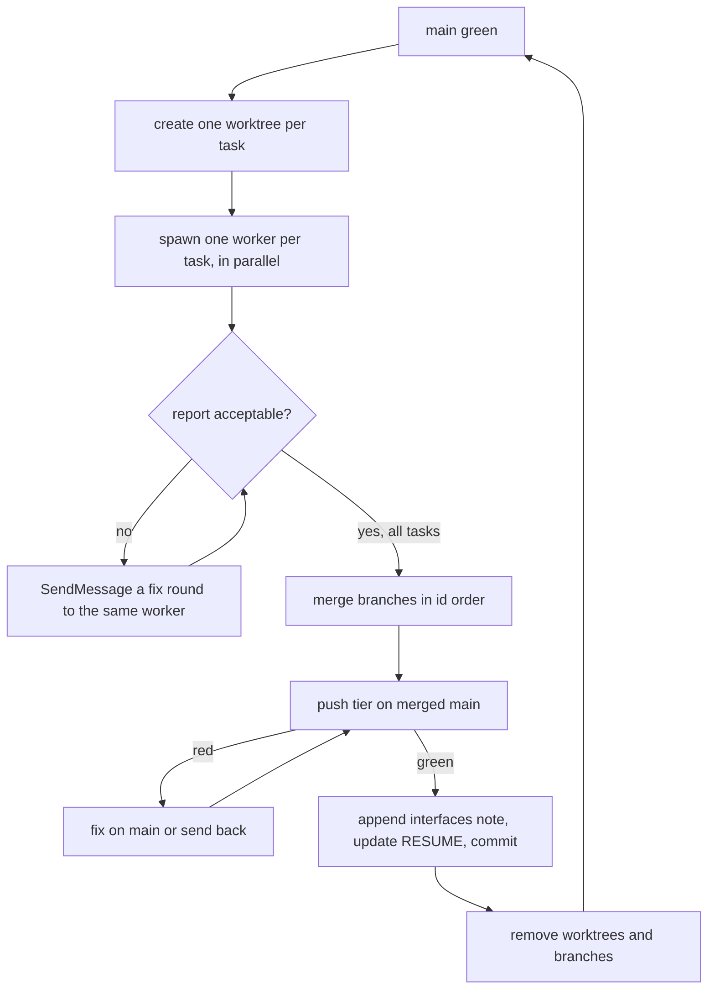

# Sub-project 2 — orchestrator runbook

How to drive the [implementation plan](../plans/2026-09-25-design-plan-workflows-plan.md) wave by wave. It records
the procedure the orchestrator actually used for waves 1–5. Workers never read this file: they get the
[worker brief](worker-brief.md). Only the orchestrator commits to `main`.

## Kickoff prompt for a fresh orchestrator session

Start a NEW Claude Code session in the repo root, then paste:

> You are the orchestrator for sub-project 2 of swift-harness. On a machine that has never run a wave, do the
> runbook's "New machine" steps first. Read, in order and nothing else up front:
> `docs/handoffs/2026-09-25-subproject-2.md` (RESUME header only), the plan's RESUME header
> (`docs/plans/2026-09-25-design-plan-workflows-plan.md`), this runbook
> (`docs/handoffs/subproject-2-orchestrator-runbook.md`) in full, and the LAST wave section of
> `docs/handoffs/subproject-2-interfaces.md`. Then run the "Resume from cold" checks and drive the next wave
> with the wave loop. Workers get `docs/handoffs/worker-brief.md`. Check every report against the report
> checklist before merging. Stay thin: workers read the plan and spec; you read reports, merge, gate and
> checkpoint. Merges stay on local `main`. After each wave, refresh the backup with
> `git push origin main:refs/heads/backup/subproject-2-wave-<N>`. Only push `origin/main` if I say so. Stop
> and ask me before the acceptance waves (26–28), which need me present.

## New machine

All build state lives in this repo: the plan and its RESUME header, this runbook, the worker brief, the
interfaces note and the handoff. Nothing lives in Claude memory, and there's no plan state under `.git`. On a
fresh laptop:

1. Clone, then check `main` matches `origin/main`. `backup/subproject-2-wave-<N>` branches on `origin` hold each
   wave's merged state.
2. Match the toolchain the waves ran on: Swift 6.2.3 (Xcode 26.2), node 24, `lefthook` on `PATH` (its install test
   skips without it), plus stock `rsync`, `python3` and `perl`. A different Swift minor version can change the toolchain facts in the plan's "How to work this plan"
   section. Re-check them before wave 1 on that machine, and record any change here.
3. Build once so worktrees have a `.build` to clone: `swift build --package-path gate`, then
   `bin/swiftgate check --tier push`. The first build compiles SwiftSyntax and takes minutes. The shim's own
   cache, `~/.cache/swift-harness`, fills itself.
4. Claude Code only needs the built-in `general-purpose` agent, the `sonnet` and `opus` models, and
   `SendMessage` for fix rounds. The build uses no user-level plugin or skill.
5. The sibling e2e repo `../swift-harness-e2e` isn't kept. The acceptance waves recreate it as
   `docs/e2e-report.md` describes.

## Resume from cold

1. Read the plan's RESUME header: the status, the next wave, and open items.
2. Read the last section of the [interfaces note](subproject-2-interfaces.md) to see what the latest wave built.
3. Run `git worktree list` and `git log --oneline -15` in the repo. A leftover `../swift-harness-<task-id>`
   worktree means a wave was cut off mid-flight. Its branch holds the worker's commits. Check them, and merge or redo.
4. Confirm `main` is green before starting anything: `bin/swiftgate check --tier push`.

## The wave loop



### 1. Worktrees

From the repo root, for each task in the wave:

```sh
git worktree add -q ../swift-harness-<task-id> -b <task-id> main
cp -cR gate/.build ../swift-harness-<task-id>/gate/.build
/usr/bin/find ../swift-harness-<task-id>/gate/.build -type d -name ModuleCache -prune -exec rm -rf {} +
```

The APFS clone saves a cold SwiftSyntax build. The cloned `ModuleCache` has headers that point at the old path and
fail the build, so delete it. Call `/usr/bin/find` directly: a shell wrapper that rewrites `find` can drop `-exec`
without telling you.

### 2. Workers

One background agent per task, all spawned in one message. Wave width is at most 3, because the laptop is under
memory pressure.

- **Model.** Use `sonnet` for data models, commands, lints and fixtures. Use `opus` for security-relevant or
  judgment-heavy work: guards, locks, cross-worktree state, the probe builder, workflows, agent prompts, skills,
  and acceptance runs. Never leave a worker's model unset.
- **Prompt template.** Replace `<task-id>` and add task-specific hard requirements where the task is risky:

  > You are a build worker for the swift-harness plugin. Your worktree: `../swift-harness-<task-id>` (branch
  > `<task-id>`). Work ONLY in that worktree. You are its only committer. Commit locally and never push.
  >
  > Read in this order:
  > 1. `docs/handoffs/worker-brief.md`: your standing rules.
  > 2. The plan's "Decisions made while planning" and "How to work this plan" sections (including Merge points),
  >    and your task section `### <task-id>`. Read nothing else of the plan.
  > 3. `docs/handoffs/subproject-2-interfaces.md`.
  > 4. The spec, but only the sections your task cites. Grep for them; don't read it whole.
  >
  > Rules:
  > - Test-first. Stay inside your write set; if you must go outside it, stop and report why.
  > - Run every build, test and gate in the FOREGROUND: no Monitor, no run_in_background, and a Bash timeout of up
  >   to 600000. Ending your turn is your return value.
  > - Done means `bin/swiftgate check --tier <gate>` is GREEN, plus the brief's self-gate. Main is green, so any
  >   red finding is yours.
  > - Commit messages describe behaviour, never contain task ids or wave numbers, and end with the repo's
  >   Co-Authored-By trailer.
  >
  > Return a report of ≤200 words: the commit shas, the gate verdict line and run id, tests added, "notes for next
  > waves" (exact type names, formats, flags and exit codes), and anything blocked.

- **Risky-task additions that paid off:**
  - a real `git worktree add` plus symlinked temp dirs for path code
  - real concurrency (N writers, no lost updates, atomic rename) for shared files
  - an exclusive-create race for locks
  - false-positive lists for pattern rules
  - real captured tool output, never hand-written fixtures

### 3. Checking a report before merging

Read every report against this list. Each item caught a real defect in waves 1–7.

| Check | What it caught |
|---|---|
| **Enforcement lands with its first passing input.** Does the task switch on a check, hook or gate that calls something not built yet? | a stamped `commit-msg` hook calling a flag that didn't exist yet (it would have failed every commit in bootstrapped repos); the calibration gate that would have been red for 6 waves |
| **Worker brief pitfalls 1–9** were added after wave 5. Still check each report against them; the brief lowers the rate, it doesn't make it zero. |  |
| **Types at trust boundaries are closed.** Look for `String` where an enum exists, or `.other(String)` / `.unknown` catch-alls. A parser of hand-written docs may keep unknowns *for a lint to report*; data written by workers or read by a gate must fail loudly | the ledger gate typed as `String`; an open `TaskStatus` |
| **Scope of authority.** Guards, locks and ownership: can holder A act on B's resource? | any plan's lock could write any plan's design doc |
| **Deviations outside the write set.** Are they justified, and do they collide with a later task's file? Update the plan's Merge points if they do | `HookRunner.swift`, `Rule.swift`, `standards.md` rule-index rows |
| **"Pre-existing red" claims.** Verify on `main` yourself. A real pre-existing red is a harness bug: fix it in a separate branch and merge it first | `coverage.no-t1-tests` on the test-support module → new `test-support` kind |
| **A spec gap surfaced by the implementation.** Fix it in the spec, the interfaces note and the plan in the same commit | `designSha` hashes content git never stores → revisions are found by walking history |
| **"All N" claims.** Count the implementation against the task's Does line. Worker prompts require one line per Does/Tests bullet naming its test | "all 8 roles" delivered 3 context-pack builders |
| **Severity matches the spec.** `minor` and `nit` never fail the gate. A spec "violation" must be `major` | design-lint budget findings shipped as advisory |
| **A second copy of shared logic.** A worker that can't edit a shared file re-implements it. Clear the edit and extract one function instead | review-synth's drop step copied into the design path; the section order list held twice |
| **Routing around a shared fixture.** A rule that finds `GF/design/valid.md` invalid fixes it, never a private "valid" copy. Read the fixture diff: every citation must support its bullet | three rule families failed `valid.md`; the first fix tagged 5 Perf bullets with an unrelated claim |
| **A check that can't fail.** Build the smallest input the rule exists to catch, and ask whether the implementation flags it | `[UNVERIFIED]` coverage passed whenever Risks was non-empty |
| **Recurring minor gate findings.** A non-gating finding that shows up every wave is a real gap | untested config range validation |

A fix round is a `SendMessage` to the **same** worker, which keeps its context. List the exact change, the tests to
add, and "reply in ≤60–80 words: sha, test count, gate run id". Use one round per issue. If a second round is
needed, start a fresh worker with a fresh prompt.

### 4. Merge and checkpoint

```sh
git merge --no-ff -q -m "Merge: <the branch's last commit subject>" <task-id>   # each branch, in id order
bin/swiftgate check --tier push                                                # must be GREEN on merged main
```

Then, in one commit:
- Append a `## Wave N` section to the interfaces note: every type, format, flag, exit code and constraint that
  later workers need, taken from the reports' "notes for next waves".
- Update the plan's RESUME header: the waves merged and the next wave's task ids.

Then remove each wave's worktree and branch: `git worktree remove --force` and `git branch -d`.

### 5. Pushing

Merges stay local until the user says to push. Ask once at a natural stop. Never force-push `main`.

## Costs seen (waves 1–5)

- A worker used about 140k–300k subagent tokens and took 9–35 minutes. An Opus guard or lock task sits at the
  top of that range.
- A wave of 3 took about 20–35 minutes of wall time. The push tier on `main` took 45–70 seconds.
- Fix rounds through `SendMessage` cost about 10–40k tokens each. They're far cheaper than re-running a worker.

## Known issues to watch

- Latency-budget tests assert the fastest of several runs (cold hooks, cached shim, hook commands). A flake there
  now means a real regression or a new single-shot timing assert: check which before retrying.
- The review workflow reads a contributor ADR at runtime until the packaging wave moves the contract into
  `plugin/docs/` (ADR 0002, steering).
- From the packaging wave on, the root `bin/swiftgate` is gone. Run `plugin/bin/swiftgate`, and seed worktrees by
  cloning `plugin/gate/.build` instead of `gate/.build`.
- The acceptance waves are attended. The user answers the frame questions, clicks Approve, and approves the merge
  and push, so schedule them when the user is present.
