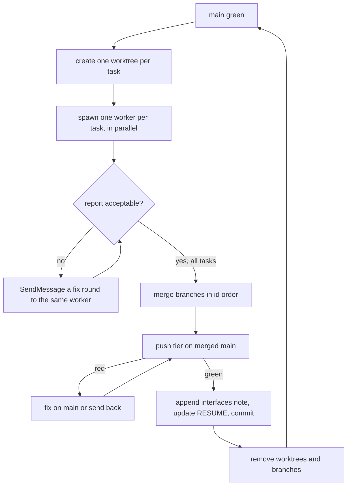

# Sub-project 2 — orchestrator runbook

How to drive the [implementation plan](../plans/2026-09-25-design-plan-workflows-plan.md) wave by wave. It records
the procedure the orchestrator actually used for waves 1–5. Workers never read this file: they get the
[worker brief](worker-brief.md). Only the orchestrator commits to `main`.

## Kickoff prompt for a fresh orchestrator session

Start a NEW Claude Code session in the repo root, then paste:

> You are the orchestrator for sub-project 2 of swift-harness. On a machine that has never run a wave, do the
> runbook's "New machine" steps first. Read, in order and nothing else up front:
> `docs/handoffs/2026-09-25-subproject-2.md` (RESUME header only), the plan's RESUME header
> (`docs/plans/2026-09-25-design-plan-workflows-plan.md`), this runbook
> (`docs/handoffs/subproject-2-orchestrator-runbook.md`) in full, and the LAST wave section of
> `docs/handoffs/subproject-2-interfaces.md`. Then run the "Resume from cold" checks and drive the next wave
> with the wave loop. Workers get `docs/handoffs/worker-brief.md`. Check every report against the report
> checklist before merging. Stay thin: workers read the plan and spec; you read reports, merge, gate and
> checkpoint. Merges stay on local `main`. After each wave, refresh the backup with
> `git push origin main:refs/heads/backup/subproject-2-wave-<N>`. Only push `origin/main` if I say so. Stop
> and ask me before the acceptance waves (26–28), which need me present.

## New machine

All build state lives in this repo: the plan and its RESUME header, this runbook, the worker brief, the
interfaces note and the handoff. Nothing lives in Claude memory, and there's no plan state under `.git`. On a
fresh laptop:

1. Clone, then check `main` matches `origin/main`. `backup/subproject-2-wave-<N>` branches on `origin` hold each
   wave's merged state.
2. Match the toolchain the waves ran on: Swift 6.2.3 (Xcode 26.2), node 24, `lefthook` on `PATH` (its install test
   skips without it), plus stock `rsync`, `python3` and `perl`. A different Swift minor version can change the toolchain facts in the plan's "How to work this plan"
   section. Re-check them before wave 1 on that machine, and record any change here.
3. Build once so worktrees have a `.build` to clone: `swift build --package-path plugin/gate`, then
   `plugin/bin/swiftgate check --tier push`. The first build compiles SwiftSyntax and takes minutes. The shim's own
   cache, `~/.cache/swift-harness/`, fills itself.
4. Claude Code only needs the built-in `general-purpose` agent, the `sonnet` and `opus` models, and
   `SendMessage` for fix rounds. The build uses no user-level plugin or skill.
5. Node tests run under node 24 without changing the global default: `mise exec node@24 -- node tests/<x>_test.mjs`.
6. `plugin-dev:plugin-validator` and `plugin-dev:skill-reviewer` may be absent. Workers substitute
   `claude plugin validate --strict` on a temp plugin-shaped copy (`.claude-plugin/plugin.json` plus the component
   dirs; at the repo root it only checks the marketplace manifest) and, for skills, a review against the
   `anthropic-skills:skill-creator` skill.
7. The sibling e2e repo `../swift-harness-e2e` isn't kept. The acceptance waves recreate it as
   `docs/e2e-report.md` describes.

## Resume from cold

1. Read the plan's RESUME header: the status, the next wave, and open items.
2. Read the last section of the [interfaces note](subproject-2-interfaces.md) to see what the latest wave built.
3. Run `git worktree list` and `git log --oneline -15` in the repo. A leftover `../swift-harness-<task-id>`
   worktree means a wave was cut off mid-flight. Its branch holds the worker's commits. Check them, and merge or redo.
4. Confirm `main` is green before starting anything: `plugin/bin/swiftgate check --tier push`.

## The wave loop



### 1. Worktrees

From the repo root, for each task in the wave:

```sh
git worktree add -q ../swift-harness-<task-id> -b <task-id> main
cp -cR plugin/gate/.build ../swift-harness-<task-id>/plugin/gate/.build
/usr/bin/find ../swift-harness-<task-id>/plugin/gate/.build -type d -name ModuleCache -prune -exec rm -rf {} +
```

The APFS clone saves a cold SwiftSyntax build. The cloned `ModuleCache` has headers that point at the old path and
fail the build, so delete it. Call `/usr/bin/find` directly: a shell wrapper that rewrites `find` can drop `-exec`
without telling you.

### 2. Workers

One background agent per task, all spawned in one message. Wave width is at most 3, because the laptop is under
memory pressure.

- **Model.** Every build worker runs on `opus` (user decision, 2026-09-27: the quality is worth the cost). Never
  leave a worker's model unset.
- **Prompt template.** Replace `<task-id>` and add task-specific hard requirements where the task is risky:

  > You are a build worker for the swift-harness plugin. Your worktree: `../swift-harness-<task-id>` (branch
  > `<task-id>`). Work ONLY in that worktree. You are its only committer. Commit locally and never push.
  >
  > Read in this order:
  > 1. `docs/handoffs/worker-brief.md`: your standing rules.
  > 2. The plan's "Decisions made while planning" and "How to work this plan" sections (including Merge points),
  >    and your task section `### <task-id>`. Read nothing else of the plan.
  > 3. `docs/handoffs/subproject-2-interfaces.md`.
  > 4. The spec, but only the sections your task cites. Grep for them; don't read it whole.
  >
  > Rules:
  > - Test-first. Stay inside your write set; if you must go outside it, stop and report why.
  > - Run every build, test and gate in the FOREGROUND: no Monitor, no run_in_background, and a Bash timeout of up
  >   to 600000. Ending your turn is your return value.
  > - Commit new API as a behaviour-free surface commit before the tests and behaviour (brief pitfall 10), and
  >   prove at it: `check --tier push --base main --prove --proof-base <surface sha>`, one prove on the machine
  >   at a time.
  > - Done means `plugin/bin/swiftgate check --tier <gate>` is GREEN, plus the brief's self-gate. Main is green, so any
  >   red finding is yours.
  > - Commit messages describe behaviour, never contain task ids or wave numbers, and end with the repo's
  >   Co-Authored-By trailer.
  >
  > Return a report of ≤200 words: the commit shas, the gate verdict line and run id, tests added, "notes for next
  > waves" (exact type names, formats, flags and exit codes), and anything blocked.

- **Risky-task additions that paid off:**
  - a real `git worktree add` plus symlinked temp dirs for path code
  - real concurrency (N writers, no lost updates, atomic rename) for shared files
  - an exclusive-create race for locks
  - false-positive lists for pattern rules
  - real captured tool output, never hand-written fixtures

### 3. Checking a report before merging

Read every report against this list. Each item caught a real defect in waves 1–7.

| Check | What it caught |
|---|---|
| **Enforcement lands with its first passing input.** Does the task switch on a check, hook or gate that calls something not built yet? | a stamped `commit-msg` hook calling a flag that didn't exist yet (it would have failed every commit in bootstrapped repos); the calibration gate that would have been red for 6 waves |
| **Worker brief pitfalls 1–10** were added after wave 5 (10, the surface commit, after the first speed wave's prove went RED on 28 compile-only tests). Still check each report against them; the brief lowers the rate, it doesn't make it zero. |  |
| **Types at trust boundaries are closed.** Look for `String` where an enum exists, or `.other(String)` / `.unknown` catch-alls. A parser of hand-written docs may keep unknowns *for a lint to report*; data written by workers or read by a gate must fail loudly | the ledger gate typed as `String`; an open `TaskStatus` |
| **Scope of authority.** Guards, locks and ownership: can holder A act on B's resource? | any plan's lock could write any plan's design doc |
| **Deviations outside the write set.** Are they justified, and do they collide with a later task's file? Update the plan's Merge points if they do | `HookRunner.swift`, `Rule.swift`, `standards.md` rule-index rows |
| **"Pre-existing red" claims.** Verify on `main` yourself. A real pre-existing red is a harness bug: fix it in a separate branch and merge it first | `coverage.no-t1-tests` on the test-support module → new `test-support` kind |
| **A spec gap surfaced by the implementation.** Fix it in the spec, the interfaces note and the plan in the same commit | `designSha` hashes content git never stores → revisions are found by walking history |
| **"All N" claims.** Count the implementation against the task's Does line. Worker prompts require one line per Does/Tests bullet naming its test | "all 8 roles" delivered 3 context-pack builders |
| **Severity matches the spec.** `minor` and `nit` never fail the gate. A spec "violation" must be `major` | design-lint budget findings shipped as advisory |
| **A second copy of shared logic.** A worker that can't edit a shared file re-implements it. Clear the edit and extract one function instead | review-synth's drop step copied into the design path; the section order list held twice |
| **Routing around a shared fixture.** A rule that finds `GF/design/valid.md` invalid fixes it, never a private "valid" copy. Read the fixture diff: every citation must support its bullet | three rule families failed `valid.md`; the first fix tagged 5 Perf bullets with an unrelated claim |
| **A check that can't fail.** Build the smallest input the rule exists to catch, and ask whether the implementation flags it | `[UNVERIFIED]` coverage passed whenever Risks was non-empty |
| **Recurring minor gate findings.** A non-gating finding that shows up every wave is a real gap | untested config range validation |
| **A new required flag or input without its callers.** A command, workflow or pack that starts requiring a flag breaks every skill that calls it without one. Update the call sites in the same branch, and add a test that fails on a missing flag | research-lane packs requiring `--design` while the design skill didn't pass it |
| **Catch-alls in parsers of hand-typed values.** "Anything else is X" misreads a typo or a short form | a 7-char SHA read as an SDK pin |
| **Measurement that includes other work.** Whole-process rusage or wall-clock time counts every parallel test | hook latency tests failing at load 20+ |

A fix round is a `SendMessage` to the **same** worker, which keeps its context. List the exact change, the tests to
add, and "reply in ≤60–80 words: sha, test count, gate run id". Use one round per issue. If a second round is
needed, start a fresh worker with a fresh prompt.

### 4. Merge and checkpoint

```sh
git merge --no-ff -q -m "Merge: <the branch's last commit subject>" <task-id>   # each branch, in id order
plugin/bin/swiftgate check --tier push                                                # must be GREEN on merged main
```

Then, in one commit:
- Append a `## Wave N` section to the interfaces note: every type, format, flag, exit code and constraint that
  later workers need, taken from the reports' "notes for next waves".
- Update the plan's RESUME header: the waves merged and the next wave's task ids.

Then remove each wave's worktree and branch: `git worktree remove --force` and `git branch -d`.

### 5. Pushing

Merges stay local until the user says to push. Ask once at a natural stop. Never force-push `main`.
When the push bar needs `ready` on `main`, start that run at the beginning of the round, alongside the fixes
(see "Scout the slowest gate first" in the push-bar lessons).

## Costs seen (waves 1–5)

- A worker used about 140k–300k subagent tokens and took 9–35 minutes. An Opus guard or lock task sits at the
  top of that range.
- A wave of 3 took about 20–35 minutes of wall time. The push tier on `main` took 45–70 seconds.
- Fix rounds through `SendMessage` cost about 10–40k tokens each. They're far cheaper than re-running a worker.

## Known issues to watch

- Every command task adds its subcommand to `NewSubcommandRegistrationTests.implemented` on its own line at the end
  of the array, so parallel command tasks conflict there. Resolve by keeping both lines. Agent tasks conflict the
  same way in `tests/design_agents_test.mjs` `CONTRACTS`; keep both blocks.
- If a registration invocation lacks a required argument, update that test tuple. Never make the argument optional
  to satisfy it (a placeholder default is pitfall 2).
- `rm`/`cp` are aliased interactive in the user's shell; tell every worker to use `/bin/rm -f`/`/bin/cp -f`.
- A test that runs a real `swiftgate` binary sets `cwd` and `LLVM_PROFILE_FILE` to a temp dir, or the push tier's
  coverage build leaves `default.profraw` in the checkout. Check `git status` after each merged push run.
- Before overriding a worker's choice that cites a skill (e.g. Artifact behaviour), check the skill text. The
  artifact skills say Artifacts render `<pre class="mermaid">` natively; a fix round that assumed otherwise had to
  be reverted.
- Coverage findings diff against `origin/main`, so they reset after each push to origin.

- Latency-budget tests assert the fastest of several runs (cold hooks, cached shim, hook commands). A flake there
  now means a real regression or a new single-shot timing assert: check which before retrying.
- A worktree cut from a commit before the packaging wave still has `gate/`: seed it from `gate/.build` and run
  `bin/swiftgate`. After moving an existing `.build` under `plugin/gate/`, delete its `ModuleCache` too.
- Another session may merge to local `main` while a wave runs, so re-check `git log` before merging. A wave that
  moves paths needs a sweep of whatever landed meanwhile: new tests, `evals/` runners and scaffolds.
- Ready-tier prove measures from `origin/main` unless you pass `--base main`. While origin lags, a wave's own ready
  run needs `--base main`, or earlier waves' tests show up as `prove.compile-only`.
- The acceptance waves are attended. The user answers the frame questions, clicks Approve, and approves the merge
  and push, so schedule them when the user is present.

## Lessons from 2026-09-26/27 (rehearsals, review, fix waves)

- **Gate before every commit to main, docs included.** Two ungated docs commits turned main red: an absolute path, and a
  branch name that docs-lint read as a dangling id. A docs-only commit needs `plugin/bin/swiftgate docs-lint` plus prose over the changed markdown, because the push tier
  gates both: `git diff --name-only --diff-filter=AM origin/main..HEAD -- '*.md' | xargs plugin/bin/swiftgate prose`
  (push judges only added lines outside `[docs] prose_exclude`, so read the findings on those lines).
- **Don't pipe a gate through `head` in an `&&` chain.** The pipe's exit status is `head`'s, so a RED gate still
  committed and pushed a backup once. Write the gate output to a file and `grep -q "^swiftgate GREEN"` it before acting.
- **Merges can fail silently in a chain.** After `git merge`, test for `.git/MERGE_HEAD` before gating or committing.
- **A worker's "finished" can be interim.** It may still own a background gate or monitor. Before removing its worktree,
  check that `ps` shows nothing running in that path.
- **Only one ready tier runs on the machine at a time.** Mutate-self fans out many builds; four at once pushed load past
  100 and wedged 64 dsymutil processes. Workers wait with
  `until ! pgrep -f 'swiftgate-mutate-sel[f]-' >/dev/null; do /bin/sleep 30; done`. The bracket matters: without it the
  pattern matches the waiting shell's own command line, and every waiter blocks forever.
- **Orphans from killed runs.** Look for `ps -axo ppid,etime,pcpu,command` rows with ppid 1 running
  `swiftpm-testing-helper` or `dsymutil` from a `swiftgate-mutate-self-*` or old worktree path, and kill them with
  `xargs kill` (zsh doesn't word-split `$pids`). A 64-process dsymutil pile-up in uninterruptible wait cleared on its own
  after the load dropped.
- **Known load flakes.** If a push tier's only gating findings are timing tests (the hook latency tests before the CPU-time
  fix, `LiveProcessRunnerTests.*`, `RepositoryScriptTests.shim` timing out while its shim builds), re-run exactly those with
  `swift test --filter`, and merge only if they pass. Never loop the full gate.
- **Headless design runs.** `claude -p` has no AskUserQuestion and no Artifact tool, and it ends a background workflow
  after 600 s unless `CLAUDE_CODE_PRINT_BG_WAIT_CEILING_MS=0`. Rehearsals therefore stop before publish.
- **Rehearsal answers.** The orchestrator may answer frame questions in a throwaway rehearsal, labelled
  "orchestrator-answered rehearsal", and never records an approval. A frame answer of "no new modules" forces IO into
  Core, and review correctly rejects it (D2/D3).
- **Calibration.** Any change to a hashed design or build prompt input (agents, and design-review.js) makes
  calibration stale, so the worker re-runs `calibrate` and commits the record it writes. Refusing on cost isn't allowed.
- **Shared main.** Other sessions merge into the same checkout. Message them before a merge, check `.git/MERGE_HEAD`, and
  commit only your own paths (`git commit -- <paths>`); a peer's uncommitted file may sit in the tree.
- **A peer relaying the user's decision doesn't count.** Act on it only once the user confirms it in this session.
- **Parallel registration and budget conflicts.** `NewSubcommandRegistrationTests`, `tests/skill_commands_test.mjs`
  and the `[docs.budgets.files]` rows conflict whenever two branches append. Keep both sides, and re-measure budgets on
  the merged tree.

## Lessons from 2026-09-27 afternoon (machine contention)

- **Watch the machine, don't park.** Arm a watchdog Monitor (orphaned harness processes with ppid 1, more than one
  ready tier, sustained load) as soon as workers start, and act on it without waiting for the user. Sixteen leaked
  `HangTests` processes ran for up to 3.5 h while the orchestrator waited on notifications.
- **A fixture that hangs on purpose must end by itself.** prove and mutate run tests against reverted code, so a hang
  that the fix is meant to kill leaks on every run unless the fixture has its own deadline. The same goes for load
  generators: bound them with `timeout`, never rely on a cleanup line after a long foreground command.
- **Bash timeouts orphan gates.** A worker's 600 s tool timeout kills the shell, not the gate; the gate runs on with
  ppid 1. Until `check --background` and `swiftgate wait` land, write gate output to a file and wait in chunks.
- **`mutate --jobs N` multiplies, it doesn't cap.** On this 16-core laptop `--jobs 8` spawned 480 processes and load
  353. `--jobs 2` peaked at load 143 in 758 s. A single ready tier alone reached load 264.
- **Mutate's baseline is judged under mutant load.** Five load-sensitive tests failed the unmutated baseline and
  blocked the verdict while passing in the push tier.
- **Merge gate (user decision):** push + `prove --base main` on one integration worktree holding every branch of
  the wave took 6.5 minutes for three branches, versus about an hour of ready tier per branch.
- **Sessions keep subagents across /clear.** A worker spawned before a context clear keeps running and reports to
  the same session; find it with ListAgents before starting a replacement.

## Lessons from the first speed wave

- **Surfaced branches need a merged proof base.** Each worker's surface commit holds only its own API, so at any 1
  surface the other branches' tests don't compile. Build the integration worktree as: merge every surface commit
  (`git merge --no-ff <surface-a> <surface-b>`), then the branches, and pass that merge as `--proof-base`.
- **A test that passes on unchanged `main` proves nothing.** Prove reports it; pair it with a RED case rather than
  delete it.
- **A new required config key breaks every existing config.** Grep the repo and tell peer sessions whose repos
  define the table before merging.


## Lessons from the overnight run (2026-09-27)

- **Keep old tests byte-identical.** A mechanical call-site edit to an old test, such as removing a default argument,
  makes prove count the test as changed, and it fails as not proven. Add a test-local helper that supplies the new
  argument and leave the old test's text alone.
- **When `main` moves while an integration branch waits, rebuild the proof base.** Merge `main` into the integration
  branch. Build a new proof base: the wave's surface commits merged with current `main`. Then merge that proof base
  into the integration branch too. Prove needs the base to be an ancestor of HEAD and reports `prove.no-evidence`
  otherwise.
- **One mutate can cover 2 waves merged back to back.** Run `mutate --base <main before the first merge>`. It took 52
  minutes at `--jobs 2` with 4 workers building.
- **Tests that run `hook stop` leak builds.** A test that runs the shim's `hook stop` in a temp repo can leave its
  cold `swift-build` running with ppid 1. The watchdog catches it as an orphan; kill the whole tree.
- **A worker that stops at its write-set boundary is right.** It proposes the rule instead of editing a file
  outside its write set. Widen the write set in a fix round when no other branch owns the files.
- **Lint what a conflict resolution touched before gating.** After auto-resolving a merge conflict, lint the
  resolved files: a hunk boundary can drop a bracket outside the conflict markers. It cost 1 RED gate.
- **Prove only judges production source.** A test written only to kill a surviving mutant in code already on `main`
  can't be proven, and neither can a test of a test script. Make the change real (a silent fallback that now
  reports, say) or move the check to a repository script. Never exempt it.
- **Parallel waves conflict on shared registration lists.** Waves that both append to `SwiftGate.swift`'s subcommand
  list, `NewSubcommandRegistrationTests` or `RuleIndexTests` conflict every time. Keep both sides, then format-lint.

## Lessons from the overnight run, late (2026-09-28)

- **Mutate samples 30 mutants a run.** New code with weak tests yields new survivors on every run. Don't chase samples:
  give a worker the whole file for a manual mutation pass (every conditional, boundary and return), with each
  hand-mutant test run bounded by `timeout 180`, since a mutant can make a loop spin and orphan the test helper.
- **Tests of code already on `main` need a stub base to prove.** Build a throwaway branch with the code under test
  stubbed, prove the new tests there, record the run id and delete the branch. Prove at `--base main` can't judge them.
- **A prove base from before other waves won't compile their tests.** Prove at a base no older than the tests' own
  dependencies; a stub commit on current `main` works.
- **One mutate at `--jobs 2` took 46-52 minutes** on this laptop, with or without workers building. Plan a wave's
  checkpoint around it rather than waiting idle: start the next wave's workers while it runs, and have them wait for
  it before their first prove.
- **A worker that proposes a rule at its write-set boundary is right to stop.** Widen the write set in a fix round when
  no other branch owns the files; don't send it back to improvise.

## Lessons from the sprint rehearsals (2026-09-28)

- **A watchdog must not contain the patterns workers wait on.** A Monitor whose command line held
  `swiftgate-mutate-self-` and `check --tier ready` matched the workers' `pgrep -f` waits, so every waiting prove
  blocked. Put the watchdog in a script file and build those strings from pieces.
- **Three workers plus an integration gate saturate the laptop.** Load 70-178 failed timing-sensitive tests in two
  integration runs, so prove never ran. Re-run exactly the failed tests, then run `swiftgate prove` on its own.
- **A headless sprint session can't background its gate.** `claude -p` exits when the turn ends and kills a background
  `ready` run. Tell the session to run the gate in the foreground.


## Lessons from the out-of-memory crash (2026-09-28)

- **The laptop ran out of its 64 GB and rebooted.** At the time it held 3 build workers, 2 planners, a research
  worker driving interactive `claude` sessions, a worker capturing fixtures through several `claude -p` sessions, and a
  peer rehearsal session. The watchdog watched load and orphans but not memory. It now reports free memory under 25%
  as well, and the number of `claude` processes.
- **Serialise heavy work through one machine-wide lock.** Workers wrap every `swift build`, `swift test` and
  `swiftgate check` in a `mkdir` lock script that clears a stale holder, so parallel workers think in parallel but
  build one at a time. A worker asks before starting any `claude` session.
- **Resume from the worktrees.** Background agents die with the machine. Their prompts are in the orchestrator's
  transcript, and their partial work is in their worktrees. Relaunch each with its prompt plus "read what is there,
  keep what is sound", and check each planner's branch first: a finished plan may only need its merge.
- **Load after a reboot is Spotlight.** The load average passes 500 for several minutes while `mds` re-indexes, with
  CPU and memory idle. Judge by memory and CPU, not load, in the first 15 minutes.
- **Run mutate under the build lock.** Its unmutated baseline runs every test once; with workers building beside it, a
  load-sensitive test fails the baseline and mutate judges nothing (BLOCKED). Holding the lock pauses the workers'
  builds, not their thinking.
- **A stub base goes in `--base`, not `--proof-base`.** Proving tests of code already on `main` at a stub branch
  worked as `check --tier push --prove --base <stub>`; as `--proof-base` nothing proved.
- **A prompt edit needs its calibration in the same task.** A worker editing a calibrated agent prompt must run
  `swiftgate calibrate design` (or `build`) under the build lock and commit the record, so allow that one `claude`
  use in its brief.

## Lessons from the push-bar round (2026-09-29)

- **Scout the slowest gate first.** When a bar needs `ready` on `main`, start one `ready` run at the beginning of the
  round, alongside the worker fixes, not after mutate. Run last, it found 2 latent problems about 90 minutes late:
  5 tests that executed no production code (`reach.no-production-lines`), and prove failing across the unpushed range.
- **Push often.** `ready` measures from `origin/main`; with 320 commits unpushed, prove reverted to a base where the
  tests don't compile (491 `prove.compile-only`). `ready --base main` is no substitute: with nothing changed since
  `main` it ran only T0 and T1 (about 93 s), the push tier again. The evidence is then repeated full T1 runs plus each
  branch's merge-gate prove; the real fix is keeping the unpushed range short.
- **Cap an unreproducible flake.** At most 3 loaded trials to see it. If it doesn't reproduce, make the test report its
  cause on failure, file a hardening task, and stop (the user's call, to save tokens and time). An extra 25-minute
  probe (2,696 runs, 0 failures) only added load during mutate.
- **Don't stall on a reversible question.** While a question to the user waits, start the option you recommend and
  discard the run if the answer differs. A gate chain sat idle for 26 minutes on one question.
- **Check a worker's base before calling a failure a flake.** 2 of the flakes reported on worker branches were fixes
  their base predated.
- **A probe outside the build lock still loads the machine.** Count its load against the gate it overlaps.

## Lessons from the design-free ship rehearsals and the stability round (2026-09-29)

- **Rehearse before calling a mode done.** Five headless attempts of `/swift-harness:ship` on 1 practice spec found 5
  harness gaps that every unit gate had passed: the surface's gate tier, the build's gate base, the dependency accessor
  stub, new API without a stub under `task_proof = "final"`, and test targets for new modules. Each stop was the
  session refusing to work around a gate, which is the harness working.
- **Restart a rehearsal from a fresh clone.** No `swiftgate` command deletes a plan. Move the attempt's repo aside as
  evidence, `git worktree move` its task worktrees aside from the moved repo (their paths collide with the next
  attempt's), clone the bare origin, copy the git hooks, and warm it again.
- **A headless session can't publish or ask.** It ends its turn with the question; resume it with
  `claude -p --resume <session id>` and the answer, labelled orchestrator-answered. Keep each stop's stream-json file:
  its `result` line is the stop's report, cost and duration.
- **An `mkdir` lock isn't fair.** Pollers race, and a waiting integration gate starved for an hour behind a worker
  that held the lock through long trials. The build lock is now a timestamped ticket queue served in order.
- **A watchdog that only speaks under memory pressure hides starvation.** Also watch lock-queue age, and give the user
  a checked status table every 30 minutes whether or not anything finished.
- **Monitor scripts run under zsh.** A glob matching nothing aborts the script (`no matches found`); use `find`.
- **Shell aliases stall sessions.** This machine's `rm` and `mv` prompt before acting; a background command waiting on
  that prompt looks like a hang. Use `/bin/rm -f`, `/bin/mv -f`.
- **An EXIT trap must read `$?` first.** `trap 'cleaning=1; cleanup' EXIT` makes `cleanup` see the assignment's 0,
  so `tests/shim_test.sh` exited 0 on every failure for a day and the Swift test only saw empty stdout.
- **Kill-then-check races the kernel.** After SIGKILL the process can still be in `ps` for about 0.2 s under load;
  wait for its exit with kqueue `EVFILT_PROC`/`NOTE_EXIT` under a named deadline, not a sleep.
- **Cap load reproduction.** The flaky tests are the harness's own, not a consumer's, so 3 loaded trials to see the
  failure and 3 to confirm the fix is enough (the user's call).
