# Design & plan workflows — implementation plan

<!-- RESUME
Status: BUILDING — waves 1–6 merged on local main (2026-09-25), push tier GREEN (863 tests). Main NOT pushed to origin (user decision pending); backups at origin backup/subproject-2-wave-<N>.
Spec: docs/designs/2026-09-25-design-plan-workflows-design.md (approved 2026-09-25).
Next action: wave 7 — design-lint-evidence-tags, design-lint-sections-and-ids, design-review-verdict. Follow the runbook's wave loop.
Resume: read this header → "Wave map" → your task's section (grep for the task id). Grep the spec by §; don't read it whole.
Interfaces note: docs/handoffs/subproject-2-interfaces.md. Orchestrator procedure: docs/handoffs/subproject-2-orchestrator-runbook.md.
Open items: shim test "swiftgate shim caches and rebuilds" flaked in 2 of 3 wave-6 workers (investigation pending); Artifact `db` call shape (design-render-design-page pre-step); `CLAUDE_PLUGIN_ROOT` in hook processes (consumer-steering-channels pre-step); live `agent_id` payload (plugin-installs-for-real).
Progress: git log. Update this header at every wave merge.
-->

## Decisions made while planning

| Decision | Evidence | Reversal |
|---|---|---|
| No edits to `gate/Package.swift` or `hooks/hooks.json`. Markdown is read by a line-oriented reader in `SwiftGateDomain`; no new dependency. | Every §5.3 construct is line-level (headings, bullets, fences, tables, frontmatter). The PreToolUse matcher already covers `Edit\|Write\|MultiEdit\|NotebookEdit`. | Add `swift-markdown` behind `MarkdownDocument` |
| Milestones run in the requested order. Inside a milestone, waves follow `plan-schedule`'s rules: Kahn layers, id tie-break, disjoint write sets, width 3. | User's build order; laptop memory pressure | Drop the barriers and recompute |
| The per-plan lock is explicit: `swiftgate plan claim <plan> --session <id> --design <doc>` creates the plan dir under the git common dir, seeds `plan.json` for a new plan, and writes `orchestrator.lock` = session id; `plan release <plan>` removes it. The design skill claims at frame. The guard only checks the lock and never writes. | §6.3 names the lock but no writer. A guard that writes state as a side effect can't be reasoned about. | Guard claims on first main-session write |
| A held lock counts as live until it's released. Taking over an abandoned lock is explicit: `plan release <slug> --force`, run by the user. | Hook payloads carry no process id, so liveness can't be probed | Heartbeat from the session's hooks with a TTL |
| The session id reaches the skill through SessionStart context, and the skill passes it to `plan claim`. | Skills can't read hook payloads | An env var, if Claude Code exposes one |
| The design review verdict is a gate rule, `review-synth --design`, not workflow JS. | §3.3: every deterministic check lives in `swiftgate` | Move the rule into `design-review.js` |
| The commit-message check is `swiftgate comments --commit-msg <file>`. | §6.3 calls it "the same check" | Give it its own subcommand |
| Context-pack token count = UTF-8 bytes / 4, labelled an estimate. | No offline tokenizer | Swap the estimator |
| `design-scope` recommends deep when a change adds a dependency and a module kind, adds ≥ 2 modules, or touches ≥ 4 modules. | §8.1 defines only quick's rule | Move thresholds to config |
| `design-render` refuses a doc that fails `design-lint`. | An unlinted design must never reach approval | Render with a warning banner |
| Every task's gate is green at merge, and the plugin's push tier is green after every wave. New enforcement lands in the same task as its first passing input. So calibration freshness is wired into push by `calibration-seeds-labelled-by-construction`, and `docs-lint` + `prose` by `plugin-docs-pass-docs-lint-and-prose` (which first makes this repo's docs pass), not before. | A known-red window hides real regressions for weeks of waves | — |
| The calibration pass record is committed: `gate/Fixtures/calibrate-design/last-pass.json`. | `.harness/` is per worktree and gitignored, so every task worktree would have to recalibrate | Move it under `.harness/` |
| `evidence capture` and `probe` take `--design <doc>` to locate `<slug>.evidence/`. | §6.1 signatures name no target | Infer from the `design/<slug>` branch |
| `RepositoryScriptTests` runs every `tests/*_test.mjs`. | Otherwise each workflow task edits that file | — |

## How to work this plan

- **Worktrees.** Per task, the orchestrator runs `git worktree add ../swift-harness-<task-id> -b <task-id>` from
  main after the previous wave merged, clones main's `gate/.build` in (`cp -cR`), then deletes the clone's
  `ModuleCache` directories with `/usr/bin/find … -name ModuleCache -prune -exec rm -rf {} +` (their headers point at
  the old path and fail the build; a shell wrapper that rewrites `find` may drop `-exec`, so call the system binary). One committer per worktree. Workers commit locally and don't push.
- **Workers** get [`worker-brief.md`](../handoffs/worker-brief.md), this plan's Decisions and "How to work"
  sections, their task section, and the interfaces note. Reports: ≤ 200 words, in the brief's shape.
- **Interfaces note** `docs/handoffs/subproject-2-interfaces.md`: the orchestrator appends each wave's "notes
  for next waves" (type names, file formats, flags) at merge and adds its router row. Workers read it and never edit it.
- **Gate evidence.** A task is done when `bin/swiftgate check --tier <gate>` is GREEN in its worktree, plus the
  brief's self-gate. The report quotes the verdict line and run id. Agent, skill and workflow tasks (gate
  `fast`) also quote their `node tests/…` output and validator result.
- **Merge.** Once every task in a wave reports green, the orchestrator merges the branches into main in id order,
  re-runs the wave's highest gate and the push tier (both must be green), updates RESUME, and removes the worktrees. Nothing is pushed without the user.
- **Id policy (spec §5.1).** Task ids and wave numbers are local to this plan. They never appear in code,
  comments, test names or commit messages. Commit messages describe behaviour, e.g.
  `feat(gate): design-lint flags untagged decision bullets`.
- **Toolchain facts.** `xcodebuild` needs `-skipMacroValidation`. Never add `swift-issue-reporting` as a direct
  dependency before Swift 6.4. `swift test` 6.2 can't shuffle or repeat, so order-independence tests
  permute inputs themselves. Host XCTest skips are invisible under `--parallel`: gate toolchain-dependent
  tests with Swift Testing `.enabled(if:)` traits and a reason.
- **Paths.** `D/` = `gate/Sources/SwiftGateDomain/`, `R/` = `gate/Sources/SwiftGateRules/`, `A/` =
  `gate/Sources/SwiftGateAdapters/`, `C/` = `gate/Sources/SwiftGateCLI/`, `S/` =
  `gate/Sources/SwiftGateTestSupport/`, `TD/` `TR/` `TA/` `TC/` = `gate/Tests/SwiftGate{Domain,Rules,Adapters,CLI}Tests/`,
  `FX/` = `gate/Tests/Fixtures/` (captured tool output only), `GF/` = `gate/Fixtures/` (hand-authored fixtures).
  From wave 24 on, all of these sit under `plugin/`, the shim is `plugin/bin/swiftgate`, and worktree seeding clones `plugin/gate/.build`.

### Merge points (hot files)

| File | Edited only by |
|---|---|
| `gate/Package.swift`, `hooks/hooks.json` | nobody |
| `C/SwiftGate.swift`, `TA/RepositoryScriptTests.swift` | `cli-subcommand-stubs` (each stub file then has one owner) |
| `D/Config/ConfigSchema.swift`, `D/Config/Config.swift`, `templates/swiftgate.toml`, `.swiftgate.toml` | `config-docs-and-plan-sections` |
| other `templates/*`, `.gitignore` | `bootstrap-stamps-docs-router`; `templates/lefthook.yml` + `gitHooks` again in `commit-message-id-check` (4 waves later) |
| `A/Git.swift`, `A/LiveGit.swift`, `S/FakeGit.swift` | `plan-state-paths-in-git-common-dir` |
| `C/Commands/CheckCommand.swift` | `push-tier-runs-doc-gates`, then `calibration-seeds-labelled-by-construction`, then `plugin-docs-pass-docs-lint-and-prose` (waves 14, 22, 23) |
| `D/Plan/PlanFile.swift` | `ledger-and-plan-model`, then `plan-claim-and-release-commands` |
| `D/Evidence/EvidenceLayout.swift` | `claim-and-amendment-records`, then `evidence-check-rules` (`answersFile`) |
| `C/Commands/CommentsCommand.swift` | `commit-message-id-check`, then `markdown-writes-checked-for-local-paths` (waves 5, 14) |
| `AGENTS.md`, `docs/index.md`, `README.md` | `plugin-docs-pass-docs-lint-and-prose`, `consumer-plugin-in-plugin-dir`, `contributor-agents-md-for-harness-developers` (waves 23, 24, 25; README not in 25) |
| `docs/handoffs/worker-brief.md` | `consumer-plugin-in-plugin-dir`, then `contributor-agents-md-for-harness-developers` (waves 24, 25) |
| `C/Commands/SelfTestCommand.swift` | `self-test-runs-evidence-and-design-seeds` |
| `FX/README.md` | `probe-diagnostic-verdicts`, `design-diff-and-design-sha`, `probe-builds-scratch-package` (3 waves) |
| `C/Commands/DesignRenderCommand.swift`, `skills/design/SKILL.md`, `docs/hooks.md`, `docs/e2e-report.md` | sequential owners, one per wave (see tasks) |

## Wave map

```mermaid
flowchart LR
  subgraph fnd["Foundation changes and formats"]
    w1["1: bootstrap-stamps-docs-router<br/>claim-and-amendment-records<br/>cli-subcommand-stubs"] --> w2["2: config-docs-and-plan-sections<br/>ledger-and-plan-model<br/>markdown-and-design-doc-model"]
    w2 --> w3["3: plan-state-paths-in-git-common-dir<br/>probe-diagnostic-verdicts"]
    w3 --> w4["4: edit-guard-covers-design-and-plan-state<br/>known-id-leak-rules<br/>session-start-reads-shared-plan-index"]
    w4 --> w5["5: commit-message-id-check<br/>index-set-under-file-lock<br/>plan-claim-and-release-commands"]
  end
  subgraph mech["Mechanical gates"]
    w6["6: context-pack-slicing<br/>design-diff-and-design-sha<br/>design-lint-diagrams-and-budgets"] --> w7["7: design-lint-evidence-tags<br/>design-lint-sections-and-ids<br/>design-review-verdict"]
    w7 --> w8["8: design-scope-tier-recommendation<br/>docs-lint-policy-and-budgets<br/>docs-lint-references-and-links"]
    w8 --> w9["9: evidence-capture-command<br/>evidence-check-rules<br/>evidence-reuse-cache-store"]
    w9 --> w10["10: plan-lint-coverage-and-sizing<br/>plan-schedule-waves<br/>prose-rules-and-command"]
    w10 --> w11["11: context-pack-command<br/>design-lint-command<br/>docs-lint-command"]
    w11 --> w12["12: evidence-check-command<br/>evidence-find-command<br/>plan-lint-graph-and-waves"]
    w12 --> w13["13: probe-builds-scratch-package"]
    w13 --> w14["14: markdown-writes-checked-for-local-paths<br/>plan-lint-command<br/>push-tier-runs-doc-gates"]
  end
  subgraph rnd["Render and metrics"]
    w15["15: design-render-design-page<br/>stats-design-and-plan-metrics"] --> w16["16: design-render-ledger-page"]
  end
  subgraph agt["Agent layer"]
    w17["17: calibrate-design-command<br/>design-research-lane-agents<br/>design-research-workflow"] --> w18["18: design-review-workflow<br/>prose-skill-written-fresh"]
    w18 --> w19["19: design-review-agents<br/>design-single-step-agents"]
    w19 --> w20["20: design-skill-frame-to-draft<br/>plan-skill"]
    w20 --> w21["21: design-skill-review-publish-amend"]
  end
  subgraph sd["Seeds"]
    w22["22: calibration-seeds-labelled-by-construction<br/>self-test-runs-evidence-and-design-seeds"] --> w23["23: plugin-docs-pass-docs-lint-and-prose<br/>self-test-runs-plan-docs-prose-id-seeds"]
  end
  subgraph pkg["Packaging and steering"]
    w24["24: consumer-plugin-in-plugin-dir"] --> w25["25: consumer-steering-channels<br/>contributor-agents-md-for-harness-developers"]
  end
  subgraph acc["Acceptance"]
    w26["26: plugin-installs-for-real"] --> w27["27: nonexistent-api-run-refutes-claim"]
    w27 --> w28["28: sampleapp-standard-design-to-plan"]
  end
  w5 --> w6
  w14 --> w15
  w16 --> w17
  w21 --> w22
  w23 --> w24
  w25 --> w26
```

| Waves | Milestone | Tasks | Why split this way |
|---|---|---|---|
| 1–5 | Foundation changes and formats | 14 | layer 0 (8 tasks) → 3 waves; guard, ids, session start; then index, plan claim, commit-msg |
| 6–14 | Mechanical gates | 25 | 15 rule/domain tasks → waves 6–10; 5 commands + `plan-lint-graph-and-waves` → 11–12; probe alone in 13 (sole cold build); 3 integrators (hook, `plan-lint` command, push wiring) in 14 |
| 15–16 | Render and metrics | 3 | ledger page shares the render command file |
| 17–21 | Agent layer | 10 | agents test first; skills after the agents and gates they call |
| 22–23 | Seeds | 4 | the id and plan seeds reuse the seed runner; the docs pass shares `CheckCommand.swift` with the calibration seeds, so it follows them |
| 24 | Packaging | 1 | moves every path; must follow all code waves and precede the real install (ADR 0002) |
| 25 | Steering | 2 | contributor and consumer channels differ (ADR 0002, Steering); both need the moved layout |
| 26–28 | Acceptance | 3 | all write `docs/e2e-report.md` |

---

## Foundation changes and formats

### `bootstrap-stamps-docs-router`
- Deps: — · Gate: push · estLines: 300
- Writes: `D/Bootstrap/BootstrapPlan.swift`, `A/Bootstrap.swift`, `templates/AGENTS.md`, `templates/gitignore`, `templates/lefthook.yml`, `templates/docs-index.md` (new), `templates/design-doc.md` (new), `.gitignore`, `TD/BootstrapRouterTests.swift`
- Does: §6.3 bootstrap row. Stamps the `docs/index.md` router and the AGENTS.md pointer. Stops stamping `.harness/plans/`. Removes `.harness/plans/` and repo-level `orchestrator.lock` ignore entries. Ignores `.harness/probe/`, `.harness/context-pack/`, `.harness/task-status.json`. lefthook gains `commit-msg: swiftgate comments --commit-msg {1}`. `design-doc.md` is the §5.3 skeleton.
- Tests: fresh repo gets router and pointer, no `.harness/plans/` — catches plan state stamped per worktree · stale ignore entries removed, others kept · stamped AGENTS.md ≤ 60 lines · second run is a no-op · template sections in §5.3 order.
- Sizing exception: Domain + Adapters + `templates/` (not a module).

### `claim-and-amendment-records`
- Deps: — · Gate: push · estLines: 260
- Writes: `D/Evidence/Claim.swift`, `D/Evidence/Amendment.swift`, `D/Evidence/EvidenceLayout.swift`, `D/Docs/IdPolicy.swift`, `TD/ClaimRecordTests.swift`
- Does: §5.1 id forms; §5.2 claim, 5 citation kinds, status machine; §5.5 amendment record; `<slug>.evidence/` layout.
- Tests: claim JSONL round-trips byte-stable — catches schema drift · `quote-fail` → `supported` rejected — catches a mechanical fail laundered by the checker · any status → `stale` allowed · 2-word or `<slug>-R1` id rejected · `clarify` record with `review` rejected.

### `cli-subcommand-stubs`
- Deps: — · Gate: push · estLines: 260
- Writes: `C/SwiftGate.swift`, `TA/RepositoryScriptTests.swift`, `TC/NewSubcommandRegistrationTests.swift`, new `C/Commands/{Evidence,EvidenceCheck,EvidenceCapture,EvidenceFind,Probe,DesignScope,DesignLint,DesignDiff,DesignRender,DocsLint,Prose,Plan,PlanClaim,PlanRelease,PlanSchedule,PlanLint,ContextPack,Index,Calibrate}Command.swift`
- Does: the one edit to `SwiftGate.swift`. Each stub (the §6.1 commands plus `plan claim` and `plan release`) parses its arguments and `--json`, then exits 2 "not implemented". `RepositoryScriptTests` runs every `tests/*_test.mjs`.
- Tests: every §6.1 command parses its arguments — catches a skill calling an unregistered command · stubs exit 2, never 0 — catches a stub passing a gate · a new `tests/*_test.mjs` is discovered.
- Sizing exception: 20 files, 1 module; thin by design.

### `config-docs-and-plan-sections`
- Deps: — · Gate: push · estLines: 220
- Writes: `D/Config/ConfigSchema.swift`, `D/Config/Config.swift`, `templates/swiftgate.toml`, `.swiftgate.toml`, `TD/DocsPlanConfigTests.swift`
- Does: `[docs]` (managed files, banned phrases with reasons, repo anchors, sentence ceiling); `[docs.budgets]` (per design section, router, topic, AGENTS.md 60 lines, design ~1,200 words); `[plan]` (`max_parallel` 3, estLines 40/400, 2 modules, 6 tests, worker pack 15k tokens). The harness opts into `[docs]`.
- Tests: defaults apply when absent · unknown `[plan]` key rejected — catches a typo disabling a bound · banned phrase without reason rejected · nested `[docs.budgets]` parses.

### `ledger-and-plan-model`
- Deps: — · Gate: push · estLines: 240
- Writes: `D/Plan/Ledger.swift`, `D/Plan/PlanFile.swift`, `D/Plan/TaskStatusReport.swift`, `D/Plan/WriteSet.swift`, `TD/LedgerModelTests.swift`
- Does: §5.6 `plan.json`, §5.7 `ledger.json`, §5.9 `design-conflict` report, write-set overlap.
- Tests: both files round-trip byte-stable · unknown status preserved — catches later build states dropped · `a/` overlaps `a/b.swift`, `a/b` doesn't overlap `a/bc` — catches false-disjoint waves · report evidence decodes as a claim citation.

### `markdown-and-design-doc-model`
- Deps: — · Gate: push · estLines: 320
- Writes: `D/Docs/MarkdownDocument.swift`, `D/Design/DesignDocument.swift`, `TD/MarkdownDocumentTests.swift`, `GF/design/valid.md` (new)
- Does: frontmatter, anchored sections, tagged bullets, fences with language and Mermaid type, tables, relative links, prose word count. `DesignDocument` gives typed §5.3 sections. `GF/design/valid.md` is the shared valid design; later tasks read it and never edit it.
- Tests: section by anchor · Mermaid type detected · prose count skips tables, code, diagrams — catches budgets charging diagrams · `#` inside a fence isn't a heading · requirement bullets yield ids and tags.

### `plan-state-paths-in-git-common-dir`
- Deps: — · Gate: push · estLines: 180
- Writes: `D/Plan/PlanStateLayout.swift`, `A/Git.swift`, `A/LiveGit.swift`, `S/FakeGit.swift`, `TA/GitCommonDirTests.swift`, `TD/PlanStateLayoutTests.swift`
- Does: `Git.commonDirectory()` (absolute) and `Git.blobContents(_:)`; `PlanStateLayout` maps the common dir to `swift-harness/plans/{index.json, <plan>/plan.json, ledger.json, orchestrator.lock}`. The only `Git` protocol edit in this plan.
- Tests: main checkout and a `git worktree add` checkout resolve the same dir — catches per-worktree plan state · relative output made absolute · blob read by id · no layout path under `.harness/`.
- Sizing exception: `FakeGit` ships with its protocol.

### `probe-diagnostic-verdicts`
- Deps: — · Gate: push · estLines: 200
- Writes: `D/Evidence/ProbeVerdict.swift`, `TD/ProbeVerdictTests.swift`, `FX/Probe/` (new), `FX/README.md`
- Does: wraps each snippet in `enum Probe_<id>` (id sanitised), attributes compiler diagnostics to probe files, per-probe `pass`/`fail`; an unattributed error is a gate error. Fixtures captured from a real `swift build` of a scratch package with good and fabricated probes.
- Tests: fabricated API fails only its own probe — catches one probe failing siblings · wrong signature fails · warnings don't fail · `ev-` ids sanitise to legal, unique identifiers · unattributed error → exit 2, never pass.

### `edit-guard-covers-design-and-plan-state`
- Deps: plan-state-paths-in-git-common-dir · Gate: push · estLines: 300
- Writes: `D/Hooks/Guards.swift`, `C/Hooks/PreToolUseHook.swift`, `docs/hooks.md`, `TD/Hooks/PlanStateGuardTests.swift`, `TC/PreToolUseGuardTests.swift`
- Does: §6.3 rows 2–4. Resolve the tool path (relative, `..`, symlink) with `CanonicalPath` before matching. Scope: common-dir `index.json`, `plan.json`, `ledger.json`; `docs/**/designs/*.md`; `*.evidence/**`; `orchestrator.lock` itself (only `swiftgate plan` writes it). Reads `<plan>/orchestrator.lock` and never writes it: a write needs the lock to hold this session's id. `SWIFT_HARNESS_ORCHESTRATOR=1` overrides; any `agent_id` is never orchestrator.
- Tests: subagent write to design doc, claim file, ledger denied · relative and symlinked forms denied like absolute — catches path-form bypass · session B denied plan A's ledger · holder session allowed; a hand edit of `orchestrator.lock` denied · env override allows · `agent_id` plus env var still denied.

### `known-id-leak-rules`
- Deps: claim-and-amendment-records · Gate: push · estLines: 220
- Writes: `R/Comments/CommentRules.swift`, `R/Testlint/TestlintRules.swift`, `D/Docs/KnownIds.swift`, `TR/IdLeakRulesTests.swift`
- Does: D18 in `comments` and `testlint`: a known-id set plus `[A-Z]{1,3}\d+[a-z]?`, `Phase N`, `Stage N`, `Wave N`. `KnownIds` builds the set from ledger, claim and doc ids (pure).
- Tests: comment with a ledger task id flagged — catches local ids in code · test name with an `ev-` id flagged · `Wave 3` flagged · "phase-locked loop" not flagged — catches over-matching · id inside a longer identifier not flagged.

### `session-start-reads-shared-plan-index`
- Deps: plan-state-paths-in-git-common-dir · Gate: push · estLines: 160
- Writes: `D/Hooks/SessionContext.swift`, `C/Hooks/SessionStartHook.swift`, `TD/Hooks/SharedPlanIndexContextTests.swift`
- Does: §6.3 rows 1 and 7. `PlanIndex` read through `PlanStateLayout`; adds `PlanIndex.encode()`; injects the session id (for `plan claim`); plan injection capped with an overflow count, well under 10,000 characters.
- Tests: linked worktree sees the main checkout's plans — catches empty plan context in task worktrees · 200 plans render under the cap with an overflow count · a leftover `.harness/plans/index.json` is ignored · the session id appears in the context.

### `commit-message-id-check`
- Deps: known-id-leak-rules, plan-state-paths-in-git-common-dir, ledger-and-plan-model · Gate: push · estLines: 220
- Writes: `A/KnownIdSources.swift`, `C/Commands/CommentsCommand.swift`, `C/Commands/TestlintCommand.swift`, `C/StaticCheckInputs.swift`, `TC/CommitMessageIdCheckTests.swift`, `templates/lefthook.yml`, `D/Bootstrap/BootstrapPlan.swift` (`gitHooks`), `TD/BootstrapPlanTests.swift`
- Does: gathers ids from every common-dir ledger, `docs/**/*.evidence/claims.jsonl` and docs; feeds both commands; adds `comments --commit-msg <file>`; stamps the `commit-msg` lefthook stanza and adds it to `gitHooks` (enforcement lands with its first passing input).
- Tests: message naming a ledger task id exits 1 — catches ids in history · bootstrap stamps a `commit-msg` hook whose command exits 0 on a clean message · clean message exits 0 · ids read from a linked worktree's shared ledger · outside a git repo → exit 2, not pass.

### `index-set-under-file-lock`
- Deps: session-start-reads-shared-plan-index, cli-subcommand-stubs · Gate: push · estLines: 180
- Writes: `A/PlanState/PlanIndexStore.swift`, `C/Commands/IndexCommand.swift`, `TC/IndexSetCommandTests.swift`
- Does: §5.8, §6.2: read-modify-write of the shared `index.json` under a one-slot `FileCountingLock`.
- Tests: two concurrent `index set` for different slugs both land — catches lost updates · malformed index → exit 2, file untouched · a linked worktree writes the shared index · `swiftgate gc` leaves `…/swift-harness/plans/` untouched (§4).

### `plan-claim-and-release-commands`
- Deps: plan-state-paths-in-git-common-dir, edit-guard-covers-design-and-plan-state, cli-subcommand-stubs · Gate: push · estLines: 200
- Writes: `A/PlanState/PlanLock.swift`, `C/Commands/PlanClaimCommand.swift`, `C/Commands/PlanReleaseCommand.swift`, `D/Plan/PlanFile.swift` (`designSha` optional), `TC/PlanClaimCommandTests.swift`, `TC/NewSubcommandRegistrationTests.swift`
- Does: §6.3 per-plan lock, explicitly. `plan claim <plan> --session <id> --design <repo-relative docs/**/designs/*.md> [--tier …]` creates `…/swift-harness/plans/<plan>/`, writes `orchestrator.lock` with an exclusive create, and, when the plan is new, seeds `plan.json` (`design` set, `designSha` nil) atomically. `--design` is required for a new plan. Refuses if another session holds the lock. `PlanFile.designSha` stays nil until the first draft; `plan-lint` exits 2 (BLOCKED) on a nil `designSha`. `plan release <plan> --session <id>` removes the lock for the holder only; `--force` is the user's takeover. `design-skill-frame-to-draft` calls `plan claim … --design …` at frame.
- Tests: claim on an unheld plan succeeds and writes the session id · claim on a plan held by another session is refused, lock unchanged — catches two orchestrators on one ledger · new plan without `--design` → exit 2, nothing written · design-doc write allowed right after claim — catches a claimed plan that owns no design · release by a non-holder is refused · the PreToolUse hook blocks a main-session ledger write when no lock exists — catches writes before a claim · re-claim by the holder is a no-op.

## Mechanical gates

### `context-pack-slicing`
- Deps: markdown-and-design-doc-model, claim-and-amendment-records, ledger-and-plan-model · Gate: push · estLines: 320
- Writes: `D/Context/ContextPack.swift`, `TD/ContextPackTests.swift`
- Does: §5.10: verbatim, anchor-selected slices for all 8 roles; token estimate; budget flag.
- Tests: every pack line is a verbatim substring of its source — catches summarising · worker pack holds only sections covering its `covers` ids · claim-checker pack holds only cited ranges · research pack includes same-pin cache hits · over-budget worker pack flagged.

### `design-diff-and-design-sha`
- Deps: markdown-and-design-doc-model, cli-subcommand-stubs · Gate: push · estLines: 260
- Writes: `D/Design/DesignDiff.swift`, `C/Commands/DesignDiffCommand.swift`, `TD/DesignDiffTests.swift`, `FX/DesignSha/` (new), `FX/README.md`
- Does: §5.4 `designSha` (blob id of the doc minus `status:`, computed in-process); §8.4 class and changed ids; clarify-chain check link by link. Revisions as paths or `<ref>:<path>`.
- Tests: `designSha` equals captured `git hash-object` output · status change keeps `designSha` — catches approval lost on merge · `req-` line edit → `amend` — catches an amend posing as clarify · Problem typo → `clarify` · chain with one forged link rejected.

### `design-lint-diagrams-and-budgets`
- Deps: markdown-and-design-doc-model, config-docs-and-plan-sections · Gate: push · estLines: 200
- Writes: `D/Design/DesignLintDiagrams.swift`, `TD/DesignLintDiagramsTests.swift`, `GF/design/diagrams/` (new)
- Does: D22–D23: Architecture has ≥ 2 Mermaid blocks of a known type and ≤ 80 prose words; section and whole-doc budgets.
- Tests: Architecture without Mermaid flagged · unknown diagram type flagged · section over budget flagged · a long table costs no budget.

### `design-lint-evidence-tags`
- Deps: markdown-and-design-doc-model, claim-and-amendment-records · Gate: push · estLines: 240
- Writes: `D/Design/DesignLintEvidence.swift`, `TD/DesignLintEvidenceTests.swift`, `GF/design/evidence/` (new)
- Does: D5: Evidence, Decision, Perf bullets tagged; cited ids exist and are `supported`; each `[UNVERIFIED]` also in Risks or Open questions; Perf names all 7 dimensions.
- Tests: untagged Decision bullet flagged · citation of a `refuted` claim flagged — catches a lie reaching Decision · `[UNVERIFIED]` missing from Risks flagged · Perf without backpressure flagged · tag to an unknown id flagged.

### `design-lint-sections-and-ids`
- Deps: markdown-and-design-doc-model, claim-and-amendment-records · Gate: push · estLines: 200
- Writes: `D/Design/DesignLintSections.swift`, `TD/DesignLintSectionsTests.swift`, `GF/design/sections/` (new)
- Does: §5.3 structure: sections present and ordered, Problem non-empty, ids in D18 form and repo-unique (known ids as input), test tiers, 2–3 options, module kinds from the standards model.
- Tests: missing Risks flagged · requirement id duplicated across designs flagged · test item without tier flagged · 4 options flagged · unknown module kind flagged.

### `design-review-verdict`
- Deps: markdown-and-design-doc-model · Gate: push · estLines: 200
- Writes: `D/Review/DesignReviewVerdict.swift`, `C/Commands/ReviewCommands.swift`, `TD/DesignReviewVerdictTests.swift`
- Inputs: Foundation design §9.1 ([`2026-09-24-swift-harness-foundation-design.md`](../designs/2026-09-24-swift-harness-foundation-design.md)).
- Does: §8.2 as `review-synth --design <doc> --tier <quick|standard|deep>`. Reuses the Foundation `FocusReview` finding shape, located by `location.anchor` (design section anchor) instead of `file:line`. `--tier` sets the required reviewer set: quick = none, standard = the 3 reviewers, deep = 3 + pre-mortem. A missing required reviewer is `NOT REVIEWED` and the verdict can't be `ready`. Output `ready` · `revise` · `rethink`, plus the reviewers to re-run. Exits 0 on any verdict, as `review-synth` does; exit 2 on a contract violation.
- Tests: `NOT REVIEWED` or `NOT RESEARCHED` is never `ready` — catches a dead agent passing · deep without the pre-mortem → `NOT REVIEWED`, not `ready` — catches a skipped reviewer · blocker on Decision → `rethink` · major elsewhere → `revise` naming only that reviewer · anchor absent from the doc → contract violation.

### `design-scope-tier-recommendation`
- Deps: cli-subcommand-stubs · Gate: push · estLines: 170
- Writes: `D/Design/DesignScope.swift`, `C/Commands/DesignScopeCommand.swift`, `TD/DesignScopeTests.swift`
- Does: §8.1: frame answers + module graph → tier and reasons (deep rule in Decisions).
- Tests: new dependency never offered quick — catches under-researched designs · new module kind never quick · one-module change offers quick · 4-module change → deep with reasons.

### `docs-lint-policy-and-budgets`
- Deps: markdown-and-design-doc-model, config-docs-and-plan-sections · Gate: push · estLines: 220
- Writes: `D/Docs/DocsLintPolicy.swift`, `D/Docs/LocalPathRule.swift`, `TD/DocsLintPolicyTests.swift`
- Does: families managed files, non-vacuity, banned phrases, repo anchors, budgets, **local paths** (home-directory, `/Users/`, `/home/`, `/private/tmp`, `/var/folders` paths in docs; allowlist constant `DocsLintPolicy.productPaths` = `~/.swift-harness/`, `~/.local/bin/swiftgate`; no config key). Docs reference repo files by relative path. The detector is a pure `LocalPathRule.scan(_ text:) -> [Finding]` so the write-time hook reuses it.
- Tests: missing managed file and unlisted scanned file flagged · anchor matching nothing flagged — catches vacuous rules · banned phrase flagged with its reason · 61-line AGENTS.md flagged · `~/Developer/x` and `/Users/me/x` flagged, `~/.swift-harness/` allowed — catches machine-specific paths that break for every other reader.

### `docs-lint-references-and-links`
- Deps: markdown-and-design-doc-model · Gate: push · estLines: 240
- Writes: `D/Docs/DocsLintReferences.swift`, `TD/DocsLintReferencesTests.swift`
- Does: families reference integrity, relative links, router reachability.
- Tests: dangling `ev-` id flagged · bare `ADR 0004` flagged · requirement cited nowhere else flagged · broken relative link flagged · doc unreachable from `docs/index.md` flagged.

### `evidence-capture-command`
- Deps: cli-subcommand-stubs, claim-and-amendment-records · Gate: push · estLines: 170
- Writes: `A/Evidence/EvidenceCapture.swift`, `C/Commands/EvidenceCaptureCommand.swift`, `TC/EvidenceCaptureCommandTests.swift`
- Does: argv only; stores stdout, stderr and exit status at `captures/<sha256>.txt`; prints a `capture` citation.
- Tests: citation hash matches stored bytes · failing command's status stored, not hidden · shell metacharacters not interpreted.

### `evidence-check-rules`
- Deps: claim-and-amendment-records, probe-diagnostic-verdicts · Gate: push · estLines: 280
- Writes: `D/Evidence/EvidenceCheck.swift`, `D/Evidence/EvidenceLayout.swift` (`answersFile`), `TD/EvidenceCheckTests.swift`
- Does: D3 per-kind rules (§5.2 table); citation `loc` must be repo-relative (`.build/checkouts/…` included), never absolute or home-relative; `--at` re-check (moved quote → relocate `loc`; gone, pin or SDK change → `stale`). Answers live in `<slug>.evidence/answers.jsonl`, one `{runId, question, options, answer, at}` per line; `EvidenceLayout.answersFile` names it. An `answer` claim's `loc` = `answers.jsonl#<runId>/<n>` (`<n>` = 1-based ordinal of that run's answers); it passes only when that record exists. Probe claims take the verdict from `probes/Probe_<id>.verdict.json` (contract in `probe-builds-scratch-package`).
- Tests: forged quote → `quote-fail` · pin ≠ `Package.resolved` → fail — catches citing another version · tampered capture → fail · moved quote relocated · quote gone at ref → `stale` · `answer` `loc` with no matching `answers.jsonl` record → fail — catches an invented user decision · absolute or `~/` `loc` → fail — catches evidence that only resolves on one machine.

### `evidence-reuse-cache-store`
- Deps: claim-and-amendment-records · Gate: push · estLines: 260
- Writes: `D/Evidence/EvidenceCache.swift`, `A/Evidence/EvidenceCacheStore.swift`, `TA/EvidenceCacheStoreTests.swift`
- Does: §8.6 cache (home injectable): package claims per pin; checker verdicts by (claim text hash, quote hash); snapshots and probe results per SDK; `origin`, reuse count, tombstones; appends under a one-slot `FileCountingLock`.
- Tests: codebase claim refused — catches reused stale code facts · tombstone hides a refuted claim · reuse count increments · concurrent appends both land · verdict reused across repos.

### `plan-lint-coverage-and-sizing`
- Deps: ledger-and-plan-model, markdown-and-design-doc-model, config-docs-and-plan-sections · Gate: push · estLines: 240
- Writes: `D/Plan/PlanLintCoverage.swift`, `TD/PlanLintCoverageTests.swift`
- Does: §9.2 coverage against the design text passed in; §9.2 test-tier → minimum gate as a pure mapping (T1 → `fast`, T2 → `push`, T3 → `ready`, the Foundation tier composition), which `plan-lint-graph-and-waves` applies; §9.3 bounds; pack sizes as input.
- Tests: design requirement in no `covers` → error — catches a dropped requirement · mapping T1/T2/T3 → fast/push/ready — catches a gate weaker than its tests · estLines 401 → error, 39 → warning · 3 modules → error; interface + live pair allowed · 7 tests → error · over-budget pack → error.

### `plan-schedule-waves`
- Deps: ledger-and-plan-model, cli-subcommand-stubs, config-docs-and-plan-sections · Gate: push · estLines: 220
- Writes: `D/Plan/PlanSchedule.swift`, `C/Commands/PlanScheduleCommand.swift`, `TD/PlanScheduleTests.swift`
- Does: §6.2: Kahn layers, greedy write-set split, id tie-break, width cap.
- Tests: overlapping write sets never share a wave — catches merge collisions · cap 3 splits 7 tasks 3/3/1 · output identical over permuted inputs · cycle → exit 1 naming it · missing dep → exit 1.

### `prose-rules-and-command`
- Deps: markdown-and-design-doc-model, config-docs-and-plan-sections, cli-subcommand-stubs · Gate: push · estLines: 320
- Writes: `D/Prose/ProseRules.swift`, `C/Commands/ProseCommand.swift`, `TD/ProseRulesTests.swift`
- Does: D24 rules written fresh from §6.2's list; skips code, tables, diagrams, frontmatter. Don't open any existing style-guide or wordsmith skill (§14).
- Tests: adverb · em-dash · number word where a numeral fits · passive voice · filler · jargon phrase · sentence over the ceiling · code fences and tables ignored — catches false positives on code.

### `context-pack-command`
- Deps: context-pack-slicing, evidence-reuse-cache-store, cli-subcommand-stubs · Gate: push · estLines: 200
- Writes: `A/Context/ContextPackSources.swift`, `C/Commands/ContextPackCommand.swift`, `TC/ContextPackCommandTests.swift`
- Does: gathers role inputs; writes `.harness/context-pack/<role>[-<key>].md`; prints the token count.
- Tests: worker pack for a fixture task has the expected sections · unknown `--role` → exit 2 · missing standards anchor → exit 1, never an empty pack — catches a silently thin pack.

### `design-lint-command`
- Deps: design-lint-sections-and-ids, design-lint-evidence-tags, design-lint-diagrams-and-budgets, prose-rules-and-command · Gate: push · estLines: 200
- Writes: `A/Design/DesignLintInputs.swift`, `C/Commands/DesignLintCommand.swift`, `TC/DesignLintCommandTests.swift`
- Does: loads doc, `claims.jsonl` and repo ids; runs the 3 rule groups and `prose`; `mmdc` validation when on PATH, else a note.
- Tests: shared valid design exits 0 · untagged Decision exits 1 with its anchor · no `mmdc` → note, exit 0, never blocked · prose violation in the same run.

### `docs-lint-command`
- Deps: docs-lint-references-and-links, docs-lint-policy-and-budgets, cli-subcommand-stubs · Gate: push · estLines: 180
- Writes: `A/Docs/DocsTreeReader.swift`, `C/Commands/DocsLintCommand.swift`, `TC/DocsLintCommandTests.swift`, `GF/docs-lint/` (new)
- Does: reads `docs/` and root `AGENTS.md`; both families; `[docs]` optional.
- Tests: one violation per family, each reported · no `[docs]` → generic families only · `CLAUDE.md` symlink counted once.

### `evidence-check-command`
- Deps: evidence-check-rules, cli-subcommand-stubs · Gate: push · estLines: 220
- Writes: `A/Evidence/EvidenceFiles.swift`, `C/Commands/EvidenceCheckCommand.swift`, `TC/EvidenceCheckCommandTests.swift`
- Does: reads claims, `Package.resolved`, cited files (tree or `--at` via `Git.contents`), snapshots, captures, `answers.jsonl`, and probe verdict files `probes/Probe_<id>.verdict.json` = `{claimId, verdict: pass|fail, diagnostics[], pins, sdk}`; exit 1 on fail or `stale`. `--json` prints one `{id, status, loc?}` per claim (`loc` only when relocated); the design skill rewrites `claims.jsonl` from it.
- Tests: temp repo: deleting a cited line → `stale` at `--at HEAD` — catches drift · relocation reports the new `loc` · probe claim against fixture verdict files: `fail` verdict → claim fails, verdict with other pins or SDK → `stale` — catches a probe result reused across versions · `--json` shape per claim · missing `claims.jsonl` → exit 2.

### `evidence-find-command`
- Deps: evidence-reuse-cache-store, cli-subcommand-stubs · Gate: push · estLines: 150
- Writes: `D/Evidence/EvidenceQuery.swift`, `C/Commands/EvidenceFindCommand.swift`, `TC/EvidenceFindCommandTests.swift`
- Does: searches repo claims and the cache; `--pkg` filter; status, origin, reuse count.
- Tests: repo and cache hits carry origin · `--pkg` excludes other versions — catches cross-version reuse · tombstoned claims hidden.

### `plan-lint-graph-and-waves`
- Deps: plan-schedule-waves, plan-lint-coverage-and-sizing · Gate: push · estLines: 200
- Writes: `D/Plan/PlanLintGraph.swift`, `TD/PlanLintGraphTests.swift`
- Does: §9.2 DAG, gate ≥ test tier (the coverage task's mapping), wave disjointness, waves = schedule, hot-file warning.
- Tests: cycle → error · hand-edited waves → error — catches ledger tampering · overlap inside a wave → error · `fast` gate on a T2 test → error · path in 3 tasks → warning.

### `probe-builds-scratch-package`
- Deps: probe-diagnostic-verdicts, evidence-reuse-cache-store, cli-subcommand-stubs · Gate: push + one recorded iOS-simulator probe run · estLines: 320
- Writes: `A/Probe/ProbeBuilder.swift`, `C/Commands/ProbeCommand.swift`, `TA/ProbeBuilderTests.swift`, `TC/ProbeCommandTests.swift`, `FX/README.md`, `GF/probe/` (new)
- Does: §6.2. One scratch package per worktree at `.harness/probe/`, pinned to the target's `Package.resolved`, depending only on products the target already uses. iOS: `xcodebuild` through `ProcessRunner` with `-skipMacroValidation` and the worktree's `-derivedDataPath`; host-only packages: `swift build`. Never a direct `swift-issue-reporting` dependency; no MainActor default isolation; build only (no `swift test`, no simulator boot). Verdicts cached per SDK. File contract, all under `<slug>.evidence/probes/`: input `<ev-id>.snippet.swift`, written by the skill; output the generated wrapper `Probe_<id>.swift` (name from `ProbeIdentifier.fileName(forClaimID:)`) plus `Probe_<id>.verdict.json` = `{claimId, verdict: pass|fail, diagnostics[], pins, sdk}`.
- Tests: host fixture: real API passes, fabricated API and wrong signature fail — catches a hallucinated API reaching Decision · each `.snippet.swift` yields its wrapper and a verdict file in the contract's shape — catches `evidence check` reading a format probe never writes · xcodebuild argv has `-skipMacroValidation` and per-worktree DerivedData · same pins and SDK hit the cache with no build · scratch manifest never lists `swift-issue-reporting`.
- Alone in its wave: the only cold build, which eases memory pressure.

### `markdown-writes-checked-for-local-paths`
- Deps: docs-lint-policy-and-budgets, commit-message-id-check · Gate: push · estLines: 160
- Writes: `C/Hooks/PostToolUseHook.swift`, `C/Commands/CommentsCommand.swift`, `TC/MarkdownLocalPathHookTests.swift`
- Does: the fast gate for docs that skills write into consumer repos. PostToolUse on a `*.md` write runs
  `LocalPathRule` on that one file (same < 1s budget as the Swift path) and reports each violation with its
  line; `comments --staged` also scans staged `*.md` files so pre-commit catches hand edits.
- Tests: writing `docs/x.md` containing a home-directory path reports it with its line — catches a skill
  leaking the author's machine · `~/.swift-harness/` passes · non-markdown writes are unaffected · a
  1,000-line doc checks in < 50ms · a staged doc with `/Users/…` fails pre-commit.

### `plan-lint-command`
- Deps: plan-lint-graph-and-waves, plan-lint-coverage-and-sizing, context-pack-command, plan-state-paths-in-git-common-dir, design-diff-and-design-sha · Gate: push · estLines: 220
- Writes: `A/PlanState/PlanStateStore.swift`, `C/Commands/PlanLintCommand.swift`, `TC/PlanLintCommandTests.swift`
- Does: reads shared `plan.json` and `ledger.json`, the module graph, worker pack sizes, and the design at `designSha`. Never `Git.blobContents` (a `designSha` is never stored, spec §5.4): walk `Git.revisions(of:)` newest first, read each with `Git.contents(of:at:)`, strip `status:` as `design-diff` does, hash with `GitBlobID.of`, stop at the match. Nil `designSha` (claimed, not yet drafted) → exit 2 BLOCKED.
- Tests: requirement added to the working-tree design after approval doesn't change the result — catches linting the wrong revision · approved revision found behind a later status-only commit · hand-edited waves exit 1 · clean plan exits 0 · unknown or nil `designSha` → exit 2.

### `push-tier-runs-doc-gates`
- Deps: evidence-check-command · Gate: push · estLines: 160
- Writes: `C/Commands/CheckCommand.swift`, `TC/PushTierDocGatesTests.swift`
- Does: first `CheckCommand` edit. Push adds `evidence check --at HEAD` over `approved`/`built` designs. `docs-lint` and `prose` are wired by `plugin-docs-pass-docs-lint-and-prose`, calibration freshness by `calibration-seeds-labelled-by-construction` (Decisions: enforcement lands with its first passing input).
- Tests: stale claim in an approved design → red · same in a `proposed` design → unchecked · no designs in the repo → green, nothing run · fast tier doesn't run it.

## Render and metrics

### `design-render-design-page`
- Deps: design-lint-command, design-diff-and-design-sha, evidence-check-command · Gate: push · estLines: 380
- Writes: `D/Design/DesignRender.swift`, `D/Design/ArtifactPageShell.swift`, `C/Commands/DesignRenderCommand.swift`, `TD/DesignRenderTests.swift`
- Does: D21 design page: Mermaid rendered, options as a comparison table, evidence badges that expand to the quote, requirements by title, prose only for problem, risks, open questions. Approve / Request changes write to page `db`: collection `approval`, doc id = `designSha`, `{decision: approve|request-changes, at}`. Pre-step: load the `artifact-design` and `artifact-capabilities` skills and verify the `db` call shape before coding; report it under "notes for next waves" (the orchestrator records it; workers never edit the interfaces note).
- Tests: each claim status gets its badge · titles shown; ids only in `data-` attributes — catches ids as reader words · quotes HTML-escaped — catches script injection · buttons carry the doc's `designSha` · lint-failing doc → exit 1, no HTML.

### `stats-design-and-plan-metrics`
- Deps: claim-and-amendment-records, ledger-and-plan-model · Gate: push · estLines: 280
- Writes: `D/Design/DesignMetrics.swift`, `C/Commands/StatsCommand.swift`, `TD/DesignMetricsTests.swift`
- Does: §10/§12 metrics from claims, amendments, `review-log.jsonl`, ledger, probe verdicts, the evidence cache and `.harness/runs/design-<id>/phases.jsonl` (format defined here; the design skill writes it). Adds probe fail rate and cache hit rate.
- Tests: escape rate counts a `supported` claim later amended — catches over-trust going unmeasured · refute and `[UNVERIFIED]` rate per lane · tokens, cost, wall per agent and phase · estimate error only when `actualLines` exists · reviewer precision from Request-changes and dismissals · probe fail rate and cache hit rate per run.

### `design-render-ledger-page`
- Deps: design-render-design-page, plan-schedule-waves · Gate: push · estLines: 240
- Writes: `D/Design/LedgerRender.swift`, `C/Commands/DesignRenderCommand.swift`, `TD/LedgerRenderTests.swift`
- Does: `design-render --ledger <plan>`: task DAG, wave timeline, requirement × task matrix, predicted overhead share; reuses the page shell.
- Tests: uncovered requirement shown as a gap — catches a view hiding a gap · DAG edges equal deps · waves in schedule order.

## Agent layer

### `calibrate-design-command`
- Deps: cli-subcommand-stubs · Gate: push · estLines: 280
- Writes: `A/Calibration/DesignCalibrationRunner.swift`, `A/Calibration/CalibrationRecord.swift`, `C/Commands/CalibrateCommand.swift`, `TC/CalibrateDesignCommandTests.swift`
- Does: runs each agent with seeds under `gate/Fixtures/calibrate-design/<agent>/<case>/` through the Foundation judge's Claude CLI runner; a full pass writes `last-pass.json` with the `CalibrationRecord` hash (content hash of `agents/design-*.md` + `workflows/design-*.js`). Enforces nothing at push.
- Tests (recorded runner): all labels met → record written with the current hash · one miss → exit 1, record untouched — catches a regressed prompt passing · case without a label → exit 1.

### `design-research-lane-agents`
- Deps: context-pack-command, evidence-find-command, probe-builds-scratch-package · Gate: fast · estLines: 280
- Writes: `agents/design-lane-codebase.md`, `agents/design-lane-apple-docs.md`, `agents/design-lane-packages.md`, `agents/design-lane-prior-decisions.md`, `tests/design_agents_test.mjs`
- Does: prompts carry the read-only agent rules (no subagents of your own, stop at diminishing returns, never contact a human, return once; see the worker brief's cost discipline); §7.1 lanes, `sonnet`, read-only. A lane returns `{lane, claims: [§5.2 records, status new], probes: [{claimId, swift}], needsDecision: [§3.4 {question, options[2–4], recommendation, evidence[]}]}`, with a probe snippet for every API relied on. Cite `.build/checkouts` at pins; Apple snapshots back semantics only. The test checks every `agents/design-*.md`: native model name, read-only tools unless declared, no relay or proxy agent types.
- Tests: `design_agents_test.mjs` green · a file naming a relay type fails it — catches D2 drift · `plugin-dev:plugin-validator` passes.

### `design-research-workflow`
- Deps: context-pack-command, evidence-find-command, probe-builds-scratch-package · Gate: fast · estLines: 300
- Writes: `workflows/design-research.js`, `tests/design_research_workflow_test.mjs`
- Does: §7.1, §3.4. Args `{tier, mode: "research"|"reresearch", claimIds?, lanes: [{name, packPath}], answers: [{question, answer}]}`; returns the lane results in the `design-research-lane-agents` shape. ≤ 4 lanes, ≤ 3 in flight. An answer is injected only into the prompt of the lane that asked it (matched by question text against that lane's `needsDecision`), so the other lanes replay from cache. `mode: "reresearch"` with `claimIds` is the single-claim re-research lane (§8.5); dead or malformed lane → `NOT RESEARCHED`; early return with `needsDecision[]` once the fan-out settles; `resumeFromRunId` replays the unchanged prefix. No filesystem or network. Pre-step: load the `workflow-authoring` skill.
- Tests (stubbed agents, as `review_workflow_test.mjs`): never > 3 in flight · dead lane → `NOT RESEARCHED`, siblings kept · malformed return → `NOT RESEARCHED` · 2 asking lanes → one early return with both asks · resume with one answer changes only the asking lane's prompt — catches every lane re-running · `reresearch` runs one lane over the named claim ids.

### `design-review-workflow`
- Deps: design-review-verdict, context-pack-command · Gate: fast · estLines: 260
- Writes: `workflows/design-review.js`, `tests/design_review_workflow_test.mjs`
- Does: §7.2: 3 `opus` reviewers, pre-mortem at deep, per-reviewer packs, anchored findings, `NOT REVIEWED` on death; a `reviewers` arg re-runs only those named. The skill runs `review-synth --design` on the result.
- Tests: dead reviewer → `NOT REVIEWED` · revise round runs only named reviewers — catches cost blow-up · deep adds the pre-mortem; standard doesn't.

### `prose-skill-written-fresh`
- Deps: prose-rules-and-command · Gate: fast · estLines: 160
- Writes: `skills/prose/SKILL.md`
- Does: D24 plugin-owned prose skill, mirroring `swiftgate prose`; the drafter applies it before `design-lint`. Written from spec §6.2 only; don't read any existing wordsmith or style-guide skill.
- Tests: `swiftgate prose skills/prose/SKILL.md` exits 0 · every `prose` rule id appears in the skill — catches skill and gate drifting · `plugin-dev:skill-reviewer` passes.

### `design-review-agents`
- Deps: design-research-lane-agents, design-review-verdict · Gate: fast · estLines: 300
- Writes: `agents/design-evidence-auditor.md`, `agents/design-standards-conformance.md`, `agents/design-challenger.md`, `agents/design-pre-mortem.md`
- Does: prompts carry the read-only agent rules (no subagents of your own, stop at diminishing returns, never contact a human, return once; see the worker brief's cost discipline); §7.2, `opus`, Foundation §9.1 findings with section anchors. The challenger's question set is written fresh in `agents/design-challenger.md`: 5–7 questions, including "is this the best end-to-end design, not merely a complete one" and "biggest blind spot"; don't copy any existing self-reflect text.
- Tests: `design_agents_test.mjs` green · `plugin-validator` passes. Behaviour is calibrated by `calibration-seeds-labelled-by-construction`.

### `design-single-step-agents`
- Deps: design-research-lane-agents · Gate: fast · estLines: 240
- Writes: `agents/design-claim-checker.md`, `agents/design-drafter.md`, `agents/design-decomposer.md`
- Does: §7.3, `opus`. Checker judges only `quote-ok` claims. Drafter uses `templates/design-doc.md` and `supported` claims only, applies `skills/prose`, returns text. Decomposer proposes tasks within §9.3 bounds and fixes `plan-lint` errors in one round.
- Tests: `design_agents_test.mjs` green · `plugin-validator` passes.

### `design-skill-frame-to-draft`
- Deps: design-research-workflow, design-single-step-agents, prose-skill-written-fresh, design-scope-tier-recommendation, design-lint-command, docs-lint-command, evidence-check-command, evidence-capture-command, plan-claim-and-release-commands · Gate: fast · estLines: 350
- Writes: `skills/design/SKILL.md`, `skills/design/references/frame-research-verify.md`, `tests/skill_commands_test.mjs`
- Does: §3.1 frame → draft. At frame, `plan claim <plan> --session <id> --design <doc>`. `AskUserQuestion` only, recommended option first; each answer is appended to `<slug>.evidence/answers.jsonl` as `{runId, question, options, answer, at}` and becomes an `answer` claim with `loc` = `answers.jsonl#<runId>/<n>`. `design-scope`; research with halt/ask/resume (≤ 4 asks per prompt; workflow args as `design-research-workflow`); writes each lane probe to `probes/<ev-id>.snippet.swift`; `evidence check`, `probe`, claim checker, then rewrites `claims.jsonl` from `evidence check --json` (`{id, status, loc?}` per claim) plus the checker verdicts; drafter via the Agent tool; `design-lint` + `docs-lint`; `phases.jsonl`. Quick tier: one lane + drafter, no ADR, no review. Agents return content; the skill writes every file.
- Tests: `skill_commands_test.mjs` runs `bin/swiftgate <cmd> --help` for every command and flag any skill names — catches instructions drifting from the CLI · `swiftgate prose` clean · `skill-reviewer` passes.

### `plan-skill`
- Deps: design-single-step-agents, plan-lint-command, design-render-ledger-page, index-set-under-file-lock, plan-claim-and-release-commands, design-diff-and-design-sha · Gate: fast · estLines: 300
- Writes: `skills/plan/SKILL.md`
- Does: §3.2, §9: requires this session to hold the plan's claim; runs only when approval matches `designSha` directly or through a verified clarify chain; `evidence check --at HEAD` first; decomposer + one `SendMessage` fix round; `plan-schedule`, `plan-lint`; writes shared `plan.json` and `ledger.json`; `index set`; publishes the ledger page. Remaining errors halt and ask.
- Tests: `prose` clean · `skill-reviewer` passes · `skill_commands_test.mjs` green after merge.

### `design-skill-review-publish-amend`
- Deps: design-skill-frame-to-draft, design-review-workflow, design-review-agents, design-render-design-page, design-diff-and-design-sha · Gate: fast · estLines: 330
- Writes: `skills/design/SKILL.md`, `skills/design/references/review-publish-amend.md`
- Does: review → `review-synth --design --tier <tier>` → one revise round (2 at deep). Each finding's disposition is appended to `<slug>.evidence/review-log.jsonl` as `{findingId, reviewer, disposition: accepted|dismissed, reason}` (`stats` reads the dismissals). Publish: `design/<slug>` branch, status `proposed`, `design-render`, Artifact with `comments` and `db`, approval read with `ArtifactData` (collection `approval`, doc id = `designSha`), status `approved`, merge. When `db` is unavailable (§14), approval goes through `AskUserQuestion` and is recorded as an `answer` claim bound to the `designSha`. `--supersede <old-slug>` sets the old design's status to `superseded-by: <slug>` in the same PR (§5.4). `--revise` via `ArtifactComments`. `--amend` and clarify via `design-diff`, amendment records, 2-agent delta review, `needs-replan`. A `stale` claim spawns a one-claim lane. Area router rows; ADRs at standard and deep.
- Tests: `skill_commands_test.mjs` green · `prose` clean · `skill-reviewer` passes.

## Seeds

### `calibration-seeds-labelled-by-construction`
- Deps: calibrate-design-command, push-tier-runs-doc-gates, design-review-agents, design-single-step-agents, design-research-workflow, design-review-workflow · Gate: push · estLines: 320
- Writes: `gate/Fixtures/calibrate-design/` (new), `C/Commands/CheckCommand.swift`, `TC/CalibrationFreshnessTests.swift`
- Does: §12 layer 2 seeds: claim checker (overstated claim vs genuine quote), evidence auditor (decision contradicting evidence), standards conformance (UIKit in a Core module), challenger and auditor (option on a probe-refuted API). Runs `calibrate design` live and commits `last-pass.json`. In the same task, wires §6.2's pre-push rule: in the plugin repo, push is red when the `CalibrationRecord` hash differs from `last-pass.json`.
- Tests: `swiftgate calibrate design` passes · changed design prompt without a new pass → push red — catches uncalibrated prompts shipping · no `agents/design-*.md` → check skipped · push green on the committed record.

### `plugin-docs-pass-docs-lint-and-prose`
- Deps: design-skill-review-publish-amend, plan-skill, push-tier-runs-doc-gates, docs-lint-command, prose-rules-and-command, calibration-seeds-labelled-by-construction · Gate: push · estLines: 280
- Writes: `AGENTS.md`, `README.md`, `docs/index.md`, `docs/hooks.md`, `docs/designs/README.md`, `docs/designs/2026-09-24-swift-harness-foundation-design.md`, `docs/standards.md`, `C/Commands/CheckCommand.swift`, `TC/PushTierDocsLintProseTests.swift`
- Does: first makes the repo's docs pass `docs-lint` and `prose`: AGENTS.md plan-state invariant names the common dir; README lists the new skills; the Foundation design points to the §15 corrections. Then, in the same task, wires push to run `docs-lint` and `prose` on changed docs. Explicit exception to the brief's README rule. Wave 23: shares `CheckCommand.swift` with the calibration seeds.
- Tests: `swiftgate docs-lint` exit 0 on this repo · dangling doc id → push red — catches docs drifting past push · prose violation in a changed doc → push red; in an unchanged doc → not run · fast tier runs neither · `check --tier push` green.

### `self-test-runs-evidence-and-design-seeds`
- Deps: every command task in "Mechanical gates" · Gate: push · estLines: 320
- Writes: `C/Commands/SelfTestCommand.swift`, `TC/DesignSeedsSelfTestTests.swift`, `GF/seeds/evidence-check/`, `GF/seeds/probe/`, `GF/seeds/design-lint/`, `GF/seeds/design-diff/`
- Does: the one `SelfTestCommand` edit: a runner over `GF/seeds/<command>/<case>/expected.json`. Seeds: evidence (forged quote, wrong file, wrong pin, tampered capture); probe (fabricated API, wrong signature; host build); design-lint (untagged Decision, refuted citation, `[UNVERIFIED]` not in Risks, Architecture without Mermaid, unknown diagram type, over budget); design-diff (requirement edit posing as clarify).
- Tests: each seed yields its rule id · a seed that passes fails self-test — catches a gate that stopped catching lies · case without `expected.json` → hygiene failure.

### `self-test-runs-plan-docs-prose-id-seeds`
- Deps: self-test-runs-evidence-and-design-seeds · Gate: push · estLines: 240
- Writes: `GF/seeds/plan-lint/`, `GF/seeds/docs-lint/`, `GF/seeds/prose/`, `GF/seeds/comments/`, `GF/seeds/testlint/`
- Does: seeds only, per §12: plan-lint (uncovered requirement, cycle, overlapping wave, hand-edited waves, oversize task, over-budget pack); docs-lint (dangling id, bare ADR number, unreachable doc, vacuous anchor, over-budget file); prose (adverb, em-dash, number word, jargon); comments/testlint (id leak, codename leak).
- Tests: `swiftgate self-test` green with every new seed red as labelled.
- Sizing exception: fixtures only.

## Packaging and steering

Moves the plugin into `plugin/` and splits contributor from consumer steering (ADR 0002).

### `consumer-plugin-in-plugin-dir`
- Deps: all code and seed waves · Gate: ready · estLines: 180 (logic; the rest is `git mv`, justified exception to the 400 cap)
- Inputs: read [ADR 0002](../adrs/0002-consumer-plugin-in-plugin-dir.md) first.
- Writes: `plugin/**` (moved from `.claude-plugin/`, `skills/`, `agents/`, `hooks/`, `workflows/`, `templates/`,
  `bin/`, `gate/`, `docs/standards.md`, `docs/testing-playbook.md`, `docs/hooks.md`), `.claude-plugin/marketplace.json`
  (root, `source: "./plugin"`), root `bin/swiftgate` (deleted), `AGENTS.md`, `docs/index.md`, `README.md`, `.swiftgate.toml`,
  agent and workflow paths in `tests/*.mjs`, `tests/shim_test.sh`, `plugin/gate/Tests/SwiftGateAdaptersTests/RepositoryScriptTests.swift`
  (repo-root and `tests/` paths), the calibration-freshness path globs (→ `plugin/agents/design-*.md`, `plugin/workflows/design-*.js`),
  `docs/handoffs/worker-brief.md` (self-gate `cd gate` → `cd plugin/gate`)
- Does: ADR 0002 layout. The root `bin/swiftgate` is removed: one shim, `plugin/bin/swiftgate`, and bootstrap
  repoints `~/.local/bin/swiftgate` to it. The shim builds `swiftgate` into `${CLAUDE_PLUGIN_DATA}` keyed by source hash
  (the per-version cache dir is not reused across updates); a contributor checkout still builds in place.
  The ready tier runs `claude plugin validate plugin` when `claude` is on PATH, else skips with a note (never BLOCKED).
  Root `AGENTS.md` stays contributor-facing; nothing under `plugin/` is contributor-only except `gate/Tests`.
  Also deletes the dead worktree-relative `.harness/plans` guard rule and its tests (plan state lives in the common dir).
  Moves the review verdict contract consumers read at runtime into `plugin/docs/review-contract.md` and repoints
  `workflows/review.js`, `skills/review/SKILL.md` and `agents/*.md` at it (ADR 0002, Steering).
- Tests: `claude plugin validate plugin` passes with no warnings — catches a root CLAUDE.md shipping to
  consumers · ready tier without `claude` on PATH → note, not BLOCKED · no file under `plugin/` references a path above `plugin/` · shim builds into the data dir and
  reuses it on a second run · bootstrap repoints an existing `~/.local/bin/swiftgate` at `plugin/bin/swiftgate` · calibration freshness finds
  `plugin/agents/design-*.md` after the move — catches a freshness check that silently hashes nothing · `shim_test.sh` and every `tests/*_test.mjs` green from the new paths · `/swift-harness:review` loads its contract from inside `plugin/` — catches a consumer
  runtime read of a contributor doc · every repo path in docs, skills and agents resolves after the move (link check) ·
  push and ready tiers green from the new layout.

### `contributor-agents-md-for-harness-developers`
- Deps: consumer-plugin-in-plugin-dir · Gate: push · estLines: 120
- Writes: `AGENTS.md`, `docs/index.md`, `docs/handoffs/worker-brief.md`
- Does: rewrites the root `AGENTS.md` for people building the harness (ADR 0002, Steering): gate layering
  (domain pure, adapters behind protocols, thin CLI), fixtures captured from real tools with the command recorded,
  every new rule ships a fixture and a rule-index row, one committer per worktree, the plan and wave process, where
  the runbook and interfaces note live. App rules become one pointer to `plugin/docs/standards.md`. ≤ 60 lines.
- Tests: `docs-lint` passes on the new file (budget, links, local paths) · the file names no app-only rule —
  catches consumer rules steering contributors · every path it names exists.

### `consumer-steering-channels`
- Deps: consumer-plugin-in-plugin-dir · Gate: push · estLines: 220
- Writes: `plugin/templates/AGENTS.md`, `plugin/gate/Sources/SwiftGateDomain/Hooks/SessionContext.swift`,
  `plugin/gate/Sources/SwiftGateCLI/Hooks/SessionStartHook.swift`, `plugin/gate/Tests/SwiftGateCLITests/ConsumerSteeringTests.swift`,
  `plugin/docs/index.md`
- Inputs: read [ADR 0002](../adrs/0002-consumer-plugin-in-plugin-dir.md) (Steering) first.
- Pre-step: verify that `CLAUDE_PLUGIN_ROOT` is set in hook processes (log it from a SessionStart run of the
  installed plugin). If it isn't, the shim exports `SWIFT_HARNESS_PLUGIN_ROOT` (add `plugin/bin/swiftgate` to the
  write set) and SessionStart reads that. Report the result under "notes for next waves".
- Does: SessionStart injects the resolved absolute path of the plugin's reference docs (`${CLAUDE_PLUGIN_ROOT}/docs`)
  alongside the session id and active plans, so consumer agents can open `standards.md` without a committed path.
  The stamped `AGENTS.md` refers to "the plugin reference docs (path in your session context)". Adds a consumer
  router `plugin/docs/index.md`. Adds a test that scans only `plugin/{skills,agents,workflows,templates,docs,hooks}`
  and flags relative links and `${CLAUDE_PLUGIN_ROOT}` paths that resolve into this repo's contributor docs
  (`docs/designs`, `docs/adrs`, `docs/plans`, `docs/handoffs` at the repo root). Bare strings aren't flagged:
  consumer repos legitimately have `docs/designs`.
- Tests: SessionStart output names an existing `standards.md` path — catches consumer agents unable to find the rules
  · a plugin skill linking `../../docs/adrs/…` fails — catches consumer runtime depending on contributor docs · a
  skill naming the consumer's own `docs/designs/` passes — catches over-matching · the stamped `AGENTS.md` contains
  no absolute path.

## Acceptance

Not code slices; the §13 checks are the tests. Record evidence (commands, verdicts, tokens, wall time) in `docs/e2e-report.md`.
All three are attended: orchestrator plus user. The user answers the frame questions, clicks Approve, and approves merge and push.
Every step that needs no user input runs headless: `claude -p --plugin-dir plugin "<prompt>" --output-format json` from `examples/SampleApp`,
except the install check, which must go through the marketplace.

### `plugin-installs-for-real`
- Attended: orchestrator plus user.
- Deps: contributor-agents-md-for-harness-developers, consumer-steering-channels · Gate: ready · estLines: 80
- Writes: `docs/e2e-report.md`, `.claude-plugin/marketplace.json` (only if install needs a fix)
- Does: install through the marketplace, not `--plugin-dir`. In a SampleApp session, run one design agent type by its plugin name; capture a live PreToolUse payload with `agent_id` (§14). Headless where possible: `claude -p` in the installed session to spawn the agent type and attempt the guarded writes.
- Tests: plugin agent types run · subagent write to a ledger, design doc and claim file denied · two worktrees read the same `index.json` and ledger.

### `nonexistent-api-run-refutes-claim`
- Attended: orchestrator plus user.
- Deps: plugin-installs-for-real · Gate: ready · estLines: 80
- Writes: `docs/e2e-report.md`
- Does: the worker picks an API and first proves it absent: grep `.build/checkouts/swift-composable-architecture` at the pinned TCA version (`Package.resolved`) and record the empty result in the report. Then run a design request that relies on it (`claude -p --plugin-dir plugin` up to the frame questions; the user answers). The design branch is never merged.
- Tests: the claim ends `refuted` or `[UNVERIFIED]` and never appears in Decision (§13) · the absence grep is recorded before the run — catches a "fabricated" API that exists.

### `sampleapp-standard-design-to-plan`
- Attended: orchestrator plus user.
- Deps: plugin-installs-for-real · Gate: ready · estLines: 150
- Writes: `docs/e2e-report.md`, `examples/SampleApp/docs/` (through the design PR)
- Does: standard `/swift-harness:design` → `/swift-harness:plan` on a real SampleApp feature (candidate: `CounterFeature` history that survives relaunch; confirmed at frame). The user answers the frame questions, clicks Approve, and approves the merge and push. `/swift-harness:plan` runs headless (`claude -p --plugin-dir plugin`) once approval is recorded.
- Tests: design approved through the Artifact, PR merged, ledger passes `plan-lint` · `swiftgate self-test` and `calibrate design` pass · §11 estimates compared with measured tokens and wall time.

---

## Coverage

| Spec item | Tasks |
|---|---|
| D1 phases, workflows, halt/ask/resume (§3, §7) | design-skill-frame-to-draft, design-skill-review-publish-amend, plan-skill, design-research-workflow, design-review-workflow |
| D2 models, no relay types (§7.3) | design-research-lane-agents, design-review-agents, design-single-step-agents |
| D3 claims, `evidence check` (§5.2) | claim-and-amendment-records, evidence-check-rules, evidence-check-command, evidence-capture-command |
| D4 `probe` | probe-diagnostic-verdicts, probe-builds-scratch-package |
| D5 `design-lint` tags | design-lint-evidence-tags, design-lint-sections-and-ids, design-lint-command |
| D6 reviewers, contract, verdicts, revise round (§7.2, §8.2) | design-review-verdict, design-review-workflow, design-review-agents, design-skill-review-publish-amend |
| D7 Artifact approval, `--revise` (§8.3) | design-render-design-page, design-skill-review-publish-amend |
| D8 drift, `--amend`, `design-diff`, `needs-replan` (§5.5, §5.9, §8.4) | claim-and-amendment-records, ledger-and-plan-model, design-diff-and-design-sha, design-skill-review-publish-amend |
| D9 staleness (§8.5) | evidence-check-rules, push-tier-runs-doc-gates, design-research-workflow, plan-skill, design-skill-review-publish-amend |
| D10 reuse cache (§8.6) | evidence-reuse-cache-store, evidence-find-command, probe-builds-scratch-package |
| D11 durable vs ephemeral, no plan branch (§4) | plan-state-paths-in-git-common-dir, bootstrap-stamps-docs-router, index-set-under-file-lock, design-skill-review-publish-amend |
| D12 doc shape and layout (§4, §5.3) | bootstrap-stamps-docs-router, markdown-and-design-doc-model, design-lint-sections-and-ids, design-skill-review-publish-amend |
| D13 `docs-lint`, status frontmatter (§5.4) | docs-lint-references-and-links, docs-lint-policy-and-budgets, docs-lint-command, design-diff-and-design-sha, design-skill-review-publish-amend, plugin-docs-pass-docs-lint-and-prose |
| D14 tiers, `design-scope` (§8.1) | design-scope-tier-recommendation, design-skill-frame-to-draft |
| D15 ledger, `plan-schedule`, `plan-lint`, decomposer (§5.7, §9) | ledger-and-plan-model, plan-schedule-waves, plan-lint-graph-and-waves, plan-lint-coverage-and-sizing, plan-lint-command, design-single-step-agents, plan-skill |
| D16 sizing (§9.3) | config-docs-and-plan-sections, plan-lint-coverage-and-sizing |
| D17 context engineering (§5.10, §10) | context-pack-slicing, context-pack-command, session-start-reads-shared-plan-index, docs-lint-policy-and-budgets, stats-design-and-plan-metrics |
| D18 id policy (§5.1) | claim-and-amendment-records, known-id-leak-rules, commit-message-id-check, bootstrap-stamps-docs-router |
| D19 shared state in the git common dir (§4, §6.3) | plan-state-paths-in-git-common-dir, plan-claim-and-release-commands, session-start-reads-shared-plan-index, edit-guard-covers-design-and-plan-state, index-set-under-file-lock |
| D20 proving the harness catches lies, calibration at pre-push (§6.2, §12, §13) | self-test-runs-evidence-and-design-seeds, self-test-runs-plan-docs-prose-id-seeds, calibrate-design-command, calibration-seeds-labelled-by-construction, stats-design-and-plan-metrics, all 3 acceptance tasks |
| D21 visual-first Artifacts | design-render-design-page, design-render-ledger-page |
| D22 Mermaid in design docs | markdown-and-design-doc-model, design-lint-diagrams-and-budgets, design-render-design-page |
| D23 word budgets | config-docs-and-plan-sections, design-lint-diagrams-and-budgets, docs-lint-policy-and-budgets |
| D24 `prose` skill + `swiftgate prose` | prose-rules-and-command, prose-skill-written-fresh, design-lint-command, plugin-docs-pass-docs-lint-and-prose |
| D25 relative paths only (spec §6.2 docs-lint, write-time hook) | docs-lint-policy-and-budgets, markdown-writes-checked-for-local-paths, evidence-check-rules |
| D26 contributor/consumer split + steering (ADR 0002) | consumer-plugin-in-plugin-dir, contributor-agents-md-for-harness-developers, consumer-steering-channels, plugin-installs-for-real |
| §6.3 common-dir resolution | plan-state-paths-in-git-common-dir, session-start-reads-shared-plan-index, edit-guard-covers-design-and-plan-state |
| §6.3 absolute-path matching · guard scope | edit-guard-covers-design-and-plan-state |
| §6.3 per-plan orchestrator lock | plan-claim-and-release-commands, edit-guard-covers-design-and-plan-state, design-skill-frame-to-draft |
| §6.3 bootstrap | bootstrap-stamps-docs-router |
| §6.3 id / codename checks, `commit-msg` hook | known-id-leak-rules, commit-message-id-check, bootstrap-stamps-docs-router |
| §6.3 hook budget | session-start-reads-shared-plan-index |
| §6.1 exit codes, `--json` | cli-subcommand-stubs, each command task |
| §4 `gc` never touches plans; §5.8 index | index-set-under-file-lock |
| §11 caps, per-worktree probe package, locked appends | design-research-workflow, probe-builds-scratch-package, evidence-reuse-cache-store |
| §13 acceptance | plugin-installs-for-real, nonexistent-api-run-refutes-claim, sampleapp-standard-design-to-plan |
| §14 open items (`agent_id`, Artifact capabilities) | plugin-installs-for-real, design-render-design-page |
| §15 Foundation corrections | bootstrap-stamps-docs-router, plugin-docs-pass-docs-lint-and-prose |

## Not in this plan

- **Consumer worker rules** (cost discipline, worktree safety, the never-list, per-repo verification traps) shipped in
  `plugin/docs/` for workers the build loop dispatches in app repos. That's sub-project 5; the contributor version is
  `docs/handoffs/worker-brief.md`.

| Item | Why |
|---|---|
| Creating task worktrees, running waves, merging, the build loop, the `built` transition, wave-boundary `evidence check` calls, writing `actualLines` | Sub-project 5 (§1). This plan ships the formats it consumes; `stats` reads `actualLines` when present |
| Simulator QA and profiling evidence | Sub-projects 3 and 4 |
| CI jobs | §1 non-goal; every check is a CLI command a job can call |
| Machine-wide agent cap | Out of scope per §11 and §14 |
| Bundling `mmdc` | §5.3: syntax validation runs only when it's on PATH |
