# Build executor: implementation plan

<!-- RESUME
Status: FROZEN at the harness freeze (2026-10-05). main is at the freeze tag `harness-freeze-2026-10-05`, and all 7 practice apps pass the brownfield one-shot. Results and the open follow-ups, none started: docs/handoffs/2026-10-05-practice-app-results.md. No wave is in flight and none is next.
History (before the freeze): waves 1–9 and speed waves 1–3 merged. The attended rehearsal waves 10–11 never ran.
Spec: docs/designs/2026-09-26-build-executor-design.md (approved 2026-09-26). Decisions: docs/handoffs/2026-09-26-subproject-5-brainstorm-decisions.md.
Resume: read this header → "Wave map" → your task's section (grep for the task id). Grep the spec by §; don't read it whole.
Interfaces note: docs/handoffs/subproject-5-interfaces.md.
Orchestrator procedure: docs/handoffs/subproject-2-orchestrator-runbook.md (this plan changes only what "How to work this plan" says).
Speed milestone (2026-09-27, the user's pick): the "Speed" section's speed waves 1–3 run before waves 10–11; the sub-project 2 orchestrator drives them. Speed waves 1–3 merged 2026-09-27/28 (push and prove GREEN each; mutate GREEN for waves 1–2, RED on 2 survivors for wave 3, fixed in the next wave).
Open items: the attended rehearsal waves 10–11 and the acceptance runs need the user; the rehearsal fixture under evals/ needs the evals owners' agreement.
Progress: git log. Update this header if work resumes after the freeze.
-->

## Decisions made while planning

| Decision | Evidence | Reversal |
|---|---|---|
| Git mutations (worktree add/remove, merge, abort, reset) go behind a new `GitWorkspace` protocol in `A/Build/`, not the read-only `Git` protocol. | `A/Git.swift` holds only reads today, and `Git.swift`, `LiveGit.swift`, `FakeGit.swift` are shared by most commands | Fold into `Git` once the executor ships |
| The domain never reads a clock. `build next` takes `now` from a `BuildClock` adapter; tests inject it. | Gate layering: `SwiftGateDomain` has no IO | — |
| A task's `branch` is always `<plan>/<task>`. `worktree create` records it in the ledger under the plan lock, through `PlanStateStore`. | Spec §5.2 says `worktree create` sets it; a derived name can't drift | Derive it and drop the field |
| `model` is optional when decoding, so older ledgers still load. `plan-lint` requires it on every task, and `build next` refuses a task without one unless the preset's `worker_model` forces a model. | Spec §5.2; sub-project 2 ledgers exist without it | Bump `schemaVersion` |
| Undoing a red merge is its own verb: `build merge --undo <plan> <task>`. It resets `main` to the pre-merge commit recorded in `events.jsonl` and refuses when `main` has moved since. | Spec §8.3 needs a reset; a hidden reset inside `build merge` can't be tested alone | — |
| Every build command acts only for the plan's lock holder, with the same `--session` check as `plan set`; `build start` and `build finish` pass `--session` to `index set`, which now requires it. | The lock-holder rule merged on 2026-09-26 for plan-state commands | — |
| `sketch` turns off design-lint's `requireSupported` rule and its Risks-mirror rule only when the doc's frontmatter says `tier: sketch`. | `DesignLintEvidence.swift` rejects any `[UNVERIFIED]` Decision bullet today | A separate lint profile |
| Build agent contracts get their own test file, `tests/build_agents_test.mjs`, rather than the `CONTRACTS` table in `design_agents_test.mjs`. | The runbook lists `CONTRACTS` as a known merge conflict | — |
| Milestones run in order. Inside a milestone, waves follow `plan-schedule`'s rules: dependencies first, disjoint write sets, id tie-break, width 3. | Laptop memory pressure, as in sub-project 2 | — |

## How to work this plan

The [orchestrator runbook](../handoffs/subproject-2-orchestrator-runbook.md) applies as written, with these changes:

- **Worktrees** are `../swift-harness-<task-id>` on branch `<task-id>`, seeded from `plugin/gate/.build` as the
  runbook describes.
- **Interfaces note** is `docs/handoffs/subproject-5-interfaces.md`. The orchestrator creates it at the wave 1
  merge and adds its router row to `docs/index.md`.
- **Workers** get [`worker-brief.md`](../handoffs/worker-brief.md), this plan's "Decisions" and "How to work"
  sections, their task section, the interfaces note, and only the spec sections their task cites.
- **Done** means `plugin/bin/swiftgate check --tier <gate>` is GREEN in the worktree, plus the brief's self-gate.
  Agent, skill and workflow tasks (gate `fast`) also quote their `node tests/…` output.
- **Shared machine.** Other sessions run workers on this Mac. Run only 1 `ready` tier at a time machine-wide:
  first wait in the foreground with `until ! pgrep -f 'swiftgate-mutate-sel[f]-' >/dev/null; do /bin/sleep 30; done`.
  Until sub-project 2's mutate-baseline fix merges, a `ready` run BLOCKED only on mutate's `LiveProcessRunnerTests`
  baseline, with 0 gating findings, is acceptable. Hook-latency tests (`HookCommandTests`, `BashWriteGuardTests`)
  fail under load: re-run them alone before calling a red real.
- **Id policy.** Task ids and wave numbers never appear in code, comments, test names or commit messages.
- **Paths.** `D/` = `plugin/gate/Sources/SwiftGateDomain/`, `A/` = `plugin/gate/Sources/SwiftGateAdapters/`,
  `C/` = `plugin/gate/Sources/SwiftGateCLI/`, `S/` = `plugin/gate/Sources/SwiftGateTestSupport/`,
  `TD/` `TA/` `TC/` = `plugin/gate/Tests/SwiftGate{Domain,Adapters,CLI}Tests/`, `P/` = `plugin/`.

### Merge points (hot files)

| File | Edited only by |
|---|---|
| `P/gate/Package.swift`, `P/hooks/hooks.json`, `A/Git.swift`, `A/LiveGit.swift`, `S/FakeGit.swift` | nobody |
| `C/SwiftGate.swift`, `TC/NewSubcommandRegistrationTests.swift` | `build-cli-stubs` (each stub file then has 1 owner) |
| `D/Config/ConfigSchema.swift`, `D/Config/Config.swift`, `P/templates/swiftgate.toml` | `build-presets-config` |
| `D/Plan/Ledger.swift` | `ledger-build-states-and-fields` |
| `D/Design/LedgerRender.swift` | `ledger-build-states-and-fields`, then `stats-build-phases` (waves 1, 5) |
| `C/Commands/PlanSetCommand.swift`, `C/Commands/PlanClaimCommand.swift` | `sketch-design-tier` |
| `D/Context/ContextPack.swift`, `A/Context/ContextPackSources.swift` | `worker-context-pack-dependency-notes` |
| `C/Commands/SelfTestCommand.swift` | `self-test-build-seeds` |
| `D/Hooks/Guards.swift`, `TC/PlanStateAuthorityTests.swift` (sub-project 2 owns them; message its orchestrator before the merge) | `ledger-set-command` |
| `P/skills/design/SKILL.md` and its references | `ship-skill-and-sketch-design-flow` |
| `P/skills/plan/SKILL.md`, `P/agents/design-decomposer.md`, `D/Plan/PlanLintCoverage.swift` | `decomposer-model-tag` |
| `docs/index.md`, `docs/designs/*` | `spec-corrections-and-routers` |

## Wave map

```mermaid
flowchart LR
  subgraph m1["Model and config"]
    w1["1: build-cli-stubs<br/>build-presets-config<br/>ledger-build-states-and-fields"] --> w2["2: build-schedule-next<br/>build-run-store<br/>sketch-design-tier"]
  end
  subgraph m2["Commands"]
    w3["3: worktree-commands<br/>ledger-set-command<br/>build-start-next-finish-commands"] --> w3b["3b: plan-state-writes-share-one-store"]
    w3b --> w4["4: build-merge-and-fix-worktree<br/>build-check-return<br/>worker-context-pack-dependency-notes"]
  end
  subgraph m3["Agents and metrics"]
    w5["5: decomposer-model-tag<br/>build-worker-and-fixer-agents<br/>stats-build-phases"] --> w6["6: build-task-workflow<br/>calibrate-build-agents<br/>self-test-build-seeds"]
  end
  subgraph m4["Skills"]
    w7["7: build-skill"] --> w8["8: ship-skill-and-sketch-design-flow<br/>spec-corrections-and-routers"]
  end
  subgraph m5["Rehearsal and acceptance"]
    w9["9: rehearsal-fixture-and-practice-specs"] --> w10["10: interview-rehearsal-runs"]
    w10 --> w11["11: sampleapp-default-preset-run"]
  end
  w2 --> w3
  w4 --> w5
  w6 --> w7
  w8 --> w9
```

| Waves | Milestone | Tasks | Why split this way |
|---|---|---|---|
| 1–2 | Model and config | 6 | stubs, presets and ledger states first; scheduler, run store and the `sketch` tier build on them |
| 3–4 | Commands | 7 | worktrees, `ledger set` and the start/next loop; then merge, return checks and dependency notes |
| 5–6 | Agents and metrics | 6 | agents before the workflow that runs them; seeds after every command exists |
| 7–8 | Skills | 3 | the build skill calls every command and the workflow; `ship` wraps it |
| 9–11 | Rehearsal and acceptance | 3 | the fixture needs the evals session; the runs need the user and share `docs/e2e-report.md`, so they run 1 per wave |

---

## Model and config

### `build-cli-stubs`
- Deps: — · Gate: push · estLines: 160
- Writes: `C/SwiftGate.swift`, `C/Commands/BuildCommand.swift`, `C/Commands/LedgerCommand.swift`, `C/Commands/WorktreeCommand.swift`, `TC/NewSubcommandRegistrationTests.swift`
- Does: §6.1: registers `build` (`start`, `next`, `merge`, `check-return`, `finish`), `ledger` (`set`) and `worktree` (`create`, `warm-check`, `remove`). Each stub exits 2 with "not implemented yet".
- Tests: every new subcommand parses its §6.1 arguments · each stub exits 2, never 0 — catches a stub passing as a green gate.

### `build-presets-config`
- Deps: — · Gate: push · estLines: 260
- Writes: `D/Config/ConfigSchema.swift`, `D/Config/Config.swift`, `D/Build/BuildPreset.swift`, `P/templates/swiftgate.toml`, `TD/BuildPresetConfigTests.swift`
- Does: §5.1: parses `[build.presets.<name>]` into a closed `BuildPreset` (enums for `design_tier`, `review`, `task_gate`, `merge_gate`, `worker_model`, `on_design_conflict`). Every key required. `stop_starts_before_min` ≤ `time_budget_min`. The template stamps `default` and `interview` with the §5.1 values.
- Tests: a preset missing 1 key is a config issue naming the key — catches silent defaults · an unknown `review` value is an issue · `stop_starts_before_min` > `time_budget_min` is an issue · the stamped template parses to exactly the §5.1 values.

### `ledger-build-states-and-fields`
- Deps: — · Gate: push · estLines: 240
- Writes: `D/Plan/Ledger.swift`, `D/Plan/LedgerTransition.swift`, `D/Design/LedgerRender.swift`, `TD/LedgerBuildStatesTests.swift`
- Does: §5.2: `TaskStatus` adds `blocked` and `abandoned`; tasks gain optional `model` (`sonnet` | `opus`) and `branch`. `LedgerTransition` holds the §6.2 transition table. The ledger page renders the new states. `plan-lint` doesn't require `model` yet: that lands with the decomposer that writes it (`decomposer-model-tag`).
- Tests: round-trip stays byte-stable with and without the new fields · every legal transition in §6.2 passes and `done → pending` fails — catches a mutable `done` · a ledger with no `model` still decodes · an unknown `model` value fails decoding.

### `build-schedule-next`
- Deps: build-presets-config, ledger-build-states-and-fields · Gate: push · estLines: 280
- Writes: `D/Build/BuildScheduler.swift`, `D/Build/BudgetPhase.swift`, `TD/BuildSchedulerTests.swift`
- Does: §8.1, §8.5: ready tasks = `pending` with every dep `done`; ordered by longest remaining chain, then id; capped at free slots; never 2 overlapping write sets among running and started tasks. Budget phase from `now`, start time and preset. Refuses a task with no `model` unless the preset forces one.
- Tests: a task with 1 unmerged dep never starts · 2 ready tasks with overlapping write sets start in different calls · critical-path task starts first when slots are short · `blocked` and `abandoned` deps never unlock dependents · phase flips to `no-new-starts` at exactly budget − stop and to `cutoff` at budget · output is identical over permuted task order.

### `build-run-store`
- Deps: ledger-build-states-and-fields · Gate: push · estLines: 220
- Writes: `D/Build/BuildRun.swift`, `A/Build/BuildRunStore.swift`, `TA/BuildRunStoreTests.swift`
- Does: §4: `plans/<plan>/build/<run>/` under the git common dir: `run.json` (start time, preset name, preset values) and `events.jsonl` (task, from, to, at, and the merge's pre and post commits). Appends under a file lock.
- Tests: 8 concurrent appenders lose no event — catches a racy append · `run.json` round-trips · a torn last line is reported, not skipped · the store resolves the same path from a linked worktree.

### `sketch-design-tier`
- Deps: — · Gate: push · estLines: 200
- Writes: `D/Review/DesignReviewVerdict.swift`, `D/Build/BuildPreset.swift`, `D/Design/DesignScope.swift`, `D/Design/DesignLintEvidence.swift`, `C/Commands/PlanSetCommand.swift`, `C/Commands/PlanClaimCommand.swift`, `C/Commands/ReviewCommands.swift`, `TD/SketchTierTests.swift`
- Does: §9: `DesignTier` adds `sketch`. `design-scope` never recommends it. `design-lint` drops the supported-only and Risks-mirror rules for a doc whose frontmatter says `tier: sketch`. `plan claim` and `plan set` accept it; `review-synth` runs no reviewer at `sketch`. `BuildPreset.designTier` switches to the shared `DesignTier`, and its nested copy goes.
- Tests: no frame answers make `design-scope` recommend `sketch` · an `[UNVERIFIED]` Decision bullet passes at `sketch` and fails at `quick` — catches the relaxation leaking to other tiers · `plan set --tier sketch` succeeds for the lock holder.

## Commands

### `worktree-commands`
- Deps: build-cli-stubs, ledger-build-states-and-fields · Gate: push · estLines: 320
- Writes: `C/Commands/WorktreeCommand.swift`, `A/Build/GitWorkspace.swift`, `A/Build/LiveGitWorkspace.swift`, `S/FakeGitWorkspace.swift`, `TA/WorktreeSeedingTests.swift`, `TC/WorktreeCommandTests.swift`
- Does: §6.2: `create` runs `git worktree add ../<repo>-<plan>-<task> -b <plan>/<task> main`, APFS-clones every package `.build` and the per-worktree DerivedData, deletes each cloned `ModuleCache`, and records `branch` under the plan lock. `warm-check` exits 1 when no warm build exists. `remove` removes a merged task's worktree and branch. `/usr/bin/find` and `/bin/cp` by absolute path.
- Tests: a real `git worktree add` in a temp repo gets a cloned `.build` with no `ModuleCache` · `warm-check` exits 1 on a repo with no `.build` · `remove` refuses an unmerged branch · a caller that isn't the lock holder is refused.

### `ledger-set-command`
- Deps: build-cli-stubs, ledger-build-states-and-fields, build-run-store · Gate: push · estLines: 200
- Writes: `C/Commands/LedgerSetCommand.swift`, `TC/LedgerSetCommandTests.swift`, `D/Hooks/Guards.swift`, `TC/PlanStateAuthorityTests.swift`
- Does: §6.2: 1 status change under the plan lock, checked against `LedgerTransition`; appends an event. Exit 2 on an illegal transition. Adds `["ledger","set"]`, `["build","start"]`, `["build","finish"]` and `["worktree","create"]` to `PlanCommandGuard.sessionCommands`, so subagents and a foreign or non-literal `--session` are denied. The subagent deny message becomes verb-aware: for these verbs it tells a build worker to return its task result to the orchestrator, not to report `design-conflict` or `needs-replan`.
- Tests: `done → pending` exits 2 and leaves the file byte-identical · a non-holder session is refused · each change appends exactly 1 event · per new verb in `PlanStateAuthorityTests`: subagent denied, foreign session denied, own session allowed (red first) · the build-verb deny message names the orchestrator, and the `plan` verbs keep their current message.

### `build-start-next-finish-commands`
- Deps: build-cli-stubs, build-presets-config, build-schedule-next, build-run-store · Gate: push · estLines: 300
- Writes: `C/Commands/BuildStartCommand.swift`, `C/Commands/BuildNextCommand.swift`, `C/Commands/BuildFinishCommand.swift`, `A/Build/BuildClock.swift`, `TC/BuildLoopCommandTests.swift`
- Does: §3.2, §6.1: `start` checks the plan is `planned` and the caller holds the lock, sets the index to `building`, writes `run.json`. `next --json` prints ready tasks, running tasks and the budget phase. `finish` prints the summary and sets `done`, or leaves `building` with a resume note when tasks remain.
- Tests: `start` on a plan that isn't `planned` exits 1 · `next` with an injected clock past the budget reports `cutoff` · `finish` with an `abandoned` task leaves the index at `building` and names the task.

### `plan-state-writes-share-one-store`
- Deps: worktree-commands, ledger-set-command, build-start-next-finish-commands · Gate: push · estLines: 220
- Writes: `A/PlanState/LedgerWriter.swift`, `A/Build/BuildRunStore.swift`, `C/Commands/LedgerSetCommand.swift`, `C/Commands/WorktreeCommand.swift`, `C/Commands/BuildNextCommand.swift`, `C/Commands/BuildFinishCommand.swift`, `TA/LedgerWriterTests.swift`
- Does: added after wave 3's review found 2 copies of ledger writing and 2 of the latest-run lookup. 1 `LedgerWriter` updates a single task in `ledger.json` under a plan-scoped file lock with an atomic replace; `ledger set` and `worktree create` both use it. 1 `BuildRunStore.latest(plan:git:)` replaces both latest-run lookups. Logic moves out of the command files where it's reusable.
- Tests: 2 concurrent writers (a status change and a branch record on different tasks) lose neither update — catches the unlocked read-modify-write · `latest` picks the greatest valid run id and ignores a stray directory · both commands' existing tests stay green unchanged.

### `build-merge-and-fix-worktree`
- Deps: build-cli-stubs, build-run-store, worktree-commands, plan-state-writes-share-one-store · Gate: push · estLines: 340
- Writes: `C/Commands/BuildMergeCommand.swift`, `A/Build/MergeRunner.swift`, `S/FakeMergeRunner.swift`, `TA/BuildMergeTests.swift`, `D/Hooks/Guards.swift` (lock patterns only), the guard test file that covers `claim.lock.*`
- Does: §6.2, §8.2, §8.3: checks `main` is clean and at the last merge event's post commit; `merge --no-ff`; records pre and post commits. On conflict: aborts, then cuts `../<repo>-<plan>-fix-<task>` from `main` with the task branch merged in and conflicted. `--undo` resets `main` to the recorded pre commit and cuts the same fix worktree. Adds `ledger.lock.*` (plan dir) and `events.lock.*` (`plans/<plan>/build/<run>/`) to the guard's hand-edit-protected lock patterns, next to `claim.lock.*` and `index.lock.*`, as agreed with sub-project 2.
- Tests (real git in a temp repo): a conflicting pair leaves `main` untouched and the fix worktree conflicted · `main` moved by another commit → exit 1, no merge — catches the concurrent-session merge · `--undo` after `main` moved refuses · a clean merge records both commits · per new lock pattern: Write, Edit, and Bash `rm` or redirect denied, and a same-named file outside the plans root allowed (red first).

### `build-check-return`
- Deps: build-cli-stubs, build-run-store · Gate: push · estLines: 260
- Writes: `D/Build/TaskReturn.swift`, `C/Commands/BuildCheckReturnCommand.swift`, `TC/BuildCheckReturnTests.swift`
- Does: §5.3: decodes the return into a closed type (`outcome` enum); checks each commit is on `<plan>/<task>`, the gate run id exists in the run store and is GREEN at a tier ≥ the task gate, and `designConflict` matches the worktree's `task-status.json`.
- Tests: a commit on another branch fails · a run id that doesn't exist fails · a RED run claimed as GREEN fails — catches a worker overstating its gate · a `design-conflict` outcome with no `task-status.json` fails · an unknown `outcome` fails decoding.

### `worker-context-pack-dependency-notes`
- Deps: build-run-store · Gate: push · estLines: 160
- Writes: `D/Context/ContextPack.swift`, `A/Context/ContextPackSources.swift`, `C/Commands/ContextPackCommand.swift`, `TD/WorkerPackDependencyNotesTests.swift`
- Does: §5.3: the worker pack gains `--build-run <run>` and includes the `notes` of every task the worker's task depends on, verbatim, in dependency order.
- Tests: a task with 2 deps gets both notes verbatim · a dep with no return yet exits 1, never a thin pack · a task with no deps gets no notes section.

## Agents and metrics

### `decomposer-model-tag`
- Deps: ledger-build-states-and-fields · Gate: push · estLines: 120
- Writes: `P/agents/design-decomposer.md`, `P/skills/plan/SKILL.md`, `D/Plan/PlanLintCoverage.swift`, `tests/design_agents_test.mjs`, `TD/PlanLintModelTagTests.swift`
- Does: §5.2: the decomposer tags every task `model` by the runbook rule; the plan skill's shape check requires it; `plan-lint` requires it on every task (a major finding).
- Tests: the decomposer contract test requires `model` on every task · a task with no `model` is a `plan-lint` error · `prose` clean.

### `build-worker-and-fixer-agents`
- Deps: — · Gate: fast · estLines: 220
- Writes: `P/agents/build-worker.md`, `P/agents/build-fixer.md`, `tests/build_agents_test.mjs`
- Does: §7.2: the worker prompt carries the worker brief's standing rules and pitfalls, test-first, the foreground-only rule, the §5.3 return and the `task-status.json` report. The fixer resolves a conflict or red `main` in its fix worktree with both returns, never commits to `main`.
- Tests: contract tests for both agents (frontmatter, model, return schema named) · `prose` clean · a plugin validator pass.

### `stats-build-phases`
- Deps: build-run-store, build-start-next-finish-commands · Gate: push · estLines: 240
- Writes: `D/Build/BuildMetrics.swift`, `C/Commands/StatsCommand.swift`, `D/Design/LedgerRender.swift`, `TC/BuildStatsCommandTests.swift`
- Does: §13: `stats --build <run>` reports wall time per phase (design, plan, each task, each merge, final gate) against the preset's budget, from `events.jsonl`. The ledger page shows each task's status and duration.
- Tests: a recorded event log yields exact per-task durations · a run over budget is flagged · the page renders `blocked` and `abandoned` distinctly.

### `build-task-workflow`
- Deps: build-check-return, build-worker-and-fixer-agents · Gate: fast · estLines: 260
- Writes: `P/workflows/build-task.js`, `tests/build_task_workflow_test.mjs`
- Does: §7.1: worker → review (`full` only: `verifier` and `test-quality` in parallel) → at most 1 fix pass with a fresh worker → return the §5.3 object through a schema. Any decision returns early with an `outcome`.
- Tests: with stubbed agents, `review: gate` spawns no reviewer · a red gate after the fix pass returns `gate-red`, never a second fix · the return schema matches `TaskReturn`'s fields exactly.

### `calibrate-build-agents`
- Deps: build-worker-and-fixer-agents · Gate: push · estLines: 220
- Writes: `C/Commands/CalibrateCommand.swift`, `P/gate/Fixtures/calibrate-build/`, `TC/CalibrateBuildTests.swift`
- Does: §12: `calibrate build` runs the worker on a seeded task with a known correct diff and the fixer on a seeded conflict with a known resolution; judges against the labels.
- Tests: a seed whose label is wrong fails calibration · the pass record is keyed by the agents' content hash.

### `self-test-build-seeds`
- Deps: build-presets-config, build-schedule-next, ledger-set-command, build-merge-and-fix-worktree, build-check-return · Gate: push · estLines: 200
- Writes: `C/Commands/SelfTestCommand.swift`, `P/gate/Fixtures/self-test/build/`, `TC/BuildSeedsSelfTestTests.swift`
- Does: §12: seeds for every row of the spec's self-test table.
- Tests: each seed yields exactly its rule's violation · removing a seed's rule makes `self-test` RED — catches a check that can't fail.

## Skills

### `build-skill`
- Deps: worktree-commands, ledger-set-command, build-start-next-finish-commands, build-merge-and-fix-worktree, build-check-return, worker-context-pack-dependency-notes, build-task-workflow · Gate: fast · estLines: 300
- Writes: `P/skills/build/SKILL.md`, `P/skills/build/references/event-loop.md`, `tests/skill_commands_test.mjs`, `D/Hooks/Guards.swift` (1 verb only), `TC/PlanStateAuthorityTests.swift`, `D/Context/ContextPack.swift` and `A/Context/ContextPackSources.swift` (returns decoding only)
- Does: §3.2, §3.4, §8: the event loop. Launches `build-task.js` in the background per ready task, and on each completion checks the return, merges, gates, sets the ledger, republishes the ledger page. Halts per §3.4. Cutoff stops running workflows with `TaskStop`. Adds `["build","merge"]` to `PlanCommandGuard.sessionCommands`, agreed with sub-project 2. `--undo` stays session-only, not user-only, because spec §8.3 has the executor reset `main` after a red merge gate. It still refuses once `main` has moved. The dependency-notes reader switches from its minimal `{task, notes}` decode to `TaskReturn`.
- Tests: every `swiftgate` command the skill names exists with those flags (`skill_commands_test.mjs`) · `prose` clean · skill review passes · `build merge` in `PlanStateAuthorityTests`: subagent denied, foreign session denied, own session allowed, with the `--undo` case's test name citing spec §8.3 (red first).

### `ship-skill-and-sketch-design-flow`
- Deps: sketch-design-tier, decomposer-model-tag, build-skill · Gate: fast · estLines: 220
- Writes: `P/skills/ship/SKILL.md`, `P/skills/design/SKILL.md`, `P/skills/design/references/review-publish-amend.md`, `tests/skill_commands_test.mjs`
- Does: §3.1, §9: `ship` runs preflight (`doctor`, clean `main`, `worktree warm-check`), then design at the preset's tier, plan, build, report; stops at the first halt. The design skill gains the `sketch` path: no research, no reviewers, `AskUserQuestion` approval recorded as an `answer` claim.
- Tests: `skill_commands_test.mjs` green · `prose` clean · skill review passes.

### `spec-corrections-and-routers`
- Deps: — · Gate: fast · estLines: 60
- Writes: `docs/designs/2026-09-24-swift-harness-foundation-design.md`, `docs/designs/2026-09-25-design-plan-workflows-design.md`, `docs/index.md`
- Does: §15: applies the 3 corrections as pointer notes in the earlier specs, and routes the build executor's docs from `docs/index.md`.
- Tests: `docs-lint` GREEN.

## Rehearsal and acceptance

### `rehearsal-fixture-and-practice-specs`
- Deps: — (the evals session agreed the paths on 2026-09-27) · Gate: push · estLines: 400
- Writes: `evals/apps/interview-starter/` (the app, with its own `.swiftgate.toml`), `evals/apps/interview-starter/specs/{1-list-detail,2-favorites-search,3-offline-sync}.md`, 1 row in `evals/apps.md`
- Does: §13: a pre-built TCA starter app and 3 practice READMEs of rising size. Before starting, the orchestrator agrees the paths and tags with the evals session: `claude plugin eval` scans `evals/cases/` through the staged copy, so the practice specs need tags that keep routing runs from picking them up, or a path outside `evals/cases/`. Agreed: nothing under `evals/cases/`; no file under `evals/apps/` named `prompt.md` or `case.yaml`; the `evals/apps.md` row calls it a rehearsal fixture for timed `ship` runs, not a suite app with hidden tests; `plugin/bin/swiftgate prose` is clean on `evals/apps.md` and on every spec README.
- Tests: the starter app passes `swiftgate check --tier push` · each README names features that decompose into ≥ 2 independent tasks.

### `interview-rehearsal-runs`
- Deps: rehearsal-fixture-and-practice-specs · Gate: ready · estLines: 60
- Writes: `docs/e2e-report.md`, `P/templates/swiftgate.toml`
- Does: §10, §13: attended. `/swift-harness:ship <readme> --preset interview` on each practice README, timed with `stats --build`; the results tune the `interview` preset values.
- Tests: each run completes with only the frame questions and the approval as manual steps · the report records per-phase wall time.

### `sampleapp-default-preset-run`
- Deps: interview-rehearsal-runs · Gate: ready · estLines: 40
- Writes: `docs/e2e-report.md`
- Does: §13: attended. The `default` preset on `examples/SampleApp` merges a planned feature with `full` review.
- Tests: the run merges with `main` GREEN at the push tier.

## Speed

Ranked changes from the ship speed research (2026-09-27), after interview trial run 2
(`docs/handoffs/2026-09-27-interview-trial-run-2.md`). They run before the queued sub-project 2 hardening. The paused
ready-lock branch also edits `check`, `prove` and the run history, so it waits and rebases onto this milestone. Merge
gate: push + `prove --base main` on one integration worktree, then `mutate` once on `main`.

Merge points: both tasks edit the `TaskReturnEvidence` call in `C/Commands/BuildCheckReturnCommand.swift`; the
orchestrator keeps both sides. `speed-task-proof-final` alone edits the presets, the template, `P/workflows/build-task.js`
and `P/agents/build-worker.md`.

### `speed-task-proof-final`
- Deps: — · Gate: push · Model: opus · estLines: 260
- Writes: `D/Build/BuildPreset.swift`, `D/Config/ConfigSchema.swift`, `D/Config/Config.swift`, `P/templates/swiftgate.toml`, `C/Commands/BuildCheckReturnCommand.swift` (the `proofRequired` argument only), `P/workflows/build-task.js`, `P/agents/build-worker.md`, `P/skills/build/references/event-loop.md`, `docs/designs/2026-09-26-build-executor-design.md` (§5.1 only), their tests, and the calibration record `calibrate` writes
- Does: a required preset key `task_proof` = `per-task` | `final` (a closed enum). `per-task` keeps today's task gate, `check --tier <taskGate> --base main --prove --mutate`. `final` drops `--prove --mutate` from the task gate: the workflow passes `taskProof` to the worker, and `check-return` stops requiring a proved-and-mutated gate run from a worker, so prove and mutate run once, in the build's final `ready` gate. The template stamps `default` = `per-task` and `interview` = `final`. §5.1 gains the key. The calibration inputs change, so re-run `calibrate` and commit its record.
- Tests: a preset missing `task_proof` is a config issue naming the key · an unknown value is an issue · `build-task.js` under `final` never tells the worker `--prove` or `--mutate`, and under `per-task` always does · `check-return` fails a worker's unproved green gate under `per-task` and passes it under `final` — catches a preset that silently skips proof · the stamped template parses to `per-task` / `final`.

### `speed-fixer-return-and-gate-provenance`
- Deps: — · Gate: push · Model: opus · estLines: 220
- Writes: `D/Build/TaskReturn.swift`, `C/Commands/BuildCheckReturnCommand.swift`, `D/RunHistory.swift`, `D/RunLayout.swift`, `A/RunStore.swift`, `C/Commands/WorktreeCommand.swift`, `A/Build/GitWorkspace.swift`, their tests
- Does: 3 fixes from trial run 2. (a) `check-return --fix` accepts `review: null`, as the fixer contract says; a worker's green return still needs its review. (b) Every gate run records the HEAD commit it ran at, in its report and its run-history row (optional when decoding, so older history still loads). (c) `worktree remove` keeps the worktree's gate reports: before removing, it copies the worktree's `.harness/runs/<id>/` into the main checkout's `.harness/runs/`, and names any report it couldn't copy.
- Tests: a fixer return with `review: null` passes `check-return --fix` and a worker return with `review: null` still fails — catches the fix path rejecting every fixer · a gate run's report and history row carry HEAD's sha, and a history row without one still decodes · after `worktree remove`, the task gate's report is readable from the main checkout — catches deleted evidence · a report that can't be copied is named, never dropped silently.

### `speed-fail-fast-gates`
- Deps: — · Gate: push · Model: opus · estLines: 180
- Writes: `C/Commands/CheckCommand.swift`, `TC/CheckCommand*Tests.swift` (new or existing check-stage tests)
- Does: `check` stops at the first failing stage that later stages depend on. A RED T0 (arch, format, lint, impact) skips the T1 build and tests, and so prove, mutate, judge and the simulator tiers. A RED T1 skips prove, as it already skips mutate. Each skipped stage shows up as a non-gating note naming the stage and the red stage that caused the skip, never silently. The verdict stays RED. The push doc gates still run, since they are cheap and independent.
- Tests: a RED T0 never invokes the host test runner — catches a gate that builds after lint fails · a RED T1 never invokes prove · each skip leaves a note naming the skipped stage · a GREEN T0 still runs T1 — catches a gate that skips on green.

### Speed waves

| Wave | Tasks | Starts when |
|---|---|---|
| 1 | `speed-task-proof-final`, `speed-fixer-return-and-gate-provenance`, `speed-fail-fast-gates` | now |
| 2 | `speed-repo-profile`, `speed-worker-pack-standards`, `speed-task-gate-impact-coverage-app-build` | wave 1 merged and mutated on `main` |
| 3 | `speed-budget-keeps-app-compiling`, `speed-check-return-requires-task-gate-steps` (alongside fast modes wave 1, whose files don't overlap) | wave 2 merged |

Speed wave 2 merge points: `speed-task-gate-impact-coverage-app-build` alone edits `P/workflows/build-task.js`,
`P/agents/build-worker.md` and `C/Commands/CheckCommand.swift`; `speed-worker-pack-standards` alone edits
`P/skills/build/references/event-loop.md`; `speed-repo-profile` alone edits `D/Config/*`, `P/templates/swiftgate.toml`,
`P/skills/build/SKILL.md` and `P/skills/ship/SKILL.md`. Every wave 2 worker commits its new API as a behaviour-free surface
commit first and proves its tests at it with `--proof-base`.

### `speed-repo-profile`
- Deps: speed wave 1 · Gate: push · Model: opus · estLines: 180
- Writes: `C/Commands/BootstrapCommand.swift`, `D/Config/ConfigSchema.swift`, `D/Config/Config.swift`, `P/templates/swiftgate.toml`, `C/Commands/DoctorCommand.swift`, `P/skills/bootstrap/SKILL.md`, `P/skills/build/SKILL.md`, `P/skills/ship/SKILL.md`, `docs/designs/2026-09-26-build-executor-design.md` (§5.1 only), their tests
- Does: a repo says what it is optimised for. `[harness] profile` names one of the file's `[build.presets.*]` tables. `bootstrap --profile <name>` stamps it (default `default`); `swiftgate doctor` reports a profile that names no preset. `/swift-harness:build` and `/swift-harness:ship` use the profile's preset when no `--preset` is given; an explicit `--preset` still wins. A profile only selects a preset: it never changes hooks, test-first rules, escape-hatch rules or the merge gate's GREEN requirement.
- Tests: `bootstrap --profile interview` stamps `profile = "interview"` · a profile naming no preset is a doctor issue naming both · with no `--preset`, the skills' resolution reads the profile, and `--preset` overrides it — catches a profile silently ignored · a repo with no `[harness]` table keeps `default`.

### `speed-worker-pack-standards`
- Deps: speed wave 1 · Gate: push · Model: opus · estLines: 160
- Writes: `D/Context/ContextPack.swift`, `A/Context/ContextPackSources.swift`, `C/Commands/ContextPackCommand.swift`, `P/skills/build/references/event-loop.md`, their tests
- Does: the worker pack carries the standards excerpt for every module kind the task's write set touches, as `P/agents/build-worker.md` already promises, so a worker never reads the whole standards file. The build skill's pack step passes whatever the command needs; the kinds come from the write set and the repo's module graph, never from the worker.
- Tests: a task writing into a Core and a Live module gets exactly those kinds' anchors · a write set with an unknown module kind is a named error, never an empty section — catches a silently thin pack · the pack stays under the worker budget on the sample app.

### `speed-task-gate-impact-coverage-app-build`
- Deps: speed wave 1 · Gate: push · Model: opus · estLines: 240
- Writes: `D/Check.swift`, `C/Commands/CheckCommand.swift`, `P/workflows/build-task.js`, `P/agents/build-worker.md`, the calibration record, their tests
- Does: a task gate catches what the merge gate would otherwise catch after a merge: impact and diff coverage over the task's change, and a compile of the app target so a view the host build compiles out still breaks the task. Added as `check` steps a build task gate turns on, like `--prove`, so the `fast` tier's own hook callers keep their speed. The workflow and the worker's gate command pass them.
- Tests: a task gate over a change with an untested Core line is RED on impact or coverage — catches the trial-run case of a green task gate then a red merge gate · a change that breaks the app target's compile is RED at the task gate · plain `check --tier fast` runs neither step · calibration re-run and fresh.

### `speed-budget-keeps-app-compiling`
- Deps: speed wave 2 · Gate: push · Model: opus · estLines: 120
- Writes: `D/Build/BuildScheduler.swift`, `P/skills/build/SKILL.md`, `P/skills/build/references/event-loop.md`, their tests
- Does: the time budget's no-new-starts cutoff never drops a task that the app target needs to compile: such a task counts as required and starts even past the cutoff, and the ledger page says why.
- Decision (orchestrator, approved by the user 2026-09-28): a task counts as required when a write-set entry is a `.swift` path outside every package directory, plus its not-done dependencies.
- Tests: past the cutoff, a required task still starts and an optional one doesn't — catches a RED final gate from a skipped view task · the reason shows on the ledger page.

### `speed-check-return-requires-task-gate-steps`
- Deps: speed wave 2 · Gate: push · Model: opus · estLines: 120
- Writes: `D/Build/TaskReturn.swift`, `C/Commands/BuildCheckReturnCommand.swift`, their tests
- Does: a worker's green return must cite a gate run that ran the task gate's impact, coverage and app-build steps, as `build-task.js` tells the worker to. A run without them fails `check-return` with a finding naming the missing step. A fixer's merge gate is exempt, as it is for proof.
- Tests: a worker's green return citing a run without `--app-build` fails, naming the step: this catches a worker that skips the new checks. The same run passes for a fixer. A run with every step passes.

