# Orchestrator runbook

How to drive a swift-harness implementation plan wave by wave: worktrees, workers, report checks, merges and
gates. Workers never read this file: they get the [worker brief](worker-brief.md). Only the orchestrator commits
to `main`. The lessons below each come from a real failure while building the harness.

## Kickoff prompt for a fresh orchestrator session

Start a NEW Claude Code session in the repo root, then paste, naming the plan:

> You are the orchestrator for swift-harness, driving the plan `<plan>`. On a machine that has never run a wave,
> do the runbook's "New machine" steps first. Read, in order and nothing else up front: the plan's RESUME header,
> this runbook (`docs/process/orchestrator-runbook.md`) in full, and the LAST wave section of the plan's interfaces
> note. Then run the "Resume from cold" checks and drive the next wave with the wave loop. Workers get
> `docs/process/worker-brief.md`. Check every report against the report checklist before merging. Stay thin:
> workers read the plan and spec; you read reports, merge, gate and checkpoint. Merges stay on local `main`. After
> each wave, refresh the backup with `git push origin main:refs/heads/backup/wave-<N>`. Only push `origin/main`
> if I say so. Stop and ask me before any attended wave.

## New machine

1. Clone, then check `main` matches `origin/main`. `backup/wave-<N>` branches on `origin` hold each wave's merged
   state.
2. Match the pinned toolchain: Swift 6.2.3 (Xcode 26.2), node 24, `lefthook` on `PATH` (its install test skips
   without it), plus stock `rsync`, `python3` and `perl`. A different Swift minor version can change the toolchain
   facts in the plan's "How to work this plan" section. Re-check them before the first wave on that machine.
3. Build once so worktrees have a `.build` to clone: `swift build --package-path plugin/gate`, then
   `plugin/bin/swiftgate check --tier push`. The first build compiles SwiftSyntax and takes minutes. The shim's own
   cache, `~/.cache/swift-harness/`, fills itself.
4. Claude Code only needs the built-in `general-purpose` agent, the `sonnet` and `opus` models, and
   `SendMessage` for fix rounds. The build uses no user-level plugin or skill.
5. Node tests run under node 24 without changing the global default: `mise exec node@24 -- node tests/<x>_test.mjs`.
6. `plugin-dev:plugin-validator` and `plugin-dev:skill-reviewer` may be absent. Workers substitute
   `claude plugin validate --strict` on a temp plugin-shaped copy (`.claude-plugin/plugin.json` plus the component
   dirs; at the repo root it only checks the marketplace manifest) and, for skills, a review against the
   `anthropic-skills:skill-creator` skill.
7. The end-to-end repo is not kept. Recreate it as [`docs/e2e-report.md`](../e2e-report.md) describes.

## Resume from cold

1. Read the plan's RESUME header: the status, the next wave, and open items.
2. Read the last section of the plan's interfaces note to see what the latest wave built.
3. Run `git worktree list` and `git log --oneline -15` in the repo. A leftover `../swift-harness-<task-id>`
   worktree means a wave was cut off mid-flight. Its branch holds the worker's commits. Check them, and merge or redo.
4. Confirm `main` is green before starting anything: `plugin/bin/swiftgate check --tier push`.

## The wave loop

```mermaid
flowchart TD
  A[main green] --> B[create one worktree per task]
  B --> C[spawn one worker per task, in parallel]
  C --> D{report acceptable?}
  D -->|no| E[SendMessage a fix round to the same worker]
  E --> D
  D -->|yes, all tasks| F[merge branches in id order]
  F --> G[push tier on merged main]
  G -->|red| H[fix on main or send back]
  H --> G
  G -->|green| I[append interfaces note, update RESUME, commit]
  I --> J[remove worktrees and branches]
  J --> A
```



### 1. Worktrees

From the repo root, for each task in the wave:

```sh
git worktree add -q ../swift-harness-<task-id> -b <task-id> main
cp -cR plugin/gate/.build ../swift-harness-<task-id>/plugin/gate/.build
/usr/bin/find ../swift-harness-<task-id>/plugin/gate/.build -type d -name ModuleCache -prune -exec rm -rf {} +
```

The APFS clone saves a cold SwiftSyntax build. The cloned `ModuleCache` has headers that point at the old path and
fail the build, so delete it. Call `/usr/bin/find` directly: a shell wrapper that rewrites `find` can drop `-exec`
without telling you.

### 2. Workers

One background agent per task, all spawned in one message. Keep a wave to at most 3 workers on a laptop under
memory pressure.

- **Model.** Every build worker runs on `opus`: the quality is worth the cost. Never leave a worker's model unset.
- **Prompt template.** Replace `<task-id>` and add task-specific hard requirements where the task is risky:

  > You are a build worker for the swift-harness plugin. Your worktree: `../swift-harness-<task-id>` (branch
  > `<task-id>`). Work ONLY in that worktree. You are its only committer. Commit locally and never push.
  >
  > Read in this order:
  > 1. `docs/process/worker-brief.md`: your standing rules.
  > 2. The plan's "Decisions made while planning" and "How to work this plan" sections (including Merge points),
  >    and your task section `### <task-id>`. Read nothing else of the plan.
  > 3. The plan's interfaces note.
  > 4. The spec, but only the sections your task cites. Grep for them; don't read it whole.
  >
  > Rules:
  > - Test-first. Stay inside your write set; if you must go outside it, stop and report why.
  > - Run every build, test and gate in the FOREGROUND: no Monitor, no run_in_background, and a Bash timeout of up
  >   to 600000. Ending your turn is your return value.
  > - Commit new API as a behaviour-free surface commit before the tests and behaviour (brief pitfall 10), and
  >   prove at it: `check --tier push --base main --prove --proof-base <surface sha>`, one prove on the machine
  >   at a time.
  > - Done means `plugin/bin/swiftgate check --tier <gate>` is GREEN, plus the brief's self-gate. Main is green, so any
  >   red finding is yours.
  > - Commit messages describe behaviour, never contain task ids or wave numbers, and end with the repo's
  >   Co-Authored-By trailer.
  >
  > Return a report of ≤200 words: the commit shas, the gate verdict line and run id, tests added, "notes for next
  > waves" (exact type names, formats, flags and exit codes), and anything blocked.

- **Risky-task additions that paid off:**
  - a real `git worktree add` plus symlinked temp dirs for path code
  - real concurrency (N writers, no lost updates, atomic rename) for shared files
  - an exclusive-create race for locks
  - false-positive lists for pattern rules
  - real captured tool output, never hand-written fixtures

### 3. Checking a report before merging

Read every report against this list. Each item caught a real defect.

| Check | What it caught |
|---|---|
| **Enforcement lands with its first passing input.** Does the task switch on a check, hook or gate that calls something not built yet? | a stamped `commit-msg` hook calling a flag that didn't exist yet (it would have failed every commit in bootstrapped repos); a calibration gate that would have stayed red for weeks |
| **Worker brief pitfalls 1–10.** Check each report against them; the brief lowers the rate, it doesn't make it zero. |  |
| **Types at trust boundaries are closed.** Look for `String` where an enum exists, or `.other(String)` / `.unknown` catch-alls. A parser of hand-written docs may keep unknowns *for a lint to report*; data written by workers or read by a gate must fail loudly | the ledger gate typed as `String`; an open `TaskStatus` |
| **Scope of authority.** Guards, locks and ownership: can holder A act on B's resource? | any plan's lock could write any plan's design doc |
| **Deviations outside the write set.** Are they justified, and do they collide with a later task's file? Update the plan's Merge points if they do | `HookRunner.swift`, `Rule.swift`, `standards.md` rule-index rows |
| **"Pre-existing red" claims.** Verify on `main` yourself. A real pre-existing red is a harness bug: fix it in a separate branch and merge it first | `coverage.no-t1-tests` on the test-support module → new `test-support` kind |
| **A spec gap surfaced by the implementation.** Fix it in the spec, the interfaces note and the plan in the same commit | `designSha` hashes content git never stores → revisions are found by walking history |
| **"All N" claims.** Count the implementation against the task's Does line. Worker prompts require one line per Does/Tests bullet naming its test | "all 8 roles" delivered 3 context-pack builders |
| **Severity matches the spec.** `minor` and `nit` never fail the gate. A spec "violation" must be `major` | design-lint budget findings shipped as advisory |
| **A second copy of shared logic.** A worker that can't edit a shared file re-implements it. Clear the edit and extract one function instead | review-synth's drop step copied into the design path; the section order list held twice |
| **Routing around a shared fixture.** A rule that finds `GF/design/valid.md` invalid fixes it, never a private "valid" copy. Read the fixture diff: every citation must support its bullet | three rule families failed `valid.md`; the first fix tagged 5 Perf bullets with an unrelated claim |
| **A check that can't fail.** Build the smallest input the rule exists to catch, and ask whether the implementation flags it | `[UNVERIFIED]` coverage passed whenever Risks was non-empty |
| **Recurring minor gate findings.** A non-gating finding that shows up every wave is a real gap | untested config range validation |
| **A new required flag or input without its callers.** A command, workflow or pack that starts requiring a flag breaks every skill that calls it without one. Update the call sites in the same branch, and add a test that fails on a missing flag | research-lane packs requiring `--design` while the design skill didn't pass it |
| **Catch-alls in parsers of hand-typed values.** "Anything else is X" misreads a typo or a short form | a 7-char SHA read as an SDK pin |
| **Measurement that includes other work.** Whole-process rusage or wall-clock time counts every parallel test | hook latency tests failing at load 20+ |

A fix round is a `SendMessage` to the **same** worker, which keeps its context. List the exact change, the tests to
add, and "reply in ≤60–80 words: sha, test count, gate run id". Use one round per issue. If a second round is
needed, start a fresh worker with a fresh prompt.

### 4. Merge and checkpoint

```sh
git merge --no-ff -q -m "Merge: <the branch's last commit subject>" <task-id>   # each branch, in id order
plugin/bin/swiftgate check --tier push                                                # must be GREEN on merged main
```

Then, in one commit:
- Append a `## Wave N` section to the interfaces note: every type, format, flag, exit code and constraint that
  later workers need, taken from the reports' "notes for next waves".
- Update the plan's RESUME header: the waves merged and the next wave's task ids.

Then remove each wave's worktree and branch: `git worktree remove --force` and `git branch -d`. Remove merged
worktrees promptly: 163 of them once held 265 GB of build output.

### 5. Pushing

Merges stay local until the user says to push. Ask once at a natural stop. Never force-push `main`.
When the push bar needs `ready` on `main`, start that run at the beginning of the round, alongside the fixes
(see "Scout the slowest gate first" below).

Scan the unpushed diff as its own step before `git push`, for home paths, emails, secrets, trial folder names, and
any app name or domain word the maintainer hasn't cleared for the public repo, and read the result before pushing.
Fix briefs and commit messages use generic wording ("entities", "a swipe"). Check fixtures for machine paths before
merging a branch that captured trial data.

## Costs seen

- A worker used about 140k–300k subagent tokens and took 9–35 minutes. An Opus guard or lock task sits at the
  top of that range.
- A wave of 3 took about 20–35 minutes of wall time. The push tier on `main` took 45–70 seconds.
- Fix rounds through `SendMessage` cost about 10–40k tokens each. They're far cheaper than re-running a worker.
- One mutate at `--jobs 2` took 46–52 minutes on a 16-core laptop, with or without workers building.

## Lessons: merging and gating main

- **After every merge, build the tests before the next merge:** `swift build --package-path plugin/gate
  --build-tests` (under a minute). Two branches each passed their own gate but broke main's compile together: one
  added an enum case, the other had an exhaustive switch over it.
- **After each batch of merges, run the full suite on main.** Individually green branches broke main about once per
  batch: an unregistered rule id, a rule name a check enumerates (such as the skill-commands list of rules plan-lint
  can't report), a stale captured snapshot, a `.harness` literal outside `RunLayout`, a stale calibration record
  after an agent prompt changed, or a test helper writing into the system temp folder. A main-red worker fixes them;
  merge conflicts in shared files go back to the branch's own worker.
- **A conflict in a list is resolved by keeping both sides.** That covers registration lists, a fixtures README
  section, `NewSubcommandRegistrationTests.implemented`, `SwiftGate.swift`'s subcommand list, `RuleIndexTests`,
  `tests/design_agents_test.mjs` `CONTRACTS`, `tests/skill_commands_test.mjs` and the `[docs.budgets.files]` rows.
  Re-measure budgets on the merged tree, then format-lint. A conflict in code is resolved by hand, then the affected
  tests run before the commit.
- **Lint what a conflict resolution touched before gating.** A hunk boundary can drop a bracket outside the
  conflict markers.
- **Gate before every commit to main, docs included.** Ungated docs commits turned main red: an absolute path, a
  branch name that docs-lint read as a dangling id, and a new doc that `docs/index.md` didn't link. Run
  `check --tier push`, not just `prose`, before telling workers main is green. For a quick docs check:
  `plugin/bin/swiftgate docs-lint` plus
  `git diff --name-only --diff-filter=AM origin/main..HEAD -- '*.md' | xargs plugin/bin/swiftgate prose`
  (push judges only added lines outside `[docs] prose_exclude`).
- **Don't pipe a gate through `head` in an `&&` chain.** The pipe's exit status is `head`'s, so a RED gate still
  committed. Write gate output to a file, print the verdict line, check the exit code, and
  `grep -q "^swiftgate GREEN"` it before acting.
- **Merges can fail silently in a chain.** After `git merge`, test for `.git/MERGE_HEAD` before gating or committing.
- **Edit main with the Edit tool, not `sed` on a line number.** A `sed` meant for a comment replaced a `case` and
  left main unbuildable. Match the exact old text instead. When main breaks, fix it in a new commit rather than
  amending, and tell running workers which sha to merge.
- **Shared main.** Other sessions may merge into the same checkout. Re-check `git log` before merging, message them
  before a merge, check `.git/MERGE_HEAD`, and commit only your own paths (`git commit -- <paths>`); a peer's
  uncommitted file may sit in the tree. A wave that moves paths needs a sweep of whatever landed meanwhile.
- **A peer relaying the user's decision doesn't count.** Act on it only once the user confirms it in this session.
- **A new required config key breaks every existing config.** Grep the repo and tell peer sessions whose repos
  define the table before merging.
- **A new required argument stays required.** If a registration invocation lacks it, update that test tuple. Never
  make the argument optional to satisfy it (a placeholder default is pitfall 2).
- **Coverage findings diff against `origin/main`**, so they reset after each push to origin.
- **Push often.** `ready` measures from `origin/main`; with hundreds of commits unpushed, prove reverted to a base
  where the tests don't compile. `ready --base main` is no substitute: with nothing changed since `main` it runs
  only the push tier again.

## Lessons: proving and mutation

- **Surfaced branches need a merged proof base.** Each worker's surface commit holds only its own API, so at any one
  surface the other branches' tests don't compile. Build the integration worktree as: merge every surface commit
  (`git merge --no-ff <surface-a> <surface-b>`), then the branches, and pass that merge as `--proof-base`.
- **Merge gate:** push + `prove --base main` on one integration worktree holding every branch of the wave took 6.5
  minutes for three branches, versus about an hour of ready tier per branch.
- **When `main` moves while an integration branch waits, rebuild the proof base.** Merge `main` into the integration
  branch. Build a new proof base: the wave's surface commits merged with current `main`. Then merge that proof base
  into the integration branch too. Prove needs the base to be an ancestor of HEAD and reports `prove.no-evidence`
  otherwise.
- **A worker whose gate fails only because main moved under it** proves at its merge base, or at its surface commit
  when that commit is the ancestor.
- **A test that passes on unchanged `main` proves nothing.** Prove reports it; pair it with a RED case rather than
  delete it.
- **Keep old tests byte-identical.** A mechanical call-site edit to an old test, such as removing a default argument,
  makes prove count the test as changed, and it fails as not proven. Add a test-local helper that supplies the new
  argument and leave the old test's text alone.
- **Prove only judges production source.** A test written only to kill a surviving mutant in code already on `main`
  can't be proven, and neither can a test of a test script. Make the change real (a silent fallback that now
  reports, say) or move the check to a repository script. Never exempt it.
- **Tests of code already on `main` need a stub base to prove.** Build a throwaway branch with the code under test
  stubbed, prove the new tests there with `check --tier push --prove --base <stub>` (as `--proof-base` nothing
  proves), record the run id and delete the branch. The stub base must be no older than the tests' own dependencies.
- **Ready-tier prove measures from `origin/main` unless you pass `--base main`.** While origin lags, a wave's own
  ready run needs `--base main`, or earlier waves' tests show up as `prove.compile-only`.
- **Surface-check RED on struct-returning stubs is accepted** when the prove at the surface still shows every new
  test failing on an assertion.
- **One mutate can cover 2 waves merged back to back.** Run `mutate --base <main before the first merge>`. Plan a
  checkpoint around it: start the next wave's workers while it runs, and have them wait for it before their first
  prove.
- **Mutate samples 30 mutants a run.** New code with weak tests yields new survivors on every run. Don't chase
  samples: give a worker the whole file for a manual mutation pass (every conditional, boundary and return), with
  each hand-mutant test run bounded by `timeout 180`, since a mutant can make a loop spin and orphan the test helper.
- **`mutate --jobs N` multiplies, it doesn't cap.** On a 16-core laptop `--jobs 8` spawned 480 processes and load
  353. `--jobs 2` peaked at load 143.
- **Mutate's baseline is judged under mutant load.** Load-sensitive tests can fail the unmutated baseline and block
  the verdict while passing in the push tier. Run mutate under the build lock.
- **A prompt edit needs its calibration in the same task.** Any change to a hashed design or build prompt input
  (agents, `design-review.js`, `build-worker.md`, `build-fixer.md`) stales calibration. The worker that changed it
  runs `swiftgate calibrate design` or `build` once under the build lock and commits the record it writes. Refusing
  on cost isn't allowed.

## Lessons: machine load, locks and orphans

- **Only one ready tier runs on the machine at a time.** Mutate-self fans out many builds; four at once pushed load
  past 100 and wedged 64 dsymutil processes. Workers wait with
  `until ! pgrep -f 'swiftgate-mutate-sel[f]-' >/dev/null; do /bin/sleep 30; done`. The bracket matters: without it
  the pattern matches the waiting shell's own command line, and every waiter blocks forever.
- **Wait on the gate binary, not on a command-line word.** A wait like `until ! pgrep -f 'proof-bas[e]'` matches
  every other waiter, because each waiting shell's command line also holds the prove command it runs next. Match the
  cached binary's path instead:
  `until ! pgrep -f '\.cache/swift-harness/bin/.*--proof-base' >/dev/null; do /bin/sleep 20; done`.
- **Serialise heavy work through one machine-wide lock.** Workers wrap every `swift build`, `swift test` and
  `swiftgate check` in a lock, so parallel workers think in parallel but build one at a time. An `mkdir` lock isn't
  fair: pollers race, and a waiting gate starved for an hour. Use a timestamped ticket queue served in order. A
  worker asks before starting any `claude` session.
- **Keep about 5 gates running at once.** At load 70 to 120 a gate outruns a worker's background command limit and
  dies with exit 144. Three workers plus an integration gate can saturate a laptop; re-run exactly the failed
  tests, then run `swiftgate prove` on its own.
- **Watch the machine, don't park.** Arm a watchdog Monitor as soon as workers start: orphaned harness processes
  with ppid 1, more than one ready tier, sustained load, free memory under 25%, the number of `claude` processes, and
  lock-queue age. Act on it without waiting for the user, and give the user a checked status table every 30 minutes
  whether or not anything finished. Leaked test processes once ran for 3.5 h while the orchestrator waited on
  notifications, and a 64 GB laptop once ran out of memory and rebooted.
- **A watchdog must not contain the patterns workers wait on.** A Monitor whose command line held
  `swiftgate-mutate-self-` and `check --tier ready` matched the workers' `pgrep -f` waits. Put the watchdog in a
  script file and build those strings from pieces. Monitor scripts run under zsh, where a glob matching nothing
  aborts the script; use `find`.
- **Orphans from killed runs.** Look for `ps -axo ppid,etime,pcpu,command` rows with ppid 1 running `swift-build`,
  `swiftpm-testing-helper` or `dsymutil` from a `swiftgate-mutate-self-*` or old worktree path, and kill them with
  `xargs kill` (zsh doesn't word-split `$pids`). Orphaned `swift-build` processes hold the build lock. Tests that run
  the shim's `hook stop` in a temp repo can leave a cold `swift-build` behind; kill the whole tree.
- **Bash timeouts orphan gates.** A worker's 600 s tool timeout kills the shell, not the gate; the gate runs on with
  ppid 1. Write gate output to a file and wait in chunks.
- **A worker's "finished" can be interim.** It may still own a background gate or monitor. Before removing its
  worktree, check that `ps` shows nothing running in that path.
- **Sessions keep subagents across /clear.** A worker spawned before a context clear keeps running and reports to
  the same session; find it before starting a replacement. Tell running workers when main moves under them, and only
  running ones: a message to a finished subagent wakes it, and it redoes work that already merged.
- **Resume from the worktrees after a crash.** Background agents die with the machine. Their prompts are in the
  orchestrator's transcript, and their partial work is in their worktrees. Relaunch each with its prompt plus "read
  what is there, keep what is sound".
- **Load after a reboot is Spotlight.** The load average passes 500 for several minutes while `mds` re-indexes, with
  CPU and memory idle. Judge by memory and CPU, not load, in the first 15 minutes.
- **Stress generators swamp every other worker.** 64 `yes` processes pushed load to 216 and another gate hit
  `swift test`'s 900 s timeout. Cap stress runs at about 2× the core count, and let nothing else gate while they run.
  A probe outside the build lock still loads the machine; count its load against the gate it overlaps.

## Lessons: flakes

- **Load-dependent flakes are one class: a test waiting on wall-clock time.** Every flake that only failed under
  load waited on a deadline or a poll. Make the test wait on a signal or a clock it moves, and give suites with
  unbounded waits a time limit. Don't rerun it at low load and call it fixed.
- **Kill-then-check races the kernel.** After SIGKILL the process can still be in `ps` for about 0.2 s under load;
  wait for its exit with kqueue `EVFILT_PROC`/`NOTE_EXIT` under a named deadline, not a sleep.
- **A test near its wall-clock budget is a latent flake.** A node test at 55 s against its 60 s timeout was split in
  two, one cold build each, rather than raising the global budget.
- **Latency-budget tests assert the fastest of several runs.** A flake there means a real regression or a new
  single-shot timing assert: check which before retrying.
- **A fixture that hangs on purpose must end by itself.** prove and mutate run tests against reverted code, so a
  hang that the fix is meant to kill leaks on every run unless the fixture has its own deadline. Bound load
  generators with `timeout`; never rely on a cleanup line after a long foreground command.
- **Cap an unreproducible flake.** At most 3 loaded trials to see it, and 3 to confirm a fix. If it doesn't
  reproduce, make the test report its cause on failure, file a hardening task, and stop.
- **If a gate's only gating findings are timing tests**, re-run exactly those with `swift test --filter`, and merge
  only if they pass. Never loop the full gate.
- **Check a worker's base before calling a failure a flake.** Some reported flakes were fixes their base predated.

## Lessons: trials and rehearsals

- **Rehearse before calling a mode done.** Headless attempts of a skill on a practice spec find harness gaps that
  every unit gate passed. A session refusing to work around a gate is the harness working.
- **Run trials one at a time.** Two trials at once pushed load to 300–900 and took both simulator slots, so gate
  tests and qa runs waited 600–800 s. Fix workers can build alongside a solo trial.
- **Pin each trial to a detached worktree of main** (`git worktree add --detach ../swift-harness-trial-<app>-<n>
  main`), because main moves while the trial runs. Name the pinned commit in the brief.
- **Trial briefs list what changed since the last attempt**, so the trial confirms each fix rather than
  rediscovering it. Reports name PASS/FAIL, measures, rows, the top 5 time sinks, and findings with a file and a
  generic fix.
- **One fix worker per finding.** Send a trial's finding to a running worker that already owns the code with
  SendMessage, rather than starting a second worker on the same files.
- **Judge progress by where the run stopped.** Each failure moved further down the pipeline: config clash, no flow
  rows, shared simulator, hung tests, cutoff estimates, stuck waits, task status vs merged code, flow step shape.
- **Require evidence before writing a rule from one failure.** A rule written from a single trial can over-correct
  the next: telling the fixer to treat a moving state as a timing race hid a real app defect. Requiring the fixer to
  reproduce what the red row's frames show, in a unit test, before naming a cause fixed both cases.
- **Measure a speed change under comparable load** before merging it, against a baseline taken the same way. Park a
  change with no reliable measured win as a `*-unmerged` branch and record the measurement.
- **Restart a rehearsal from a fresh clone.** No `swiftgate` command deletes a plan. Move the attempt's repo aside as
  evidence, `git worktree move` its task worktrees aside (their paths collide with the next attempt's), clone the
  bare origin, copy the git hooks, and warm it again.
- **Headless sessions.** `claude -p` has no AskUserQuestion and no Artifact tool, ends a background workflow after
  600 s unless `CLAUDE_CODE_PRINT_BG_WAIT_CEILING_MS=0`, and kills a background gate when the turn ends, so tell it to
  run the gate in the foreground. It ends its turn with its question; resume it with `claude -p --resume <session id>`
  and the answer, labelled orchestrator-answered. Keep each stop's stream-json file: its `result` line is the stop's
  report, cost and duration.
- **Rehearsal answers.** The orchestrator may answer frame questions in a throwaway rehearsal, labelled
  "orchestrator-answered rehearsal", and never records an approval. A frame answer of "no new modules" forces IO
  into Core, and review correctly rejects it.

## Lessons: workers, decisions and secrets

- **A worker that stops at its write-set boundary is right.** It proposes the rule instead of editing a file
  outside its write set. Widen the write set in a fix round when no other branch owns the files.
- **Before overriding a worker's choice that cites a skill, check the skill text.** A fix round that assumed
  Artifacts don't render `<pre class="mermaid">` had to be reverted.
- **Don't stall on a reversible question.** While a question to the user waits, start the option you recommend and
  discard the run if the answer differs.
- **Delegated approvals go in the plan.** When the user delegates an approval, the plan's decisions table records it
  as "orchestrator, under the user's delegation", so the user can review every one on return.
- **A research spike can change the plan.** Commit the study under `evals/results/`, add a design section and plan
  tasks, rather than building a design the study showed can't win.
- **Park a test that needs a person's input on its own branch.** Merge the commit before it, and keep the test on a
  named branch. Merging it would turn main red.
- **Attended waves need the user present.** The user answers frame questions, clicks Approve, and approves the merge
  and push.
- **Keep secrets in the Keychain, and have workers read them inside the command.** For the Jev judge:
  `TYPESAFE_API_KEY="$(security find-generic-password -a "$USER" -s TYPESAFE_API_KEY -w)" <cmd>`. Before committing,
  grep the diff for the key value and for `apikey_`.

## Shell traps on the build machine

- `rm`, `cp` and `mv` are aliased interactive and hang a background command at the prompt; use `/bin/rm -f`,
  `/bin/cp -f`, `/bin/mv -f`.
- Never run a bare `ls`: it is an `eza` alias that, with no path, reads paths from the Bash tool's never-closing
  stdin and hangs until killed. Hung `eza` processes outlive their worker; kill them by PID. Every worker brief says
  to name the folder.
- An EXIT trap must read `$?` first. `trap 'cleaning=1; cleanup' EXIT` makes `cleanup` see the assignment's 0, so a
  test script exited 0 on every failure.
- A test that runs a real `swiftgate` binary sets `cwd` and `LLVM_PROFILE_FILE` to a temp dir, or the push tier's
  coverage build leaves `default.profraw` in the checkout. Check `git status` after each merged push run.
