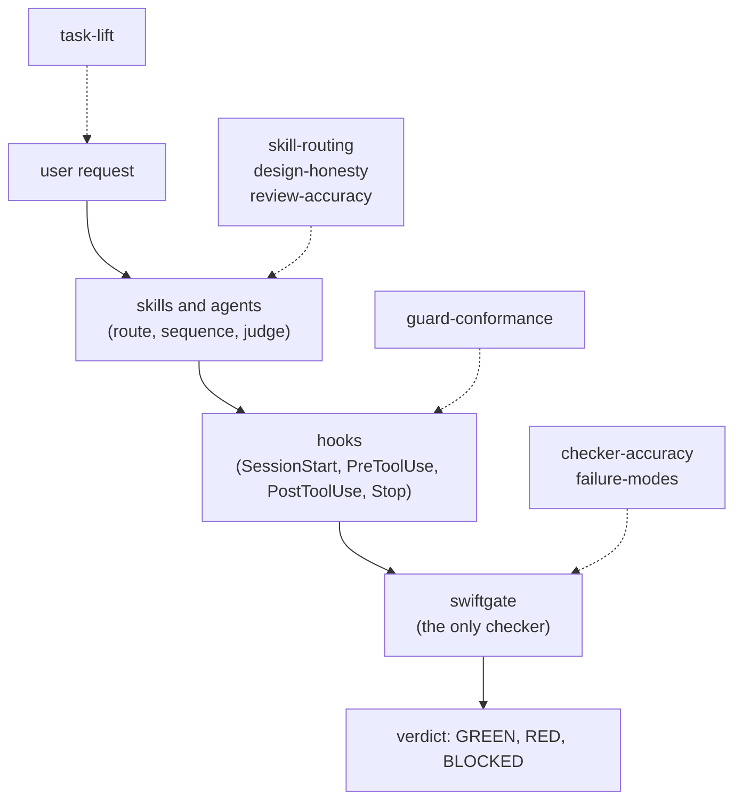

# Eval design

How the suites in [`suites.md`](suites.md) run, grade and report. The sources behind each choice
are in [`research.md`](research.md).

## What we evaluate

The harness, not the model. The model stays fixed within a comparison: 1 model id and 1 Claude
Code version per run, both recorded. What varies is the plugin: on, off, or with 1 part removed.
A score change with the model held fixed is a change the harness caused.

The harness has 4 layers, and each suite targets 1 or more:

The suites run bottom-up. If `checker-accuracy` shows a rule misses a spelling of `Date()`, a
`task-lift` failure on that spelling is a checker bug, not an agent or skill bug. Fix the lowest
broken layer first.

## Conditions

| Condition | Plugin | Used by |
|---|---|---|
| `off` | none. The app still has its `AGENTS.md`, since a team without the plugin would too | `task-lift`, `skill-routing` controls |
| `on` | installed through the marketplace, as a user gets it | every live suite |
| `hooks-only` | hooks and `swiftgate`, no skills or agents | `task-lift` ablation |
| `skills-only` | skills and agents, no hooks | `task-lift` ablation |
| `no-stop` | everything but the Stop hook | `task-lift` ablation: what the end-of-turn gate adds |

The `off` condition keeps the app's `AGENTS.md` on purpose. The question is what the plugin adds
beyond written rules. A second `off` variant without `AGENTS.md` shows what the rules file alone
buys, and runs once for the baseline report, not on every run.

## Trials and statistics

- **3 trials per task per condition** by default, 5 for any task whose result flips between
  trials. Agent runs vary, so 1 trial proves little.
- **Report pass@1 and pass^k.** pass@1 is the mean single-trial success. pass^k is the share of
  tasks where all k trials succeed, which is the number a user feels: a harness that holds 2 times
  in 3 is not reliable. The guards need pass^k of 1.0.
- **Paired comparisons.** Conditions run the same tasks, so compare per task (on minus off) and
  bootstrap a 95% interval over tasks. A lift whose interval includes 0 is not a lift yet.
- **Report counts with every rate.** "3 of 20" beats "15%".
- **Pin everything.** Model id, Claude Code version, plugin commit, app baseline SHA, Xcode and
  simulator runtime. Nobody can compare a result that lacks its pins.

## Graders

Prefer the cheapest grader that can be right, in this order:

1. **Labels by construction.** The case generator wrote the violation, so it knows the answer.
   Used by `checker-accuracy`, `failure-modes`, and the seeded part of `review-accuracy`.
2. **Code checks on outcome.** Hidden tests, file state, `swiftgate --json` output, the design
   doc's parsed sections. Deterministic and free.
3. **Code checks on the trajectory.** The transcript and hook log: which skills loaded, which
   hooks fired, which commands ran, in what order. Used where the path is the requirement (a
   guard must deny *before* the write; `tdd` must see the test fail before the fix). Don't grade
   a path where only the outcome matters, since agents find valid paths nobody wrote down.
4. **Model judge.** Only for what code can't check: module-kind fit, test-name quality, whether
   a review finding is real. Each judge:
   - scores 1 dimension, pass or fail, with a written rubric and examples of each;
   - gets checked against a person on at least 30 labelled cases before its scores count, and
     reports its true-positive and true-negative rates against those labels, not raw agreement;
   - runs a different model from the agent under test;
   - returns a reason with each verdict, since error analysis reads the reasons;
   - gets rechecked when its prompt, its model, or the harness's own judge agents change.
5. **A person.** Labels the judge's calibration set, reviews every new task, and reads failing
   transcripts in error analysis. Not a per-run grader.

**The circularity rule.** A suite can report `swiftgate`'s verdict as a column, but it can't
be the only oracle for a claim about `swiftgate`. `task-lift` checks the tempted rules against
construction labels. `checker-accuracy` grades `swiftgate` against the generator's labels. If
`swiftgate` and the labels disagree, a person decides which one is wrong, and both outcomes get
recorded.

### Judge model candidates

The default judge is a Claude model other than the agent's, pinned by id. TypeSafe's Jev is a
candidate for a second opinion, not the default. It is a decision model: it answers typed choice,
score and yes/no questions with probabilities, faster and cheaper than a frontier model. 3 facts
count against it as the main judge:

- It returns no reason. Error analysis needs the judge's reason to sort failures into causes.
- It can't abstain. Our rubrics need an "unclear" answer that sends the case to a person.
- Its accuracy drops with long, noisy context, and its context limit is 32K or 64K tokens
  (TypeSafe's docs list both). A `task-lift` diff with its transcript can exceed that.

Our judge volume is hundreds of calls per run, not millions, so its price gap matters little here.
The trial worth running: score Jev on the same labelled calibration set as the Claude judge, for
the short pass or fail dimensions (does this review finding match a seeded defect; does this
comment restate the code). Keep it if its true-positive and true-negative rates match the Claude
judge's. It is in early access behind a waitlist, and it sends app code to a third party.

## Error analysis

Pass rates show that something broke. Only the transcripts show what. After every run:

1. Read every failing trial, and a sample of passing ones, since a pass can hide a bad path.
2. Write 1 line per trial naming the first thing that went wrong. Use free text at first.
3. Group the lines into failure categories, count them, and sort by count.
4. Map each category to its layer (checker, hook, skill, agent, task, environment) and to an
   action: fix the harness, fix the task, add a seed to `self-test`, or record a known limit.

The categories and counts go in the run summary. The next harness change comes from the top of
that list. A category nobody can act on means the task is wrong or the category is too vague.

## Runner

2 options. Decide before building.

**`claude plugin eval`.** Claude Code's own plugin eval runner. It already runs a with-plugin and
a without-plugin arm per case, repeats trials, runs each trial in a fresh `HOME` and config, has
free code graders (`regex`, `tool_used`, `tool_order`, `file_exists`) and a model judge, caps cost,
and writes `aggregate-result.json`. Limits to check before choosing it:

- Its graders see the transcript and created files, but hook decisions don't appear in its
  results. `guard-conformance` needs them.
- Bash runs under an OS sandbox, which may block `xcodebuild`, simulators and SwiftPM's network
  fetch. `task-lift` needs all 3.
- Its default suite directory is `evals/` inside the plugin root, which after the ADR 0002 move is
  `plugin/`. Eval fixtures must not ship to consumers, so the suite needs `--eval-dir` pointed here.
- Ablations beyond on and off (hooks-only, skills-only) need separate plugin builds per arm.

**A thin runner around `claude -p`.** Runs `claude -p --plugin-dir <build> --output-format
stream-json` in a copied app repo with a scratch `HOME`, as the acceptance tasks already do. Full
control over the environment and the ablation builds. We write and maintain the trial loop,
isolation and reporting.

Recommendation: use `claude plugin eval` for `skill-routing`, where its graders fit. Prove the
sandbox with 1 `task-lift` task that builds and tests `SampleApp`. If that works, use it everywhere
and write custom graders as scripts the cases call. If it doesn't, use the thin runner for the
suites that build Swift.

Either way the runner needs 1 gate change: `swiftgate hook` appends each decision to a log (event,
tool, decision, rule id, latency) when an env var names the file. The log lets `guard-conformance`
grade hook decisions. Today `swiftgate` records check runs in `.harness/runs/history.jsonl`, not
PreToolUse decisions. That change is a `gate/` task with its own tests, per the first invariant.

## Isolation

Each trial gets:

- a fresh copy of the app at its baseline SHA, in its own git repo with a local bare `origin`
  (the diff-based tiers need `origin/main`);
- a scratch `HOME`, so bootstrap's registry, the shim link and lefthook never touch the real one;
- its own DerivedData and simulator clone, per Foundation §4.4;
- no network beyond what the task needs. SwiftPM dependencies resolve from a warm local cache.

Hidden tests enter the tree only after the agent's last turn.

## The run record

Each run writes `evals/results/<date>-<suite>/summary.md` and `summary.json`: pins, conditions,
per-task and per-condition results with counts, intervals, cost and wall time, and the
error-analysis table. Transcripts and trees stay out of git: they are large and hold paths from
the machine. The summary names where the runner keeps them.

A result becomes a regression baseline when a person accepts it. A later run that drops below an
accepted baseline by more than its interval is a regression, and the run summary says so first.

## Cost

A rough ceiling for planning, to replace with measured numbers after the `SampleApp` baseline:

| Suite | Runs | Per-run guess | Note |
|---|---|---|---|
| `checker-accuracy` | 1 | minutes of CPU | no model calls |
| `guard-conformance` | about 20 cases × 3 trials | short session | cheap; run on every plugin change |
| `skill-routing` | 110 prompts × 3 trials | a few turns | cheap per run, many runs |
| `task-lift` | 20 tasks × 3 trials × 5 conditions = 300 | a full feature session | the expensive suite |
| `design-honesty` | about 12 requests × 3 trials | 0.6 to 1M tokens, per the design spec's estimate | the spec's estimate is still unmeasured |
| `review-accuracy` | about 30 diffs × 3 trials | a review run | |

`task-lift` and `design-honesty` dominate. Run them in full only for a release candidate, and
on `SampleApp` alone for day-to-day changes.
