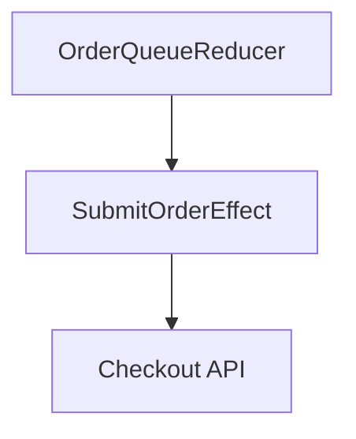
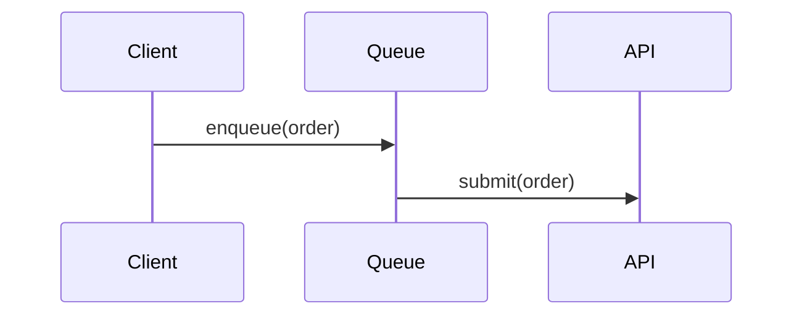

# Offline order queue

## Problem

Guests on flaky Wi-Fi lose their cart when the app can't reach checkout. The client should queue
the order locally and submit it once the network returns, instead of showing a dead end.

## Requirements

- req-offline-queue-drains-on-reconnect: Queued orders submit automatically once connectivity returns.
- req-queue-survives-app-relaunch: A queued order is still present after the app is force-quit and reopened.

## Evidence

- [ev-tca-effect-run-supports-cancellation] `Effect.run` returns an effect that can be cancelled by id.
- [UNVERIFIED] The App Store review guidelines allow silent background submission of a queued order.

## Options

### Option 1: Client-side queue with a TCA reducer

Trade-offs: no server changes, but the client owns retry and dedupe logic.

### Option 2: Server-side draft orders

Trade-offs: the server owns retry, but every draft consumes an order row until it's confirmed.

## Decision

- Client-side queue [ev-tca-effect-run-supports-cancellation]

## Architecture

## Module kinds

| Module | Kind | Reason |
|---|---|---|
| OrderQueueFeature | feature | owns the reducer and queue state |
| OrderQueueCore | library | pure queue model, no I/O |

## Test plan by tier

- test-queued-orders-replay-in-submit-order: a queued order resubmits after reconnect — tier T1
- test-queue-persists-across-relaunch: a queued order survives a simulated relaunch — tier T2

## Observability

Every enqueue, submit attempt and drop is logged with the queue depth at that point.

- Structured log on enqueue, submit success, submit failure and drop.

## Perf & scale

- throughput: up to 5 queued orders per device at once [UNVERIFIED]
- tail latency: submit retries back off up to 30s [UNVERIFIED]
- fan-out: one submit effect per queued order, run serially [UNVERIFIED]
- failure isolation: one failed submit doesn't block the rest of the queue [UNVERIFIED]
- resources: queue persists to on-device storage, bounded to 5 entries [UNVERIFIED]
- backpressure: a full queue rejects new orders with a clear error [UNVERIFIED]
- 10×: 50 queued orders still drain within one retry window [UNVERIFIED]

## Risks

- The App Store review guidelines allow silent background submission of a queued order — see Open questions.
- Tail latency: submit retries back off up to 30s under sustained load — needs a longer soak test before launch.

## Open questions

- Throughput: up to 5 queued orders per device at once — to confirm in the first build's T2 run.
- Fan-out: one submit effect per queued order, run serially — to confirm in the first build's T2 run.
- Failure isolation: one failed submit doesn't block the rest of the queue — to confirm in the first build's T2 run.
- Resources: queue persists to on-device storage, bounded to 5 entries — to confirm in the first build's T2 run.
- Backpressure: a full queue rejects new orders with a clear error — to confirm in the first build's T2 run.
- Does silent background submission need explicit guest consent?
- 10×: 50 queued orders still drain within one retry window — confirm under real device thermal throttling.

## Changelog

- 2026-09-25: drafted
