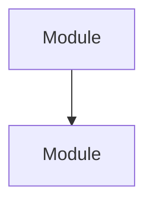
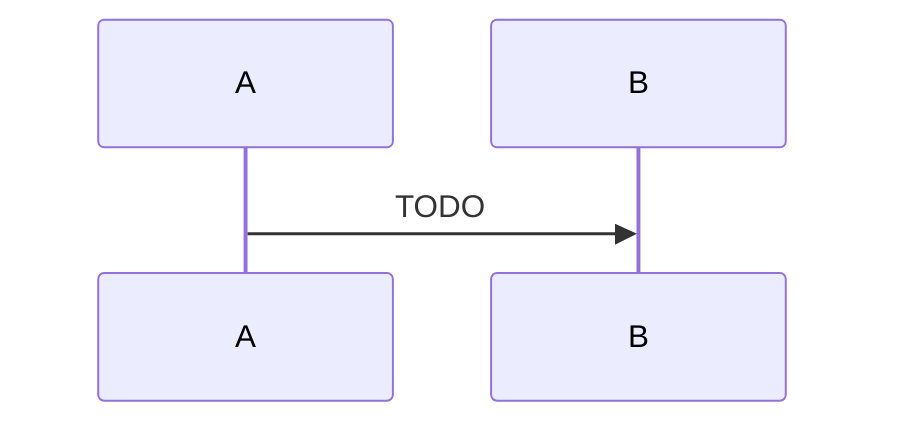

# TODO: name the design

## Problem

<!-- What's broken or missing, and why it matters now. One or two paragraphs. -->

## Requirements

- req-name-the-requirement: TODO

## Evidence

- [ev-name-the-evidence] TODO, with a citation
- [UNVERIFIED] TODO — a claim not yet checked

## Options

### Option 1: TODO

Trade-offs.

### Option 2: TODO

Trade-offs.

## Decision

- TODO [ev-name-the-evidence]

## Architecture

## Module kinds

| Module | Kind | Reason |
|---|---|---|
| TODO | TODO | TODO |

## Test plan by tier

- test-name-the-behaviour: TODO — tier T1

## Observability

<!-- What's logged, traced, and metriced, and at what level. -->

## Perf & scale

- throughput: TODO [ev-…]
- tail latency: TODO [ev-…]
- fan-out: TODO [ev-…]
- failure isolation: TODO [ev-…]
- resources: TODO [ev-…]
- backpressure: TODO [ev-…]
- 10×: TODO [ev-…]

## Risks

- TODO — see Open questions

## Open questions

- TODO

## Changelog

- YYYY-MM-DD: drafted
